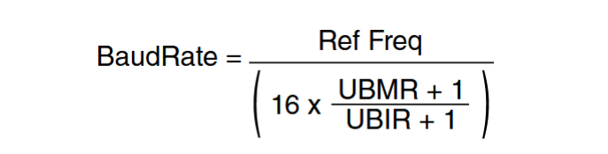

# UART实验

## 异步串行收发器 UART(Universal Asynchronous Receiver/Trasmitter)

**USART** 的 全称是 Universal Synchronous/Asynchronous Receiver/Transmitter，也就是同步/异步串行收发器。 相比 **UART** 多了一个同步的功能，在硬件上体现出来的就是多了一条时钟线。 
***
UART 作为串口的一种，其工作原理也是将数据一位一位的进行传输，发送和接收各用一条线，因此通过 UART 接口与外界相连最少只需要三条线： TXD(发送)、 RXD(接收)和 GND(地线)。图 21.1.1.1 就是 UART 的通信格式：

图 21.1.1.1 中各位的含义如下：
- 空闲位：数据线在空闲状态的时候为逻辑“1”状态，也就是高电平，表示没有数据线空闲，没有数据传输。
- 起始位：当要传输数据的时候先传输一个逻辑“0”，也就是将数据线拉低，表示开始数据
传输。
- 数据位： 数据位就是实际要传输的数据，数据位数可选择 5~8 位，我们一般都是按照字节传输数据的，一个字节 8 位，因此数据位通常是 8 位的。低位在前，先传输，高位最后传输。
- 奇偶校验位： 这是对数据中“1”的位数进行奇偶校验用的，可以不使用奇偶校验功能。
- 停止位：数据传输完成标志位，停止位的位数可以选择 1 位、 1.5 位或 2 位高电平，一般都选择 1 位停止位。
- 波特率：波特率就是 UART 数据传输的速率，也就是每秒传输的数据位数，一般选择 9600、19200、 115200 等。
***

UART 一般的接口电平有 TTL 和 RS-232，一般开发板上都有 TXD 和 RXD 这样的引脚，这些引脚低电平表示逻辑 0，高电平表示逻辑 1，这个就是 TTL 电平。 RS-232 采用差分线， -3~-15V 表示逻辑 1， +3~+15V 表示逻辑 0。

## I.MX6ULL的UART寄存器

UART的时钟源UART_CLK_ROOT为480/6=80Mhz，需要设置多路选择器CSCDR1[UART_CLK_SEL]（bit6）为0，为1时时钟源为24Mhz晶振

还有时钟树的分频CSCDR1[UART_CLK_PODF]（bit0-5），1分频为000000
***

- UARTx_URXD：低8位保存着串口收到的数据
- UARTx_UTXD：低8位为发送数据的位置
- UARTx_UCR1：串口控制寄存器
	- bit0：为使能位，写1使能
	- bit14：自动选择波特率，
- UARTx_UCR2：串口控制寄存器
	- bit0：软复位，写0复位，1不复位
	- bit1：接收使能
	- bit2：发送使能
	- bit5：设置数据长度，0为7位数据位，1为8位数据位
	- bit6：停止位，0为一位停止位，1为2位
	- bit7：奇偶校验设置位，0为偶校验，1为奇校验
	- bit8：奇偶校验使能位，0为禁止
- UARTx_UCR3：
	- bit2：In this chip, UARTs are used in MUXED mode, so that this bit should always be set.
- UART Status Register 2 (UARTx_USR2)
	- bit0：为1时表示有数据接收到了
	- bit3：为1表示发送完成
- UARTx_UFCR：
	- bit7-9：分频设置
- UARTx_UBIR：
- UARTx_UBMR：

***

UART1_TXD用的是UART1_TX_DATA，UART1_RXD用的是UART1_RX_DATA

