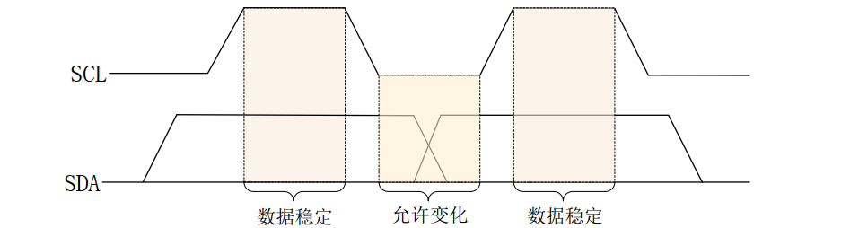
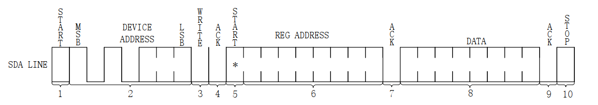
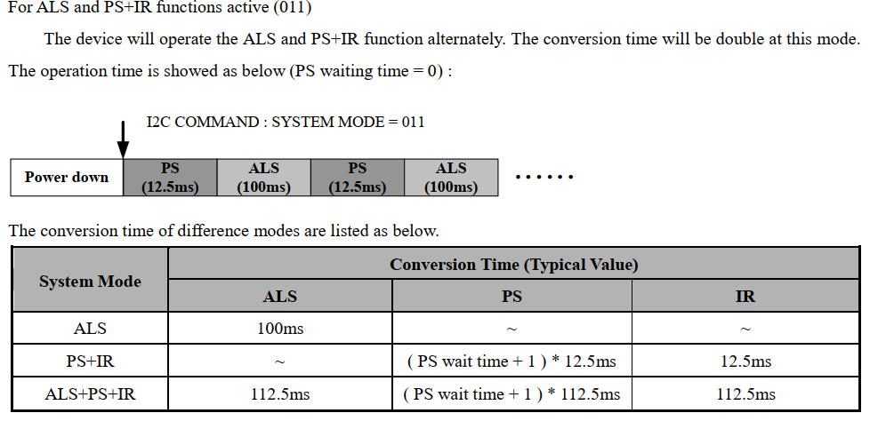

# IIC实验

单工：单向通信，只能由一方发送数据，另一方接收。

半双工：双方都可发送数据，但同一时刻只能一方发送，一方接收。

全双工：双方都可发送数据，并且可同时发送数据。

UART： 全双工、==异步==通信
SPI ：    全双工、同步通信
I2C：     半双工、同步通信

## IIC原理

I2C 是很常见的一种==半双工==，==**串行通信**==总线协议， I2C 是 NXP 公司设计的， I2C 使用两条线在主控制器和从机之间进行数据通信。**一条是 SCL(串行时钟线)，另外一条是 SDA(串行数据线)，这两条数据线需要接上拉电阻（一般是3.3v，4.7k上拉电阻），总线空闲的时候 SCL 和 SDA 处于高电平。** I2C 总线标准模式下速度可以达到 100Kb/S，快速模式下可以达到 400Kb/S。 I2C 总线工作是按照一定的协议来运行的，接下来就看一下 I2C 协议。

**I2C 是支持多从机的，也就是一个 I2C 控制器下可以挂多个 I2C 从设备，这些不同的 I2C从设备有不同的器件地址**，这样 I2C 主控制器就可以通过 I2C 设备的器件地址访问指定的 I2C设备了，一个 I2C 总线连接多个 I2C 设备如图 26.1.1.1 所示：

### IIC协议
1. ##### 起始位

   顾名思义，也就是 I2C 通信起始标志，通过这个起始位就可以告诉 I2C 机，“我”要开始进行 I2C 通信了。在 SCL 为高电平的时候， SDA 出现下降沿就表示为起始位

  

2. ##### 停止位

   停止位就是停止 I2C 通信的标志位，和起始位的功能相反。在 SCL 位高电平的时候， SDA出现上升沿就表示为停止位

  

3. ##### 数据传输

    I2C 总线在数据传输的时候要保证在 SCL 高电平期间， SDA 上的数据稳定，因此 SDA 上的数据变化只能在 SCL 低电平期间发生
   ​	

4. ##### 应答信号

   当 I2C 主机发送完 8 位数据以后会将 SDA 设置为输入状态，等待 I2C 从机应答，也就是等到 I2C 从机告诉主机它接收到数据了。应答信号是由从机发出的，主机需要提供应答信号所需的时钟，主机发送完 8 位数据以后紧跟着的一个时钟信号就是给应答信号使用的。从机通过将 SDA 拉低来表示发出应答信号，表示通信成功，否则表示通信失败。

5. ##### IIC写时序（3大步）

   ##### 主机通过 I2C 总线与从机之间进行通信不外乎两个操作：写和读， I2C 总线单字节写时序如下：

   

   1. 开始信号

   2. 发送 I2C 设备地址，每个 I2C 器件都有一个设备地址，通过发送具体的设备地址来决定访问哪个 I2C 器件。这是一个 8 位的数据，其中高 7 位是设备地址I2C 器件地址后面跟着一个读写位（和前面的7位设备地址组成一个字节），为 0 表示写操作，为 1 表示读操作。

   3. 从机发送的 ACK 应答信号。

      

   4. 重新发送开始信号。

   5. 发送要写入数据的寄存器地址。

   6. 从机发送的 ACK 应答信号。

      

   7. 发送要写入寄存器的数据。

   8. 从机发送的 ACK 应答信号。

   9. 停止信号

6. ##### IIC单字节读时序（4大步）

   

   1. 主机发送起始信号。

   2. 主机发送要读取的 I2C 从设备地址。

   3. 读写控制位，**因为是向 I2C 从设备发送数据，因此是写信号。**

   4. 从机发送的 ACK 应答信号。

      

   5. 重新发送 START 信号。

   6. 主机发送要读取的寄存器地址。

   7. 从机发送的 ACK 应答信号。

      

   8. 重新发送 START 信号。

   9. 重新发送要读取的 I2C 从设备地址。

   10. 读写控制位，这里是读信号，表示接下来是从 I2C 从设备里面读取数据。

   11. 从机发送的 ACK 应答信号。

       

   12. 从 I2C 器件里面读取到的数据。

   13. 主机发出 NO ACK 信号，表示读取完成，不需要从机再发送 ACK 信号了

   14. 主机发出 STOP 信号，停止 I2C 通信。

7. ##### IIC 多字节读写时序：有时候我们需要读写多个字节，多字节读写时序和单字节的基本一致，只是在读写数据的时候可以连续发送多个自己的数据，其他的控制时序都是和单字节一样的。

## IMX6ULL的IIC外设

ALPHA开发板上有个AP3216C，环境光传感器

该传感器的I2C1_SCL用的是UART4_TXD;	I2C1_SDA用的是UART4_RXD

6ULL点IIC速率标准模式是100kbit/s，快速模式是400kb/s，时钟源选择PERCLK_CLK_ROOT 66Mhz

### 寄存器
- I2Cx_IFDR：设置I2C频率
  - bit0-5：设置分频，100kb/s设置为0x15
- I2Cx_I2CR：
	- bit7：I2C使能，置1
	- bit6：I2C中段使能，置0（本实验不适用中断）
	- bit5：主从模式选择，1为主机，0为从机
	- bit4：发送接收选择位，0为接受，1为发送
	- bit3：发送ack确认位，0为在接收一个字节之后发送ack，1为在接收一个字节之后不发送ack
- I2Cx_I2SR
	- bit7：传输状态位，为0表示正在发送，为1表示发送完成
	- bit5：总线状态位，为0表示总线空闲，为1表示忙
	- bit4：Software cannot set the bit.
	- bit0：读取ack确认位，0表示在总线上完成8位数据传输后，收到了ack。1为8位数据传输后没有ack信号。
	- I2Cx_I2DR：数据寄存器，低8位有效

### AP3216C

AP3216C是一个集成的ALS和PS模块，包括一个数字环境光传感器（ALS）、一个接近传感器（PS）和一个红外LED。

环境光ALS是16位输出，PS是10位输出，从机地址是 0x1E.

#### 寄存器

**

- 0x00（System Configuration）bit2-0
	- 000: Power down (Default)
	- 001: ALS function active
	- 010: PS+IR function active
	- **011: ALS and PS+IR functions active**
	- 100: SW reset
	- 101: ALS function once
	- 110: PS+IR function once
	- 111: ALS and PS+IR functions once
- 0x01（中断状态）bit1-0（只读）
- 0x02（中断标志位清除）bit0
- 0x0A（IR Data Low）bit7-0（只读）
	- bit7：数据有效状态位，0为IR和PS数据有效，1为无效
	- bit1-0：==**红外**==IR的低2位（IR lower byte of ADC output）
- 0x0B（IR Data High）bit7-0: ==**红外**==IR的高8位（IR higher byte of ADC output）
- 0x0C（ALS Data Low）bit7-0（只读）==**环境光**==低8位
- 0x0D（ALS Data High）bit7-0（只读）==**环境光**==高8位
- 0x0E（PS Data Low）
  - bit7：物体检测，1为物体接近，0为远离
  - bit6：数据有效状态位，0为有效，1位无效
  - bit3-0：==**距离**==低4位（PS lower byte of ADC output）
- 0x0F（PS Data High）
  - bit7：物体检测，1为物体接近，0为远离
  - bit6：数据有效状态位，0为有效，1位无效
  - bit5-0：==**距离**==高6位（PS higher byte of ADC output）

