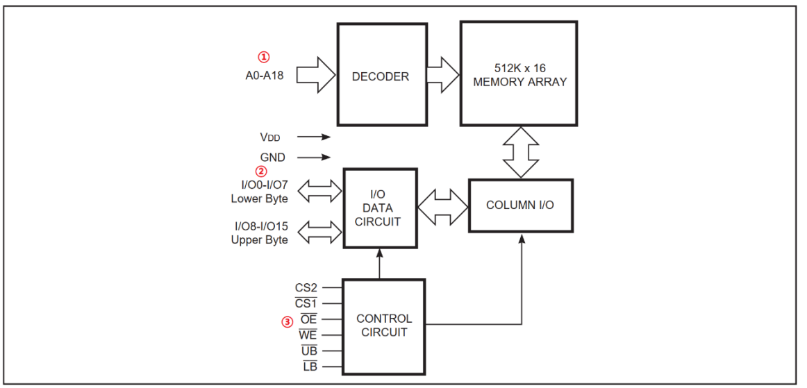
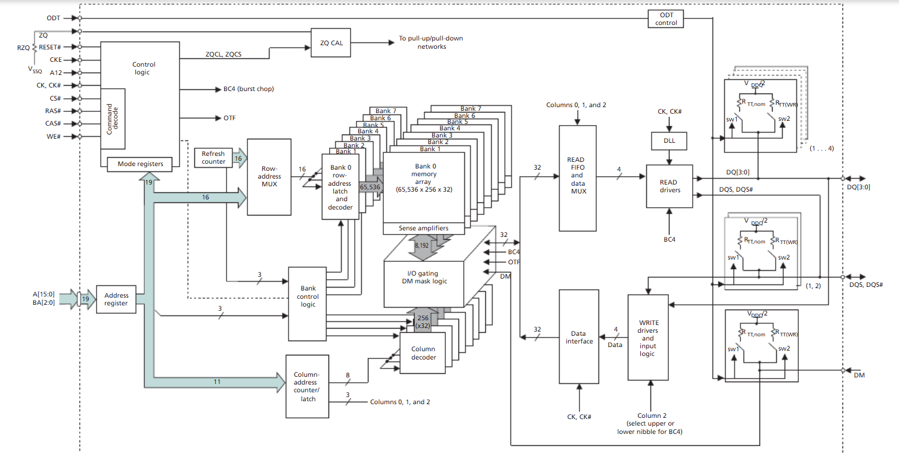

# DDR3实验


## RAM和ROM


**RAM**： 随机存储器，可以随时进行读写操作，速度很快，掉电以后数据会丢失。比如内存条、 SRAM、 SDRAM、 DDR 等都是 RAM。 RAM 一般用来保存程序数据、中间结果，比如我们在程序中定义了一个变量 a，然后对这个 a 进行读写操作，示例代码如下：
```
int a;
a = 10;
```
a 是一个变量，我们需要很方便的对这个变量进行读写操作，方法就是直接“a”进行读写操作，不需要在乎具体的读写过程。我们可以随意的对 RAM 中任何地址的数据进行读写操作，非常方便。


**ROM**： 只读存储器，笔者认为目前“只读存储器”这个定义不准确。比如我们买手机，通常会告诉你这个手机是 4+64 或 6+128 配置，说的就是 RAM 为 4GB 或 6GB， ROM 为 64G 或128GB。但是这个 ROM 是 Flash，比如 EMMC 或 UFS 存储器，因为历史原因，很多人还是将Flash 叫做 ROM。但是 EMMC 和 UFS，甚至是 NAND Flash，这些都是可以进行写操作的！只是写起来比较麻烦，要先进行擦除，然后再发送要写的地址或扇区，最后才是要写入的数据，学习过 STM32，使用过 WM25QXX 系列的 SPI Flash 的同学应该深有体会。可以看出，相比于RAM，向 ROM 或者 Flash 写入数据要复杂很多，因此意味着速度就会变慢(相比 RAM)，但是ROM 和 Flash 可以将容量做的很大，而且掉电以后数据不会丢失，适合用来存储资料，比如音乐、图片、视频等信息。


综上所述， RAM 速度快，可以直接和 CPU 进行通信，但是掉电以后数据会丢失，容量不容易做大(和同价格的 Flash 相比)。 ROM(目前来说，更适合叫做 Flash)速度虽然慢，但是容量大、适合存储数据。


## SRAM


**SRAM** 的全称叫做 Static Random-Access Memory，也就是静态随机存储器，**这里的“静态”说的就是只要 SRAM 上电，那么 SRAM 里面的数据就会一直保存着，直到 SRAM 掉电**。速度快，成本高。SRAM通常作为 SOC 的内部 RAM 使用或 Cache 使用

这里就以 STM32F103/F407 开发板常用的 IS62WV51216 这颗 SRAM 芯片为例简单的讲解一下 SRAM，这是一颗 16 位宽(数据位为 16 位)、1MB 大小的 SRAM，芯片框图如图 23.1.2.1所示：




A0-18是地址线    2^19×2=1M     乘二是因为数据位是16位，2个字节

IO0-7是低字节数据线

IO8-15是高字节数据线


## SDRAM


SDRAM 全称是 Synchronous DynamicRandom Access Memory，翻译过来就是同步动态随机存储器，**“同步”的意思是 SDRAM 工作需要时钟线**，**“动态”的意思是 SDRAM 中的数据需要不断的刷新来保证数据不会丢失**，**“随机”的意思就是可以读写任意地址的数据。**


## DDR
DDR 内存是 SDRAM 的升级版本

- DDR (1)全称是 Double Data Rate SDRAM，也就是双倍速率 SDRAM，SDRAM 在一个 CLK 周期传输一次数据， DDR 在一个 CLK 周期传输两次数据，也就是在上升沿和下降沿各传输一次数据，这个概念叫做预取(prefetch)。在描述 DDR 速度的时候一般都使用 MT/s，也就是每秒多少兆次数据传输。同样 133~200MHz的频率， DDR 的传输速度就变为了 266~400MT/S，所以大家常说的 DDR266、 DDR400 就是这么来的。
- DDR2 在 DDR 基础上进一步增加预取(prefetch)，增加到了 4bit，相当于比 DDR 多读取一倍的数据，因此 DDR2 的数据传输速率就是 533~800MT/s，这个也就是大家常说的 DDR2 533、DDR2 800。
- DDR3 在 DDR2 的基础上将预取(prefetch)提高到 8bit，因此又获得了比 DDR2 高一倍的传输速率。这里我们讲一下
  LPDDR3、 DDR3 和 DDR3L 的区别，这三个都是 DDR3，但是区别主要在于工作电压， LPDDR3叫做低功耗 DDR3，工作电压为 1.2V。 DDR3 叫做标压 DDR3，工作电压为 1.5V，一般台式内存条都是 DDR3。 DDR3L 是低压 DDR3，工作电压为 1.35V，一般手机、嵌入式、笔记本等都使用 DDR3L。


## DDR3参数

正点原子开发板用的是NT5CC256M16ER-EK

时钟最该933Mhz，Data Rate最高1866Mb/s，CL-TRCD-TRP是13-13-13

- tRCD：
- CL：
- tRC：
- tRAS：


## I.MX6ULL的MMDC控制器

MMDC全称：Multi Mode DDR Controller

MMDC is a multi-mode DDR controller that supports DDR3/DDR3L x16 and LPDDR2x16 memory types.

这个MMDC最高支持400MhzDDR3，800MT/s

**DDR时钟配置**：时钟源为PLL2的PFD2，CBCMR[PRE_PERIPH2_CLK_SEL]（bit21-22）写01，CBCDR[PERIPH2_CLK_SEL]（bit26）写0，CBCDR[FABRIC_MMDC_PODF]（bit3-5）设为0，最终DDR时钟为396Mhz

用nxp官方提供的ddr_stress_tester软件测试ddr

​	


