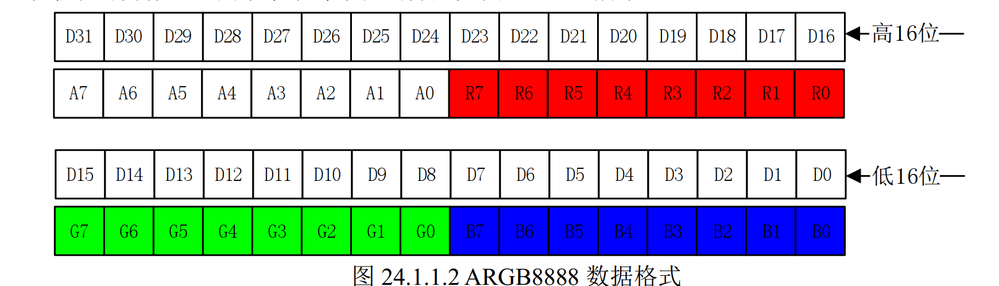
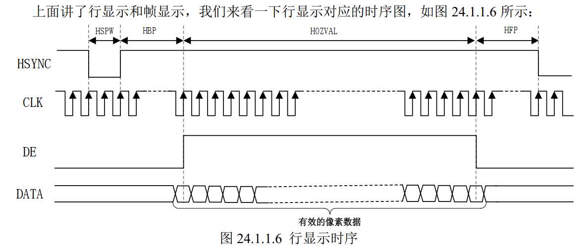
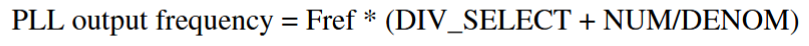

# LCD实验

## LCD原理（简）

### 像素点和分辨率
LCD 显示器都是由一个一个的像素点组成，像素点就类似一个灯(在 OLED 显示，像素点就是一个小灯)，这个小灯是 RGB 灯，也就是由 R(红色)、 G(绿色)和 B(蓝色)这三种颜色组成的，而 RGB 就是光的三原色。1080P 的意思就是一个 LCD 屏幕上的像素数量是1920*1080 个，也就是这个屏幕一列 1080 个像素点，一共 1920 列，如图 24.1.1.1 所示：

2K 就是 2560\*1440 个像素点， 4K 是3840\*2160 个像素点。

屏幕多少寸指的是屏对角线的长度，用的单位是英寸，如果量取时的单位是厘米，再除以2.54得到的数据就是多少英寸。

**PPI**表示图像中每英寸面积所包含的像素数目

### 像素格式

- **RGB888**：一般一个 R、G、 B 这三部分分别使用 8bit 的数据，那么一个像素点就是 8bit*3=24bit，也就是说一个像素点3 个字节，这种像素格式称为**RGB888**。
- **ARGB8888**：如果再加入 8bit 的 Alpha(透明)通道的话一个像素点就是 32bit，也就是 4 个字节，存储顺序为**B，G，R，A**
- **RGB565**：每个像素用16比特位表示，占2个字节，RGB分量分别使用5位、6位、5位。
- **HDR10**：每种颜色都有10bit

### LCD屏幕接口
屏幕接口有：MIPI、LVDS、RGB、HDMI

RGB格式的屏幕，一般叫RGB接口屏

正点原子屏幕ID：使用ID可以识别不同的屏幕，在RGBLCD屏幕上对R7，G7，B7焊接上拉或下拉电阻实现不同的ID，且不会影响正常显示效果

正点原子的ALPHA开发板RGBLCD接口用了3个SGM3157模拟开关。防止屏幕ID上下拉电阻对IMX6ULL启动造成影响（IMX6ULL启动也是在LCD_DATA线上做文章）

### LCD 时间参数和时序

- HSYNC ：水平同步信号，也叫做行同步信号，当出现HSYNC信号时，表示新的一行开始显示
- HSPW： 有些地方也叫做 thp，是 HSYNC 信号宽度。
- HBP： 一段延时，术语叫做行同步信号后肩，单位是 CLK。（上面图里的黑边）
- HOZVAL：显示一行数据所需的时间，假如屏幕分辨率为 1024*600，那么 HOZVAL 就是 1024，单位为 CLK。
- HFP：一段延时，术语叫做行同步信号前肩，单位是 CLK。（上面图里的黑边）
- DE：DE信号有效时，开始显示

这些信号宽度查屏幕的数据手册

因此显示一行所需要的时间是(HSPW+HBP+HOZVAL+HFP)*CLK=20+140+1024+160=1344CLK

- VSYNC ：垂直同步信号，也叫做帧同步信号，当出现VSYNC信号时，表示新的一帧开始显示，查阅所使用的
  LCD 数据手册可以知道此信号是低电平有效还是高电平有效，假设此时是低电平有效。
- VSPW： 有些地方也叫做 tvp，是 VSYNC 信号宽度，单位为 1 行的时间。
- VBP： 有些地方叫做 tvb，术语叫做帧同步信号后肩，单位为 1 行的时间。
- LINE： 有些地方叫做 tvd，显示一帧有效数据所需的时间，假如屏幕分辨率为 1024*600，那么 LINE 就是 600 行的时间。
- VFP： 有些地方叫做 tvf，术语叫做帧同步信号前肩，单位为 1 行的时间。

这些信号宽度查屏幕的数据手册

一帧的时间（VSPW+VBP+LINE+VFP）\*（HSPW+HBP+HOZVAL+HFP）\*CLK=635\*1344\*CLK

60帧的时钟是51.2Mhz

### 显存

显存就是显示存储空间，若采用ARGB8888格式，每个像素4个字节。假如1024\*600的屏幕，需要1024\*600*4=2.5MB，因此一帧需要2.5MB。所以需要留出2.5MB的空间给LCD用，直接定义一个1024\*600的数组

### IMX6ULL  LCDIF接口控制

DOTCLK接口

会用到的寄存器：

- LCDIF_CTRLn（eLCDIF General Control Register）
	- bit0：在数据传输过程中该位必须置为1,使能位
	- bit1：设置数据格式，0为24位数据全部有效
	- bit5：设置LCDIF接口为主线总控设备，要置1。**总线主控设备（Bus Master）：在总线系统中，主控设备负责发起和控制数据传输，而从设备则响应主控设备的请求。作为总线主控，eLCDIF可以主动向内存或其他外设请求数据，而无需依赖其他设备。**
	- bit8-9：数据格式设置，0x3为24bit
	- bit10-11：LCD数据总线传输宽度。0x3为24bit
	- bit12-13：设置数据交换，设为0
	- bit14-15：设置输入数据交换，设为0
	- bit17：设为1进入DOTCLK模式
	- bit19：工作在DOTCLK模式下该位必须置1
	- bit31：设为0正常工作，置1为复位
	
- LCDIF_CTRL1n
	- bit16-19：如果显示数据以24位解包格式排列（A-R-G-B，其中没有传输A值），则将位字段值设置为0x7。
	
- LCDIF_TRANSFER_COUNT
	- bit0-15：每条水平线中的总有效数据（像素），设为1024
	- bit16-31：一共有多少行，设为600
	
- LCDIF_VDCTRL0n
	- bit0-17：VSYNC信号有效的单元数。要小于HSYNC_PERIOD	
	- bit20：设置VSYNC信号的宽度单位，设为1单位为显示一行所用的时间
	- bit21：设置为1
	- bit24：设置enable信号极性，为0低电平有效，为1高电平有效
	- bit25：设置clk信号极性，设为0上升沿有效
	- bit26：设置HSYNC信号极性，设为0低电平有效
	- bit27：设置VSYNC信号极性，设为0低电平有效
	- bit28：设为1
	- bit29：设置VSYNC为输出或输出，设为0
	
- LCDIF_VDCTRL1
	- 2个VSYNC信号之间的宽度，就是上面时序图中的（VSPW+VBP+LINE+VFP）

- LCDIF_VDCTRL2
	- bit0-17：2个HSYNC信号之间的宽度，(HSPW+HBP+HOZVAL+HFP)*CLK=20+140+160+1024=1344CLK
	
	- bit18-31：HSYNC信号的宽度，也就是HSPW
	
- LCDIF_VDCTRL3
	- bit0-15：vbp+vspw
	- bit16-27：hbp+hspw

- LCDIF_VDCTRL4
	- bit0-17：每一行的像素点，1024
	- bit18：设为1
	
- LCDIF_CUR_BUF：eLCDIF正在传输的当前帧的地址。
- LCDIF_NEXT_BUF：下一帧的首地址。

### LCD时钟配置
我们设置VEDIO PLL（PLL5）为时钟源

PLL5的输出频率计算公式如下：

为了简化计算，不要后面的分数部分，最后结果是Fref*DIV_SELECT，Fref是24Mhz，DIV_SELECT是CCM_ANALOG_PLL_VIDEOn寄存器的bit0-6（valid value：27~54）	

CCM_ANALOG_PLL_VIDEOn寄存器的bit13为PLL使能，置1

CCM_ANALOG_PLL_VIDEOn的bit20–19：设为2，1分频

CCM_ANALOG_MISC2n的bit31-30：设为0，1分频

不使用小数分频，因此CCM_ANALOG_PLL_AUDIO_DENOM设为0，CCM_ANALOG_PLL_AUDIO_NUM设为0

CSCDR2[LCDIF1_PRE_CLK_SEL] bit15-17：设为2，选择PLL5作为输入

CSCDR2[LCDIF1_PRED] bit12-14：0-7为1-8分频

CCM_CBCMR bit23-25：0-4对应1-5分频

CSCDR2 bit9-11：设为0

***

- 内联函数：在C语言中，如果一些函数被频繁调用，不断地有函数入栈，即函数栈，会造成栈空间或栈内存的大量消耗。为了解决这个问题，特别的引入了inline修饰符，表示为内联函数。本实验的画点函数lcd_drawPoint和读点函数lcd_readPoint会在显示过程中重复大量使用，因此使用内联函数
- 本节实验进行中遇到的问题：ASCII字符集点阵数组本来保存在font.h中，但在编译过程中出现重复定义问题。原来条件编译只能保证不会重复编译，不能保证不会重复定义。重复编译可能造成重复定义，但重复定义的来源不只有重复编译。解决方法：不仅用#ifndef组合防止重复编译，而且将变量在源文件中定义，只在头文件里放extern声明。这样各模块在编译的时候，就知道“有这么个变量，但它的空间不在我这里”，链接的时候，这个变量虽然出现在所有包含这个头文件的模块里，但只有一个模块是它的真身所在。

