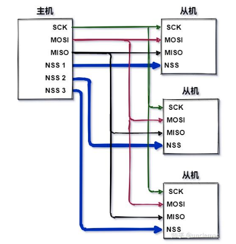

# SPI实验

单工：单向通信，只能由一方发送数据，另一方接收。

半双工：双方都可发送数据，但同一时刻只能一方发送，一方接收。

全双工：双方都可发送数据，并且可同时发送数据。

UART： 全双工、异步通信
SPI ：    全双工、同步通信
I2C：     半双工、同步通信

SPI比I2C的优势：

- 速度快，可达几百Mhz
- 全双工

## SPI原理

SPI是高速，全双工，串行同步通信协议，比IIC快，最高速度可以达到几十Mhz。SPI 以主从方式工作，通常是有一个主设备和一个或多个从设备，标准SPI有4根线:

- CS/SS， Slave Select/Chip Select，这个是片选信号线

- SCK， Serial Clock，串行时钟，和 I2C 的 SCL 一样，为 SPI 通信提供时钟。

- MOSI/==SDO==， Master Out Slave In/==Serial Data Output==，简称主出从入信号线，这根数据线
  只能用于主机向从机发送数据，也就是主机输出，从机输入

- MISO/==SDI==， Master In Slave Out/==Serial Data Input==，简称主入从出信号线，这根数据线只
  能用户从机向主机发送数据，也就是主机输入，从机输出。

SPI 有四种工作模式，通过==串行时钟极性(CPOL)和相位(CPHA)==的搭配来得到四种工作模式（根据从机支持的模式去配置主机）：

- CPOL=0，串行时钟空闲状态为低电平。

- CPOL=1，串行时钟空闲状态为高电平，此时可以通过配置时钟相位(CPHA)来选择具体的传输协议。

- CPHA=0，串行时钟的第一个跳变沿(上升沿或下降沿)采集数据

- CPHA=1，串行时钟的第二个跳变沿(上升沿或下降沿)采集数据。

  

SPI的时序图如下（每个从机都有单独的片选信号线，或者串行连接）：




## I.MX6ULL的SPI控制器

I.MX6ULL的时钟源是PLL3（480Mhz），CCM_CCSR的bit0设为0，CCM_CSCDR2的bit18设为0，CSCDR2的bit24-19设为0，进入ECSPI的时钟是60Mhz

寄存器：

- ECSPIx_RXDATA：等待接收到数据再读
- ECSPIx_TXDATA
- ECSPIx_CONREG
  - bit0：使能位，1使能，==写入其他ECSPI寄存器之前必须要把这一位置1==
  - bit3：向TXDATA写入数据后马上启动SPI，置1
  - bit7-4：设置SPI通道主从模式，bit7为通道3，bit4为通道0，通道0设为主模式，bit4置1
  - bit11-8：设置4分频，设为0010
  - bit15-12：设置2分频，设为0011，最终时钟为7.5Mhz
  - bit19-18：通道选择，使用SS0，设为00
  - bit31-20：由于移位寄存器总是从传输FIFO加载32位数据，因此只有n个最低有效值（n=BURST LENGTH+1）将被移出。剩余的位将被忽略。我们每次读一个字节，设为0x7。


- ECSPIx_CONFIGREG
  - bit3-0：通道时钟相位控制，我们使用通道0，把通道0的相位设为0
  - bit7-4：通道时钟极性控制，我们使用通道0，把通道0点极性设为0
  - bit15-12：通道片选极性控制，ICM-20608要求active low，，所以把通道0设为0
  - bit19-16：通道数据线空闲电平设置，通道0数据线空闲时为低电平，bit16设为0
  - bit23-20：设为0

- ECSPIx_STATREG
  - bit0：TXFIFO Empty，1表示空，发送数据之前等待TXFIFO为空（等待上一个数据发完）
  - bit3：RXFIFO Ready。1表示RXFIFO中至少有一个word（==32位，word的大小取决于数据总线的大小，这个实验用的是Cortex A7内核，基于Armv7-A指令集设计（32位）==）
  - bit7: 传输完成状态位。向该位写入1将清除它。

- ECSPIx_PERIODREG
  - bit14-0：设置等待时间，设为0x2000
  - bit15：设置等待时间单位，设为0
  - bit16-21：表示片选信号的延时，我们使用软件控制片选信号


## ICM-20608
ICM20608是一款由英飞凌（InvenSense）公司生产的6轴惯性测量单元（IMU）芯片。该芯片结合了三轴陀螺仪和三轴加速度计，可以同时提供精确的角度和加速度测量。可以使用IIC或者SPI驱动，I2C at 400kHz or SPI at 8MHz.

The gyroscope has a programmable full-scale range of ±250, ±500, ±1000, and ±2000 degrees/sec. 16bit输出


(注：陀螺仪角速度输出为16bit，范围是0-65535。当FS_SEL为0时，测量范围是-250~+250。因此，1度/s就是65536/500=131)

The accelerometer has a userprogrammable accelerometer full-scale range of ±2g, ±4g, ±8g, and ±16g. 16bit输出

I.MX6ULL通过ECSPI3接口连接传感器，

- UART2_TXD复用为ECSPI3_SS0
- UART2_TXD复用为ECSPI3_SCLK
- UART2_RTS复用为ECSPI3_MISO
- UART2_CTS复用为ECSPI3_MOSI

ICM-20608的SPI Operational Features: SPI读写操作在16个或更多的时钟周期（两个或更多字节）完成。第一个字节包含SPI地址，接下来的字节包含SPI数据。第一个字节的第一位包含Read/Write位，表示Read(1)或Write(0)操作。下面的7位包含寄存器地址。在多字节读/写情况下，数据为两个或两个以上字节。


## 小结


### sprintf函数和snprintf函数
- sprintf 是 C 语言标准库中的一个格式化输出函数，用于将格式化数据写入字符串。如果成功，则返回写入的字符总数，不包括字符串追加在字符串末尾的空字符。如果失败，则返回一个负数。==这个函数是不安全的，若格式化数据的大小超过了字符串的大小，会导致溢出==
```
#include <stdio.h>
#include <math.h>

int main()
{
   char str[80];

   sprintf(str, "Pi 的值 = %f", M_PI);
   puts(str);
   
   return(0);
}
```

  snprintf() 是一个 C 语言标准库函数，用于格式化输出字符串，并将结果写入到指定的缓冲区，与 sprintf() 不同的是，如果 snprintf() 输出的字符数超过了 size 参数指定的缓冲区大小，则输出的结果会被截断，只有 size - 1 个字符被写入缓冲区，最后一个字符为字符串结尾的空字符 \0。**snprintf() 会限制输出的字符数，避免缓冲区溢出。**
```
int snprintf ( char * str, size_t size, const char * format, ... );
str -- 目标字符串，用于存储格式化后的字符串的字符数组的指针。
size -- 字符数组的大小。
format -- 格式化字符串。
... -- 可变参数，可变数量的参数根据 format 中的格式化指令进行格式化。
```


### ==**浮点计算**==

需要开启Cortex-A7 的 NEON 和 FPU(VFPV4_D32)
```
 void imx6ul_hardfpu_enable(void)
{
	uint32_t cpacr;
	uint32_t fpexc;

	/* 使能NEON和FPU */
	cpacr = __get_CPACR();
	cpacr = (cpacr & ~(CPACR_ASEDIS_Msk | CPACR_D32DIS_Msk))
		   |  (3UL << CPACR_cp10_Pos) | (3UL << CPACR_cp11_Pos);
	__set_CPACR(cpacr);
	fpexc = __get_FPEXC();
	fpexc |= 0x40000000UL;	
	__set_FPEXC(fpexc);
}
```


```Makefile
$(COBJS): obj/%.o : %.c
	$(CC) -Wall -march=armv7-a -mfpu=neon-vfpv4 -mfloat-abi=hard -Wa,-mimplicit-it=thumb -nostdlib -fno-builtin -c -O2  $(INCLUDE) -o $@ $<
```
