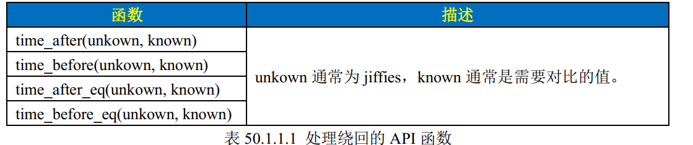

# Linux内核定时器

**本节实验使用的是软件定时器**，若要使用硬件定时器，使用字符设备驱动的框架去使用就可以了

## 1.内核时间管理

**cortex-M内核使用systick作为系统定时器**，作为系统时钟源。

Linux核心每隔固定周期会发出timer interrupt (IRQ 0)，该频率可以通过编程预定，称作**节拍率**（和芯片主频不是一个东西）。当时钟中断发生时，内核就通过一种特殊的中断处理程序对其进行处理。系统时钟中断需要处理的事情有：

- 更新时间和日期

- 更新系统统计数：更新本地CPU统计数

- 更新系统统计数：记录系统负载

- 更新系统统计数：监管内核代码

- 检查非屏蔽中断（NMI）监视器


linux内核中有个变量**HZ**表示产生每秒时钟中断的近似个数，也就是节拍率。在我们通过图形化界面配置并编译linux内核后可以在根目录下的.config文件中找到这个变量。

```shell
 471 CONFIG_PREEMPT=y
 472 CONFIG_PREEMPT_COUNT=y
 473 CONFIG_HZ_FIXED=0
 474 CONFIG_HZ_100=y
 475 # CONFIG_HZ_250 is not set
 476 # CONFIG_HZ_300 is not set
 477 # CONFIG_HZ_500 is not set
 478 # CONFIG_HZ_1000 is not set
 479 CONFIG_HZ=100
```


Linux 内核使用**==全局变量 jiffies==** 来记录系统从启动以来的系统节拍数，系统启动的时候会将 jiffies 初始化为 0， jiffies 定义在文件 include/linux/jiffies.h 中，定义如下：

```c
76 extern u64 __jiffy_data jiffies_64;
77 extern unsigned long volatile __jiffy_data jiffies;
```

jiffies_64对应64位系统，jiffies对应32位系统。jiffies是jiffies_64低32位。**jiffies有溢出（也有资料叫绕回）的风险**，当HZ=1000时，32 位的 jiffies 只需要 49.7 天就发生了绕回，对于 64 位的 jiffies 来说大概需要5.8 亿年才能绕回，因此 jiffies_64 的绕回忽略不计。

假设我们使用jiffies记录超时情况，线程1开始时间是jiffies_1，当前时间是jiffies_2，若发生了绕回，jiffies_2 < jiffies_1，这个时候就会出现问题。因此，**处理 32 位 jiffies 的绕回显得尤为重要**，Linux 内核提供了如表 50.1.1.1 所示的几个 API 函数来处理绕回。



用time_before函数举例子： 如果 unkown 没有超过 known 的话 time_before 函数返回真，否则返回假。

```c
unsigned long timeout;
timeout = jiffies + (2 * HZ); /* 超时的时间点 */
/*************************************
具体的代码
************************************/

/* 判断有没有超时 */
if(time_before(jiffies, timeout)) {
/* 超时未发生 */
} else {
/* 超时发生 */
}
```


## 2. 内核定时器

linux内核定时器（**软件定时器**）通过系统时钟实现。软件定时器与硬件定时器不同，硬件定时器需要通过配置寄存器来设置**周期值（例如设置每500ms触发一次中断）**。软件定时器需要设置**周期到来的时间点（例如设置jiffies+msecs_to_jiffies(t)这个时间点触发中断）**


内核定时器是一次性的，一次设定时间到来后，内核定时器就会关闭。如果想要实现周期性定时，那么就需要在定时处理函数中重新开启定时器。


Linux 内核使用 timer_list 结构体表示内核定时器

```c
struct timer_list {
	struct list_head entry;
	unsigned long expires; /* 定时器超时时间，单位是节拍数 */
	struct tvec_base *base;
	void (*function)(unsigned long); /* 定时处理函数 */
	unsigned long data; /* 要传递给 function 函数的参数 */
	int slack;
}
```


### API函数

- init_timer :初始化定时器
- add_timer：开始定时器
- del_timer ：删除定时器
- del_timer_sync ：等待处理器使用完定时器再删除
- mod_timer ：初始化定时器，同时开启定时器。若想循环使用定时器就用这个

```c
struct timer_list timer; /* 定义定时器 */
/* 定时器回调函数 */
void function(unsigned long arg)
{
    /*
    * 定时器处理代码
    */

     /* 如果需要定时器周期性运行的话就使用 mod_timer
     * 函数重新设置超时值并且启动定时器。
     */
 	mod_timer(&timer, jiffies + msecs_to_jiffies(2000));
 }

 /* 初始化函数 */
 void init(void)
 {
     init_timer(&timer); /* 初始化定时器 */

     timer.function = function; /* 设置定时处理函数 */
     timer.expires=jffies + msecs_to_jiffies(2000);/* 超时时间 2 秒 */
     timer.data = (unsigned long)&dev; /* 将设备结构体作为参数 */

     add_timer(&timer); /* 启动定时器 */
 }

 /* 退出函数 */
 void exit(void)
 {
     del_timer(&timer); /* 删除定时器 */
     /* 或者使用 */
     del_timer_sync(&timer);
 }
```


## 3. ioctl

虽然在文件操作结构体"struct file_operations"中有很多对应的设备操作函数，但是有些命令是实在找不到对应的操作函数。如CD-ROM的驱动，想要一个弹出光驱的操作，这种操作并不是所有的字符设备都需要的，所以文件操作结构体也不会有对应的函数操作。

出于这样的原因，ioctl就有它的用处了————一些没办法归类的函数就统一放在ioctl这个函数操作中，通过指定的命令来实现对应的操作。所以，ioctl函数里面都实现了多个的对硬件的操作，通过应用层传入的命令来调用相应的操作。

```
struct file_operations {
	......
	long (*unlocked_ioctl) (struct file *, unsigned int, unsigned long);
	long (*compat_ioctl) (struct file *, unsigned int, unsigned long);
	......
};
```

1、compat_ioctl：支持64bit的driver必须要实现的ioctl，当有32bit的userspace application call 64bit kernel的IOCTL的时候，这个callback会被调用到。如果没有实现compat_ioctl，那么32位的用户程序在64位的kernel上执行ioctl时会返回错误：Not a typewriter

2、如果是64位的用户程序运行在64位的kernel上，调用的是unlocked_ioctl，如果是32位的APP运行在32位的kernel上，调用的也是unlocked_ioctl	


### unlock_ioctl

```c
long (*unlocked_ioctl) (struct file *, unsigned int, unsigned long);
```

以unlocked_ioctl为例，第一个参数是文件指针，第二个参数是传入的命令，第三个参数是用户传进来的数据


ioctl的cmd编码规则在linux_kernel/include/uapi/asm-generic/ioctl.h和Documentation/ioctl/ioctl-decoding.txt文件中有描述


```c
cmd[31:30]—数据（args）的传输方向（读写）
cmd[29:16]—数据（args）的大小
cmd[15:8]—>命令的类型，可以理解成命令的密钥，一般为ASCII码（0-255的一个字符，有部分字符已经被占用，每个字符的序号段可能部分被占用）
cmd[7:0] —>命令的序号，是一个8bits的数字（序号，0-255之间）

```

linux内核提供了api函数来编码cmd

```c
/* used to create numbers */

//没有参数的命令
#define _IO(type,nr)		_IOC(_IOC_NONE,(type),(nr),0)	

//从驱动读取数据
#define _IOR(type,nr,size)	_IOC(_IOC_READ,(type),(nr),(_IOC_TYPECHECK(size)))	

//向驱动写入数据
#define _IOW(type,nr,size)	_IOC(_IOC_WRITE,(type),(nr),(_IOC_TYPECHECK(size)))

//双向数据传输
#define _IOWR(type,nr,size)	_IOC(_IOC_READ|_IOC_WRITE,(type),(nr),(_IOC_TYPECHECK(size)))

--type：0~0xff，占8bit(_IOC_TYPEBITS)。也就是cmd[15:8]这一部分。为一个ASCII字符，内核文档给出一些推荐的或者已经被使用的幻数，也可以叫做魔数。
--序数（NR）：为功能号，给自己的命令编号，占8bit(_IOC_NRBITS)。也就是cmd[7:0]这一部分。
--size：数据大小，在这里只需要填写数据类型即可，例如
    #define _IOWR(0xFE,1,int)
    
    
幻数 (Magic Number) 的含义
唯一标识符/命名空间： 幻数的核心作用是唯一标识一个驱动程序或一类相关的 ioctl 命令。它相当于一个“命名空间”。

防止冲突： 这是最主要的目的。不同的设备驱动（字符设备、块设备）会定义自己的 ioctl 命令。如果没有幻数，两个毫不相干的驱动完全有可能定义出数值相同的 cmd。当应用程序对一个文件描述符调用 ioctl(fd, cmd, arg) 时，内核需要根据文件描述符关联的驱动来判断 cmd 是否有效以及如何处理。幻数提供了一个快速检查机制：内核可以首先检查传入 cmd 中的幻数字段是否与该驱动注册时使用的幻数相匹配。如果不匹配，通常意味着这个 cmd 不是发给这个驱动的（或者是无效的），内核可以立即返回 -ENOTTY 或 -ENOIOCTLCMD 错误，而无需进一步解析命令。这大大减少了不同驱动间命令冲突的可能性。

可读性： 在驱动源代码和内核日志中，幻数通常用一个可打印的 ASCII 字符（范围 0-255）来表示（例如 'k', 'p', 'T'）。这使得代码和调试信息更易读。虽然最终编码到 cmd 里的是一个 8 位整数，但在源码中看到 _IO('E', 1) 比看到 0x4501 更容易理解这个命令是属于某个“E”打头的驱动或模块的。
```

驱动中的`unlock_ioctl`例程：
```c
/*ioctl指令宏定义*/
#define CMD_BASE 0XEF                     //幻数，只要驱动之间的幻数不冲突，这个数在0-255可以随便设置  
#define CLOSE_CMD   (_IO(CMD_BASE, 1))    //关闭命令
#define OPEN_CMD   (_IO(CMD_BASE, 2))
#define SET_PEROID_CMD   (_IOW(CMD_BASE, 3, int))
#define PEROID (500)      //500ms


long timer_ioctl (struct file *filp, unsigned int cmd, unsigned long arg)
{
    int ret = 0;
    struct dev* dev = (struct dev*)filp->private_data;
    switch (cmd)
    {
        case CLOSE_CMD:
            del_timer_sync(&dev->timer);
            break;

        case OPEN_CMD:
            ret = mod_timer(&dev->timer,jiffies + msecs_to_jiffies(PEROID));
            if(ret<0)
            {
                printk("OPEN_CMD_mod_timer_failed\r\n");
            }
            break;  

        case SET_PEROID_CMD:
            dev->peroid = arg;
            del_timer_sync(&dev->timer);
            ret = mod_timer(&dev->timer,jiffies + msecs_to_jiffies(arg));
            if(ret<0)
            {
                printk("SET_PEROID_CMD_mod_timer_failed\r\n");
            }
            break;
        default:
            del_timer_sync(&dev->timer);
            break;
    }
    return ret;
}
```

### 应用程序示例

```c
#define CMD_BASE 0XEF           //和驱动一致
#define CLOSE_CMD   (_IO(CMD_BASE, 1))    //关闭命令
#define OPEN_CMD   (_IO(CMD_BASE, 2))
#define SET_PEROID_CMD   (_IOW(CMD_BASE, 3, int))

void cmd_handle(int fd, unsigned int cmd)
{
    unsigned long arg = 0;
    switch (cmd)
    {
        case CLOSE_CMD:
            ioctl(fd,cmd,0);
            break;

        case OPEN_CMD:
            ioctl(fd,cmd,0);
            break;

        case SET_PEROID_CMD:
            if(scanf("%lu",&arg)!=1)
            {
                while(getchar()!='\n');
                printf("错了,arg:%lu",arg);
                break;
            }
            // printf("arg:%lu\r\n",arg);
            while (getchar() != '\n');          //清除标准输入缓冲区
            ioctl(fd,cmd,arg);
            break;

        default:
            break;
    }
}

int main(int args, char* argv[])
{
    ......
    
    fd = open(filename,O_RDWR);

    if(fd<0)
    {
        printf("open key device failed\r\n");
        return fd;
    }

    while(1)
    {
        printf("\nInput CMD [1=Close, 2=Open, 3=SetPeriod]: ");
        if (scanf("%u", &cmd) != 1) {
            // 清空无效输入
            while (getchar() != '\n');
            printf("Invalid command!\n");
            continue;
        }                  
        while (getchar() != '\n');//清除标准输入缓冲区
        if(cmd==1)
        {
            cmd = CLOSE_CMD;        //关闭命令
        }
        else if(cmd==2)
        {
            cmd = OPEN_CMD;         //打开命令
        }
        else if(cmd==3)
        {
            cmd = SET_PEROID_CMD;   //设置周期
        }
        cmd_handle(fd, cmd);            //cmd处理函数

    }


    close(fd);
    return 0;

}
```


## 4. 遇到的问题

 fflush是c标准库中的函数，用来清除**输出缓冲区**，**不能用来清除输入缓冲区**！！！

scanf之后清除输入缓冲区可以使用下面的代码：

```
while(getchar()!='\n');
```

