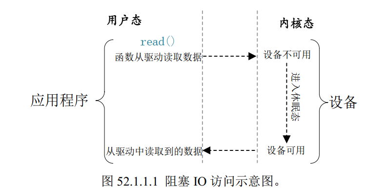
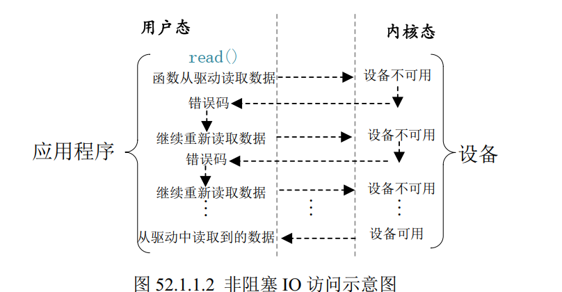
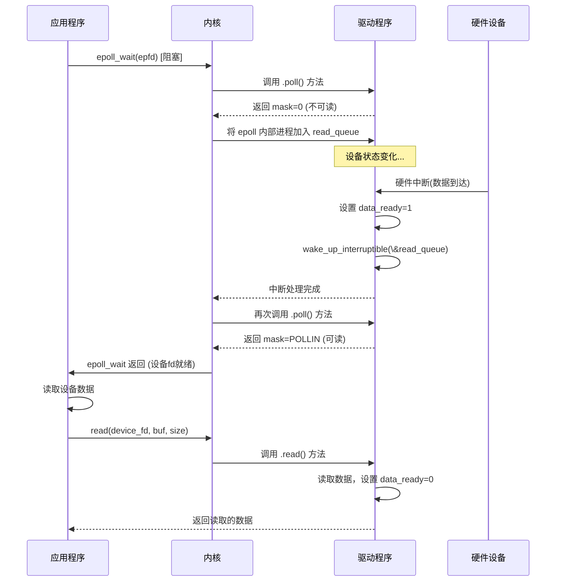

# 阻塞和非阻塞IO

**这里的IO不是硬件层面的GPIO，是Input/Output，也就是应用程序对驱动设备的输入/输出操作。**

当资源不可用时，阻塞式IO会将应用程序对应的程序进入休眠状态，当资源可用时唤醒应用程序；非阻塞式的IO会让应用程序一直轮询等待，可以设置超时机制。





应用程序使用`open`函数打开驱动文件时，默认使用的`O_RDWR`标识符为阻塞方式打开

```c
int fd;
int data = 0;

fd = open("/dev/xxx_dev", O_RDWR); /* 阻塞方式打开 */
ret = read(fd, &data, sizeof(data)); /* 读取数据 */
```

若想使用非阻塞式方式打开，加上`O_NOBLOCK`标识符

```c
int fd;
int data = 0;

fd = open("/dev/xxx_dev", O_RDWR|O_NOBLOCK); /* 非阻塞方式打开 */
ret = read(fd, &data, sizeof(data)); /* 读取数据 */
```


## 阻塞IO

**阻塞IO使用等待队列实现。**


### 等待队列


#### 等待队列头

阻塞式访问最大的好处就是当设备文件不可操作时，进程可以进入休眠状态，这样就可以把CPU资源释放出来给其他进程使用。**但是，当设备文件可以操作时，就必须唤醒进程，一般是在中断函数中唤醒进程。**

linux内核提供了等待队列（wait queue，类似于链表）来实现阻塞进程的唤醒。要使用等待队列头`wait_queue_head_t`（类似于链表头），要先创建和初始化一个等待队列头。

```c
struct __wait_queue_head {
    spinlock_t lock;
    struct list_head task_list;
};
typedef struct __wait_queue_head wait_queue_head_t;
```

```c
void init_waitqueue_head(wait_queue_head_t *q)	//初始化
    
--q:就是要初始化的等待队列头
```


#### 等待队列项

等待队列头就是一个等待队列的头部，每个访问设备的进程都是一个队列项，当设备不可用的时候就要将这些进程对应的等待队列项添加到等待队列里面。结构体 wait_queue_t 表示等待队列项，结构体内容如下：

```c
struct __wait_queue {
    unsigned int flags;
    void *private;
    wait_queue_func_t func;
    struct list_head task_list;
};
typedef struct __wait_queue wait_queue_t;
```

```c
DECLARE_WAITQUEUE(name, tsk)		//创建并初始化等待队列项的宏定义
    
--name：等待队列项的名字
--tsk：表示这个等待队列项属于哪个任务(进程)，一般设置为current，在Linux内核中current相当于一个全局变量，表示当前进程。 
```


#### 将进程加入或移出等待队列

当设备不可访问的时候就需要将进程对应的等待队列项添加到前面创建的等待队列头中，只有添加到等待队列头中以后进程才能进入休眠态。当设备可以访问以后再将进程对应的等待队列项从等待队列头中移除即可。

```c
void add_wait_queue(wait_queue_head_t *q, wait_queue_t *wait)
```

```c
void remove_wait_queue(wait_queue_head_t *q, wait_queue_t *wait)
```


#### 主动唤醒等待队列

```c
void wake_up(wait_queue_head_t *q)
```

l**inux进程睡眠状态有2种，TASK_INTERRUPTIBLE 和TASK_UNINTERRUPTIBLE**

**TASK_INTERRUPTIBLE状态的进程可以使用主动唤醒，也可以等待信号到来自动唤醒。（个人理解：INTERRUPTIBLE是可中断的，也就是可以等待信号到来发生中断，然后唤醒）**

**TASK_UNINTERRUPTIBLE状态的进程只能使用主动唤醒。**


#### 事件到来自动唤醒等待队列

| 函数                                                     | 描述                                                         |
| -------------------------------------------------------- | ------------------------------------------------------------ |
| wait_event(wq, condition)                                | 以 wq 为等待队列头的等待队列被唤醒，前提是 condition 条件必须满足(为真)，否则一直阻塞 。 此函数会将进程设置为TASK_UNINTERRUPTIBLE 状态。此函数会自动将阻塞进程加入等待队列。 |
| wait_event_timeout(wq, condition, timeout)               | 功能和 wait_event 类似，但是此函数可以添加超时时间，以 jiffies 为单位。此函数有返回值，如果返回 0 的话表示超时时间到，而且 condition为假。为 1 的话表示 condition 为真，也就是条件满足了。 |
| wait_event_interruptible(wq, condition)                  | 与 wait_event 函数类似，但是此函数将进程设置为TASK_INTERRUPTIBLE，就是可以被信号打断 |
| wait_event_interruptible_timeout(wq, condition, timeout) | 与 wait_event_timeout 函数类似，此函数也将进程设置为 TASK_INTERRUPTIBLE，可以被信号打断。 |


#### 例子

使用阻塞方式读取按键状态

1. 在应用程序中以阻塞方式读取设备文件
2. 在按键结构体中定义按键状态可读变量
3. 在按键消抖结束后，设置**可读状态变量为真，并唤醒等待队列**
```c
void key1_timer_func(unsigned long arg)
{
    static unsigned int count = 0;		//记录按键按下次数
    unsigned char key_state = 0;		//记录按键值
    struct irq_key * irq_key0 = (struct irq_key *)arg;
    key_state = gpio_get_value(irq_key0->gpio);	//读取IO值
    atomic_set(&irq_key0->value,key_state);		//设置设备结构体中的按键值
    
    irq_key0->read_state = READ_VALID;			//设置可读状态
    wake_up_interruptible(&irq_key0->rwait);	//唤醒等待队列

    if(key_state==0)
    {
        // printk("press key\r\n");
        count++;
        atomic_set(&irq_key0->press_time,count);

    }
    else
    {
        // printk("free key\r\n");
    }
}
```

4. 在设备操作函数集的read函数中，使用`wait_event_interruptible`等待`pkey0->read_state`有效，唤醒进程
```c
/*读取函数*/
ssize_t dev_read (struct file * filp, char __user * buf, size_t count, loff_t * ppos)
{
    int ret = 0;    
    unsigned char databuf[2];
    struct irq_key * pkey0 = &((struct dev*)filp->private_data)->key[0];

    wait_event_interruptible(pkey0->rwait, pkey0->read_state);  //等待按键可读状态有效

    databuf[0] = atomic_read(&pkey0->value);        	//按键值
    databuf[1] = atomic_read(&pkey0->press_time);    	//按下次数

    ret = copy_to_user(buf,databuf,sizeof(databuf));
    pkey0->read_state = READ_INVALID;					//重置按键可读状态
    if(ret<0)
    {
        printk("data error\r\n");
        return ret;
    }

    return count;

}
```


### 阻塞IO流程

**流程：**应用程序以阻塞方式打开文件，并使用`read`读取设备文件。使用read读取设备文件会调用驱动程序中设备操作函数集中的read函数。**因此我们需要再驱动程序中的read函数来处理阻塞IO读取。**

首先在设备初始化时创建等待队列，并创建一个设备可读状态变量。然后在驱动程序的read函数中，使用`wait_event_interruptible`函数，该函数的作用：若设备可读状态变量为真，进程继续执行；若为假，则进程让出CPU，进入阻塞状态。

假设此时设备不可读，进程被阻塞。然后设备可读时，设置设备可读状态为真，并调用`wake_up`函数唤醒等待队列，并检查设备可读状态变量，若为真，则从`wait_event_interruptible`函数继续执行，若为假，则继续让出CPU，阻塞。（`wake_up`会遍历唤醒等待队列中的所有阻塞进程，一一检查等待变量是否为真）

如果进程被信号中断： wait_event_interruptible 返回 -ERESTARTSYS。.read 函数应检测此返回值并直接返回 -ERESTARTSYS 给用户空间。


## 非阻塞IO

应用程序使用**poll、 epoll 和 select**来查询设备是否可用。==**一定要在打开文件时加上`O_NONBLOCK`标识符指定打开方式为非阻塞**==

当应用程序调用 select 、poll或epoll 函数来对驱动程序进行非阻塞访问的时候，驱动程序file_operations 操作集中的 poll 函数就会执行。


### 应用程序API函数


#### poll

在单个线程中， select 函数能够监视的文件描述符数量有最大的限制，一般为 1024，可以修改内核将监视的文件描述符数量改大，但是这样会降低效率！这个时候就可以使用 poll 函数，poll 函数本质上和 select 没有太大的差别。


#### epoll

传统的 selcet 和 poll 函数都会随着所监听的 fd 数量的增加，出现效率低下的问题，而且 poll 函数每次必须遍历所有的描述符来检查就绪的描述符，这个过程很浪费时间。为此， epoll 应运而生， epoll 就是为处理大并发而准备的，一般常常在网络编程中使用 epoll 函数。


```c
int epfd = epoll_create1(0);
struct epoll_event ev, events[MAX_EVENTS];
// 添加非阻塞fd到epoll，关注可读事件
ev.events = EPOLLIN;
ev.data.fd = non_blocking_fd;
epoll_ctl(epfd, EPOLL_CTL_ADD, non_blocking_fd, &ev);

while (1) {
    // 关键：阻塞等待事件发生，进程在此处休眠，不占CPU！
    int nfds = epoll_wait(epfd, events, MAX_EVENTS, -1 /* 无限等待 */);
    if (nfds == -1) { /* 错误处理 */ break; }

    for (int i = 0; i < nfds; i++) {
        if (events[i].events & EPOLLIN) {
            int ready_fd = events[i].data.fd;
            ssize_t n = read(ready_fd, buf, sizeof(buf)); // 对就绪的fd进行非阻塞read
            if (n > 0) {
                // 处理数据...
            } else if (n == -1 && (errno == EAGAIN || errno == EWOULDBLOCK)) {
                // 极少数情况：在通知到read之间数据又被消耗光了？重加事件或忽略
            } else {
                // 出错或 EOF，从epoll移除fd
            }
        }
        // 检查其他事件类型 (EPOLLOUT, EPOLLERR, EPOLLHUP)...
    }
}
```


#### select

```c
int select(int nfds,
            fd_set *readfds,
            fd_set *writefds,
            fd_set *exceptfds,
            struct timeval *timeout)
    
--nfds:要操作的文件描述符个数+1
--readfds：监视fd_set中的文件是否可读，若可读，select就返回可读文件的个数。若不关心可读情况，可设为			NULL
--writefds：监视这些文件是否可写,同readfds
--exceptfds：监视这些文件的异常
--timeout：设置超时时间
    
struct timeval {				//超时时间结构体
	long tv_sec; /* 秒 */
	long tv_usec; /* 微妙 */
}
```

若我们想用select来查询一个或几个设备文件是否可读，我们就要先创建一个文件集合`fd_set`变量，并将想要查询的文件加入这个集合中。下面是一些关于`fd_set`的API函数。

```c
void FD_ZERO(fd_set *set)			//清空
void FD_SET(int fd, fd_set *set)	//加入指定文件
void FD_CLR(int fd, fd_set *set)	//删除指定文件
int FD_ISSET(int fd, fd_set *set)	//查询文件集合中是否有指定文件
```


例程

```c
void main(void)
{
    int ret, fd; /* 要监视的文件描述符 */
    fd_set readfds; /* 读操作文件描述符集 */
        struct timeval timeout; /* 超时结构体 */

	fd = open("dev_xxx", O_RDWR | O_NONBLOCK); /* 非阻塞式访问 */

	FD_ZERO(&readfds); /* 清除 readfds */
	FD_SET(fd, &readfds); /* 将 fd 添加到 readfds 里面 */
	
	/* 构造超时时间 */
	timeout.tv_sec = 0;
	timeout.tv_usec = 500000; /* 500ms */
	
	ret = select(fd + 1, &readfds, NULL, NULL, &timeout);
	switch (ret) {
		case 0: /* 超时 */
			printf("timeout!\r\n");
			break;
		case -1: /* 错误 */
			printf("error!\r\n");
			break;
		default: /* 可以读取数据 */
			if(FD_ISSET(fd, &readfds)) { /* 判断是否为 fd 文件描述符 */
				/* 使用 read 函数读取数据 */
			}
			break;
        }
}
```


**若监视的文件操作符数目大于1023，使用poll和epoll**


### 驱动程序file_operations 操作集中的 poll 函数

poll函数做的只有3件事：

- 检查设备状态：检查当前设备是否可读、可写，或出现异常状态
- 注册等待队列：若设备未就绪，将当前进程加入等待队列（poll_wait函数）。当事件发生时，驱动程程序需要手动唤醒等待队列，用按键来举例，当按键按下，消抖结束进入处理函数时，必须手动唤醒等待队列（wake_up_interruptible函数）。这一点和阻塞不同，阻塞只需要在read函数中使用wait_event_interruptible，非阻塞需要完成操作函数集中的poll函数。
- 返回状态掩码：返回设备当前状态


内核路径：

- 调用驱动程序的 poll 函数。

- 驱动注册等待队列并返回状态掩码。

- 若掩码非零，poll() 立即返回。

- 若掩码为零，将进程挂起直到：

  - 超时时间到

  - 设备调用 wake_up_interruptible()

  - 收到信号


当应用程序调用 select 或 poll 函数来对驱动程序进行非阻塞访问的时候，驱动程序file_operations 操作集中的 poll 函数就会执行。所以驱动程序的编写者需要提供对应的 poll 函数， poll 函数原型如下所示：

```c
unsigned int (*poll) (struct file *filp, struct poll_table_struct *wait)

函数参数和返回值含义如下：
    filp： 要打开的设备文件
    wait： 结构体 poll_table_struct 类型指针， 由应用程序传递进来的。一般将此参数传递给poll_wait 		   函数。
    返回值:向应用程序返回设备或者资源状态，可以返回的资源状态如下：
        POLLIN 有数据可以读取。
        POLLPRI 有紧急的数据需要读取。
        POLLOUT 可以写数据。
        POLLERR 指定的文件描述符发生错误。
        POLLHUP 指定的文件描述符挂起。
        POLLNVAL 无效的请求。
        POLLRDNORM 等同于 POLLIN，普通数据可读
```

我们需要在驱动程序的 poll 函数中调用 poll_wait 函数， poll_wait 函数不会引起阻塞，只是将应用程序添加到 poll_table 中， poll_wait 函数原型如下：

```c
void poll_wait(struct file * filp, wait_queue_head_t * wait_address, poll_table *p)
```

参数 wait_address 是要添加到 poll_table 中的等待队列头，参数 p 就是 poll_table，就是file_operations 中 poll 函数的 wait 参数。

```c

unsigned int dev_poll (struct file * filp, struct poll_table_struct * wait)
{
    int mask = 0;       //poll函数要返回给应用程序的设备或资源状态
    struct irq_key * pkey0 = &((struct dev*)filp->private_data)->key[0];
    
    poll_wait(filp,&pkey0->rwait,wait);     //

    //判断是否可读
    if(pkey0->read_state)   //可读
    {
        mask = POLLIN|POLLRDNORM;
    }

    return mask;
}
```


### read函数要做的操作

**假设应用程序要读设备文件，我们就需要在read函数里做以下操作。**

```c
static ssize_t my_read(struct file *filp, char __user *buf, size_t count, loff_t *pos)
{
    struct my_device *dev = filp->private_data;
    DEFINE_WAIT(wait);

    // 非阻塞模式直接返回
    if (filp->f_flags & O_NONBLOCK)
    {
        if(!dev->data_ready)
        	return -EAGAIN;
    }
    else  		//阻塞模式
    {
        wait_event_interruptible(dev->rwait, dev->data_ready);       //等待按键值有效
    }
    
    databuf[0] = atomic_read(&pkey0->value);         //按键值
    databuf[1] = atomic_read(&pkey0->press_time);    //按下次数


    ret = copy_to_user(buf,databuf,sizeof(databuf));
    dev->read_state = READ_INVALID;
    if(ret<0)
    {
        printk("data error\r\n");
        return ret;
    }

    
}
```


### 非阻塞IO实现流程



注意：**在驱动程序的poll函数中使用了poll_wait函数，该函数初始化了一个等待队列，但是并没有在这里阻塞进程，该函数的实际作用是获取内核传递的 poll_table 参数，将 poll_table 中的回调函数加入等待队列。**当设备不可读时，实际阻塞位置在 epoll_wait 中系统调用内部的 schedule_timeout() 中。


## 阻塞和非阻塞IO的优缺点

非阻塞fd + 阻塞的多路复用等待可以实现**单线程处理并发访问**，例如

```c
// 伪代码：传统阻塞 I/O (低效)
while(1) {
    read(block_fd1, buf); // 可能阻塞在此
    read(block_fd2, buf); // 如果fd1阻塞，fd2就绪也无法处理
}

// epoll方案：非阻塞IO，单次唤醒处理所有就绪fd
while(1) {
    nfds = epoll_wait(...); // 同时等待所有fd
    for (each ready_fd in nfds) {
        read(non_blocking_fd, buf); // 立即读取
    }
}
```


| 特性                   | 阻塞 I/O                     | 非阻塞 I/O                                         | **关键注意事项**                                |
| :--------------------- | :--------------------------- | :------------------------------------------------- | :---------------------------------------------- |
| **并发模型**           | 低效，依赖多线程/进程         | **高效单线程多路复用**，高并发基石                  |                                                  |
| **编程复杂度**         | ✅ 简单直观                 | ⚠️ 复杂，需状态机 & 多路复用 API                | 非阻塞 + 多路复用 = 强大但陡峭                     |
| **CPU 利用率(空闲时)** | ✅ **0% 睡眠无空转**       | ⚠️ 风险：若不用多路复用会 **100% 空转**         | **必须配合 `epoll`/`kqueue`！**                |
| **响应延迟**           | ⚠️ 取决于I/O操作速度       | ✅ **极低，即时响应多个事件**                  | UI/游戏等高响应场景必备                         |
| **适用连接规模**       | ⚠️ 数百~千级 (多线程开销大) | ✅ **万~百万级连接** (单线程+多路复用)          | C10K 问题的核心解决方案                        |
| **典型应用**           | 工具/脚本/简单客户端         | Web服务器/数据库/微服务/实时通讯                   |                                                  |
| **流程控制**           | ⚠️ 内核调度程序             | ✅ **应用程序完全掌控**                           | 双刃剑：更灵活但也更需手动管理                 |
| **错误处理**           | ✅ 简单（返回即成功/失败）  | ⚠️ 复杂（需处理 `EAGAIN`/部分I/O/边界条件）   | `EAGAIN` 是常态而非异常                        |
| **内核通知机制**       | ✅ **精确就绪通知**         | ⚠️ **通知+读取分离**（`epoll_wait` -> `read`)   | 可能出现通知后瞬间数据被抢 (`read` 到 `EAGAIN`) |

💎 终极选择建议

- 性能 & 海量连接？ → 非阻塞 I/O + I/O 多路复用 (epoll, kqueue)：这是现代高性能服务器架构的绝对标准。不要重造轮子，用现成框架 (libevent, libuv, netty, boost.asio)。
- 简单性 & 低负载？ → 阻塞 I/O：清晰易懂是它的王牌，小型工具或并发低的客户端应用的首选。注意避免在多连接服务中滥用多线程阻塞模型。
- 中间地带？ → 线程池 + 阻塞 I/O：适合 CPU 密集型任务处理，每个线程处理少量连接避免调度压力。

