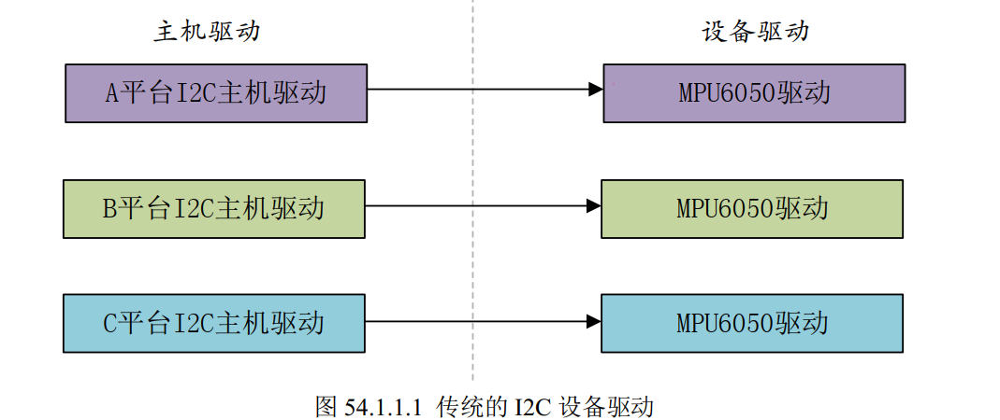
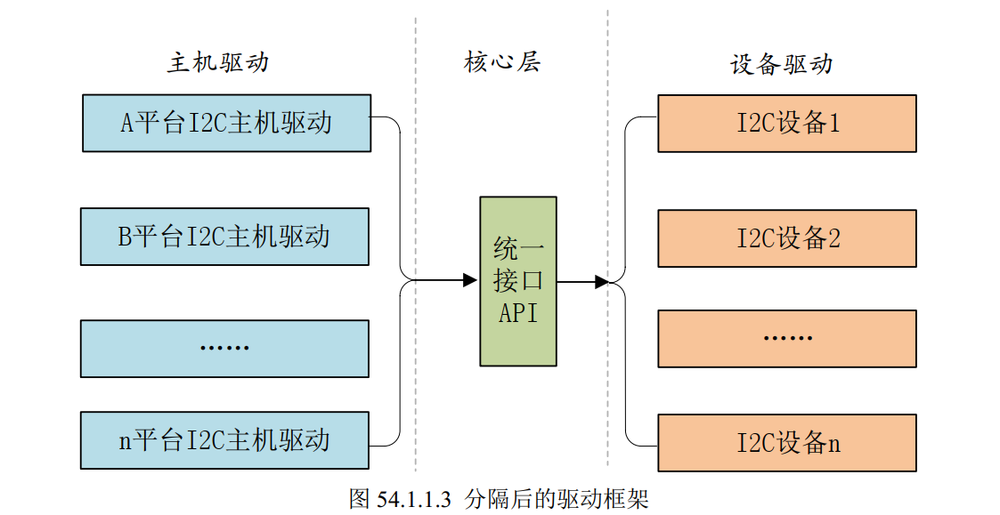

# Platform设备驱动实验

前面几章编写的设备驱动都非常的简单，都是对 IO进行最简单的读写操作。像I2C、SPI、 LCD 等这些复杂外设的驱动就不能这么去写了， Linux 系统要考虑到驱动的可重用性，因此提出了驱动的分离与分层这样的软件思路，在这个思路下诞生了我们将来最常打交道的platform 设备驱动，也叫做平台设备驱动。


## 1. Linux驱动的分离和分层


### 1.1 驱动的分离



单片机驱动：外设控制器驱动和具体设备驱动分离，移植的时候只要改控制器驱动。



在Linux中，驱动分为了3层，主机驱动和核心层都有芯片厂商编写，我们要做的只是使用统一接口API编写具体设备驱动。


### 1.2 驱动的分层


## 2. 驱动——总线——设备

总线代码由Linux内核提供

总线：负责管理挂载对应总线的设备以及驱动；

驱动：具体的设备驱动，负责初始化该设备以及提供一些操作该设备的操作方式；

设备：设备属性，包括：地址范围、速度等


总线管理着两个链表：设备链表 和 驱动链表。

- 当我们向内核注册一个驱动时，便插入到总线的驱动链表。

- 当我们向内核注册一个设备时，便插入到总线的设备链表。

在插入的同时，总线会执行一个` bus_type` 结构体中的 `match` 方法对新插入的 设备/驱动 进行匹配。（例如以名字的方式匹配。方式有很多总，下面再详细分析。）
匹配成功后，会调用 驱动 `device_driver` 结构体中的 `probe` 方法。（通常在 probe 中获取设备资源。具体有开发人员决定。）
在移除设备或驱动时，会调用 `device_driver` 结构体中的 `remove` 方法。


### 2.1 总线

总线是连接处理器和设备之间的桥梁，代表着同类设备需要共同遵循的工作时序。

总线驱动：负责实现总线行为，管理两个链表。

总线结构体：`bus_type`

```c
struct bus_type {
	
    const char *name;//当新注册一种总线类型时，会在 /sys/bus 目录创建一个新的目录，目录名就是该参数的值
	const char		*dev_name;		
	struct device		*dev_root;
	struct device_attribute	*dev_attrs;	/* use dev_groups instead */
	const struct attribute_group **bus_groups;
	const struct attribute_group **dev_groups;
	const struct attribute_group **drv_groups;

	int (*match)(struct device *dev, struct device_driver *drv);	//重点
	int (*uevent)(struct device *dev, struct kobj_uevent_env *env);
	int (*probe)(struct device *dev);								//重点
	int (*remove)(struct device *dev);								//重点
	void (*shutdown)(struct device *dev);

	int (*online)(struct device *dev);
	int (*offline)(struct device *dev);

	int (*suspend)(struct device *dev, pm_message_t state);
	int (*resume)(struct device *dev);

	const struct dev_pm_ops *pm;

	const struct iommu_ops *iommu_ops;

	struct subsys_private *p;
	struct lock_class_key lock_key;
};

```

在实际的驱动开发中，Linux 已经为我们编写好了大部分的总线驱动。但是内核也提供了注册总线的 API:`bus_register()`。


### 2.2 驱动

`driver` 结构体：

```c

struct device_driver 
{
        const char              *name;
        struct bus_type         *bus;

        struct module           *owner;
        const char              *mod_name;      /* used for built-in modules */

        bool suppress_bind_attrs;       /* disables bind/unbind via sysfs */

        const struct of_device_id       *of_match_table;
        const struct acpi_device_id     *acpi_match_table;

        //当驱动和设备匹配后，会执行该回调函数，对设备进行初始化
    	int (*probe) (struct device *dev);	
    
        int (*remove) (struct device *dev);

        const struct attribute_group **groups;
        struct driver_private *p;
};
```


#### 驱动注册

```c
int driver_register(struct device_driver *drv);
返回值：
    成功：0
	失败：负数
```

```c
/*driver_register大致流程*/
driver_register
    ->bus_add_driver			//向总线添加驱动
    	->driver_attach			
    		->bus_for_each_dev	//drv驱动程序会和drv所在总线上连接了的物理设备进行一一匹配
    			->__driver_attach	
    				->driver_probe_device	//开始初始化设备
    					->really_probe
  							->drv->probe(dev);		
```

**向总线注册驱动的时候，会检查当前总线下的所有设备有没有与此驱动匹配的设备，如果有的话就会执行驱动里面的probe函数。**


#### 驱动注销

```c
int driver_unregister(struct device_driver *drv);
```


### 2.3 设备

在 /sys/devices 目录记录了系统中所有的设备。

/sys 下的所有设备文件和 /sys/dev 下的所有设备节点都是链接文件，实际上都指向了对应的设备文件。

device 结构体：

```c
struct device {
	struct device		*parent;

	struct device_private	*p;

	struct kobject kobj;
	const char		*init_name; /* initial name of the device */
	const struct device_type *type;

	struct mutex		mutex;	/* mutex to synchronize calls to
					 * its driver.
					 */

	struct bus_type	*bus;		/* type of bus device is on */
	struct device_driver *driver;	/* which driver has allocated this
					   device */
	void		*platform_data;	/* Platform specific data, device
					   core doesn't touch it */
	void		*driver_data;	/* Driver data, set and get with
					   dev_set/get_drvdata */
	struct dev_pm_info	power;
	struct dev_pm_domain	*pm_domain;
    #ifdef CONFIG_PINCTRL
	struct dev_pin_info	*pins;
#endif

#ifdef CONFIG_NUMA
	int		numa_node;	/* NUMA node this device is close to */
#endif
	u64		*dma_mask;	/* dma mask (if dma'able device) */
	u64		coherent_dma_mask;/* Like dma_mask, but for
					     alloc_coherent mappings as
					     not all hardware supports
					     64 bit addresses for consistent
					     allocations such descriptors. */
	unsigned long	dma_pfn_offset;

	struct device_dma_parameters *dma_parms;

	struct list_head	dma_pools;	/* dma pools (if dma'ble) */

	struct dma_coherent_mem	*dma_mem; /* internal for coherent mem
					     override */
#ifdef CONFIG_DMA_CMA
	struct cma *cma_area;		/* contiguous memory area for dma
					   allocations */
#endif
	/* arch specific additions */
	struct dev_archdata	archdata;

	struct device_node	*of_node; /* associated device tree node */
	......
};
```


#### 设备注册

```c
int device_register(struct device *dev);
返回值：
    正常：0
    失败：负数
```

```c
device_register
	->device_add			//向总线添加设备
		->bus_probe_device
			->device_attach		
				->bus_for_each_drv		//遍历对应总线的每个驱动
					->__device_attach	
						->driver_probe_device	//匹配到对应的驱动
							->really_probe		//驱动执行probe
```

驱动与设备匹配之后驱动的probe函数就会自动执行，==**probe函数就是我们要去编写的。**==


## 3. Platform

前面我们讲了设备驱动的分离，并且引出了总线、驱动和设备模型，比如 I2C、 SPI、 USB 等总线。但是在 SOC 中有些外设是没有总线这个概念的（例如定时器、RTC、LCD等），但是又要使用总线、驱动和设备模型该怎么办呢？为了解决此问题， Linux 提出了 platform 这个虚拟总线，相应的就有 platform_driver 和 platform_device。


### 3.1 platform总线

platform 总线是 bus_type 的一个具体实例，并使用bus_register向内核注册。

```c
struct bus_type platform_bus_type = {
    .name = "platform",
    .dev_groups = platform_dev_groups,
    .match = platform_match,			//重点
    .uevent = platform_uevent,
    .pm = &platform_dev_pm_ops,
};
```


### 3.2 platform_driver

```c
struct platform_driver {
	int (*probe)(struct platform_device *);			//重点
	int (*remove)(struct platform_device *);
	void (*shutdown)(struct platform_device *);
	int (*suspend)(struct platform_device *, pm_message_t state);
	int (*resume)(struct platform_device *);
	struct device_driver driver;					//重点,类似C++的继承
    /*
    struct device_driver driver{
    	......
    	const struct of_device_id       *of_match_table;	//匹配表
    	......
    };
    */
	const struct platform_device_id *id_table;		//设备id表
	bool prevent_deferred_probe;
};
```


#### platform驱动注册

```c
#define platform_driver_register(drv) \
	__platform_driver_register(drv, THIS_MODULE)
	
int __platform_driver_register(struct platform_driver *drv,
				struct module *owner);

```
注册platform设备
    └─> 总线检查驱动链表
        └─> 无匹配驱动，设备等待
            └─> 注册platform驱动
                └─> 总线检查设备链表
                    └─> 匹配成功，调用probe

注册platform驱动
    └─> 总线检查设备链表
        └─> 无匹配设备，驱动等待
            └─> 注册platform设备
                └─> 总线检查驱动链表
                    └─> 匹配成功，调用probe


**仅当设备先注册、驱动后注册时，总线才会主动调用probe；若驱动先注册、设备后注册，则设备注册时触发probe。**


#### platform驱动注销

```c
void platform_driver_unregister(struct platform_driver *drv)
```


### 3.3 platform_device

```c
struct platform_device {
	const char	*name;
	int		id;
	bool		id_auto;
	struct device	dev;
	u32		num_resources;
	struct resource	*resource;

	const struct platform_device_id	*id_entry;
	char *driver_override; /* Driver name to force a match */

	/* MFD cell pointer */
	struct mfd_cell *mfd_cell;

	/* arch specific additions */
	struct pdev_archdata	archdata;
};
```


#### platform设备注册

```c
int platform_device_register(struct platform_device *pdev)
```


#### platform设备注销

```c
void platform_device_unregister(struct platform_device *pdev)
```


### 3.4 platform匹配过程

platform驱动和设备的匹配是通过`platform_bus_type`下的`platform_match`完成的

```c
static int platform_match(struct device *dev, struct device_driver *drv)
{
	struct platform_device *pdev = to_platform_device(dev);
	struct platform_driver *pdrv = to_platform_driver(drv);

	/* When driver_override is set, only bind to the matching driver */
	if (pdev->driver_override)
		return !strcmp(pdev->driver_override, drv->name);

	/* Attempt an OF style match first */
	if (of_driver_match_device(dev, drv))
		return 1;

	/* Then try ACPI style match */
	if (acpi_driver_match_device(dev, drv))
		return 1;

	/* Then try to match against the id table */
	if (pdrv->id_table)
		return platform_match_id(pdrv->id_table, pdev) != NULL;

	/* fall-back to driver name match */
	return (strcmp(pdev->name, drv->name) == 0);
}
```


匹配方式：

- `of_driver_match_device`：如果使用了==**设备树**==，那么匹配过程是通过`platform_match`中的`of_driver_match_device`函数实现
- `acpi_driver_match_device`：
- id_table
- ==比较名字的字符串==：`strcmp(pdev->name, drv->name) `,无设备数的情况下，大部分驱动都是用这种匹配方式。


#### 使用设备树的匹配方式

```c
static inline int of_driver_match_device(struct device *dev,
					 const struct device_driver *drv)
{
	return of_match_device(drv->of_match_table, dev) != NULL;
}


/*of_match_table类型为of_device_id*/
struct of_device_id {
	char	name[32];
	char	type[32];
	char	compatible[128];
	const void *data;
};
```


**of_driver_match_device实际比较的是设备树节点compatible属性与of_device_id数组中compatible字段的字符串前缀匹配，而非完全相等。若匹配成功，设备信息就会从设备树节点转为platform_device结构体。**


## 4. 编程

**当内核支持设备树时，内核会自动将设备树中的信息转为`platform_device`结构体，因此我们只需要完善`platform_driver`结构体。**

一般来说，我们至少要完善`platform_device`中的`remove`函数，`probe`函数，`.driver.of_match_table`设备匹配表和platform驱动名称。`of_match_table`例子如下：

```c
/*C 语言中，当你初始化一个数组时，如果没有显式指定大小，编译器会根据初始化列表的元素数量自动推导数组大小。*/

static struct of_device_id led_of_match[] = {
    {.compatible = "alientek_imx6ull_led"},
    {}						//一定要有一个空结构体
};
```

==**空条目 {} 都是必需的，因为 Linux 内核使用空条目作为 of_device_id 数组的结束标记。如果缺少这个空条目，内核可能无法正确识别数组边界，导致匹配逻辑出错。**==


与之前的例程不同，现在我们使用platform设备驱动后，在`module_init`函数中只需要使用`platform_driver_register`函数来注册platform设备驱动，之后platform总线会检查是否有与该驱动匹配的platform设备，若存在匹配设备，则会调用`platform_driver`中的`probe`函数来初始化设备。`probe`函数就是我们在以前例程的`module_init`函数完成的内容(字符设备驱动注册的一整套流程和设备的初始化)。同理`remove`函数就是之前`module_exit`中的内容，而现在的`module_exit`函数只需要调用`platform_driver_unregister`。

```c
struct platform_driver led_driver = {
    .probe = led_probe,
    .remove = led_remove,
    .shutdown = led_shutdown,  // 设备关机时调用
    .suspend = led_suspend,    // 系统休眠时调用
    .resume = led_resume,      // 系统唤醒时调用
    .driver = {
        .name = "imx6ull_led",
        .of_match_table = led_of_match,
    },
};
```


```c
static int led_probe(struct platform_device *pdev) {
    int ret;
    struct device_node *node = pdev->dev.of_node;
    
    /* 1. 字符设备初始化 */
    ret = alloc_chrdev_region(&led_devno, 0, 1, "imx6ull_led");
    cdev_init(&led_cdev, &led_fops);
    cdev_add(&led_cdev, led_devno, 1);
    
    /* 2. 从设备树获取资源 */
    gpio = of_get_named_gpio(node, "led-gpios", 0);
    if (gpio < 0) {
        printk(KERN_ERR "Failed to get LED GPIO\n");
        return -EINVAL;
    }
    
    /* 3. GPIO初始化 */
    ret = gpio_request(gpio, "led-gpio");
    gpio_direction_output(gpio, 0);
    
    return 0;
}
```


### 4.1实际开发步骤
驱动开发步骤：
1. 定义platform_driver结构体，**==一定要初始化的属性有：`.probe`、`.remove`、`.driver.name`、`.driver.of_match_table`==**
2. 实现probe函数（字符设备注册 + 硬件初始化）
3. 实现remove函数（资源释放 + 字符设备注销）
4. 定义of_device_id匹配表
5. 模块加载 / 卸载函数中注册 / 注销驱动


调试方法：dmesg查看probe/remove函数日志

