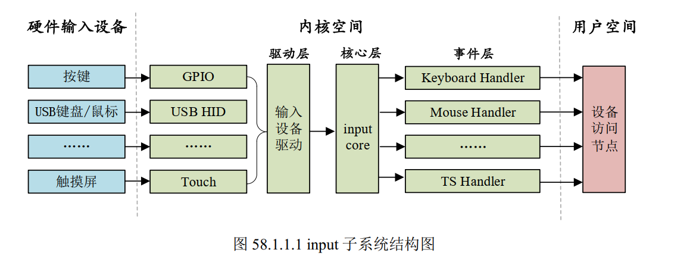

# Linux Input子系统驱动开发笔记

Input子系统是Linux内核专门为输入设备（如键盘、鼠标、触摸屏、按键、游戏杆等）设计的一套框架，它统一了各类输入设备的驱动接口，简化了输入设备的开发流程。

## 1. Input子系统概述

### 1.1 Input子系统的作用
- 统一管理所有输入设备的驱动，屏蔽硬件差异
- 提供标准化的事件报告机制（如按键按下、坐标变化等）
- 自动创建设备节点（通常在`/dev/input`目录下）
- 支持多种输入设备类型：按键、鼠标、触摸屏、操纵杆等

### 1.2 Input子系统的分层结构

Input子系统整体分为3层：
1. 硬件层
2. 内核空间
3. 应用层

我们主要关注内核空间部分

Input子系统在内核空间部分从上到下分为三层：

1. **Input事件处理层**：**==Input 子系统的事件处理层会为每个输入设备创建/dev/input/eventX设备节点，并将驱动上报的输入事件通过该节点传递给用户空间的应用程序，供 APP 读取。==**
2. **Input核心层**：`input.c`实现，提供核心数据结构和API，连接驱动层和事件处理层，通知事件层对输入事件进行处理
3. **Input驱动层**：具体输入设备的驱动实现，负责硬件操作并向核心层报告事件





## 2. Input子系统核心数据结构

在`include/linux/input.h`中定义了Input子系统的**主设备号是13**，因此我们向linux注册的输入设备都是Input的子设备。

### 2.1 input_dev结构体
`input_dev`是Input设备驱动的核心结构体，定义在`include/linux/input.h`中，用于描述一个输入设备的能力和属性：

```c
struct input_dev {
    const char *name;          // 设备名称
    const char *phys;          // 物理路径（如"input/ts0770"）
    const char *uniq;          // 唯一标识符
    struct input_id id;        // 设备ID（用于匹配事件处理层）

    unsigned long propbit[BITS_TO_LONGS(INPUT_PROP_CNT)];  // 设备属性

    // 支持的事件类型（如EV_KEY、EV_REL、EV_ABS等）
    unsigned long evbit[BITS_TO_LONGS(EV_CNT)];
    // 支持的按键类型（如KEY_0、KEY_1等）
    unsigned long keybit[BITS_TO_LONGS(KEY_CNT)];
    // 支持的相对坐标类型（如REL_X、REL_Y等）
    unsigned long relbit[BITS_TO_LONGS(REL_CNT)];
    // 支持的绝对坐标类型（如ABS_X、ABS_Y等）
    unsigned long absbit[BITS_TO_LONGS(ABS_CNT)];
    // 其他事件类型的位掩码...

    struct device dev;         // 设备结构体
    struct list_head h_list;   // 与该设备关联的handler列表
    struct list_head node;     // 用于将设备添加到input_dev_list
};
```

```c
/*事件类型*/    
#define EV_SYN			0x00        //同步事件
#define EV_KEY			0x01        //按键
#define EV_REL			0x02        //relative,相对坐标
#define EV_ABS			0x03        //absolute,绝对坐标
#define EV_MSC			0x04        //杂项事件
#define EV_SW			0x05        //switch,开关事件
#define EV_LED			0x11        //LED
#define EV_SND			0x12        //sound,声音
#define EV_REP			0x14        //repeat,重复事件
#define EV_FF			0x15        //压力事件
#define EV_PWR			0x16        //电源事件
#define EV_FF_STATUS		0x17    //压力状态事件
#define EV_MAX			0x1f        //事件最大的编号
#define EV_CNT			(EV_MAX+1)  //总事件数量
```
例如，我们要使用案件，就要注册`EV_KEY`，如果要使用连按功能还要注册`EV_REP`事件。本章实验要使用按键事件，因此要使用到`evbit`和`keybit`。在`include/uapi/linux/input.h`中定义了很多按键值
```c
#define KEY_RESERVED		0
#define KEY_ESC			1
#define KEY_1			2
#define KEY_2			3
#define KEY_3			4
#define KEY_4			5
#define KEY_5			6
#define KEY_6			7
#define KEY_7			8
#define KEY_8			9
#define KEY_9			10
#define KEY_0			11
......
#define BTN_TRIGGER_HAPPY38		0x2e5
#define BTN_TRIGGER_HAPPY39		0x2e6
#define BTN_TRIGGER_HAPPY40		0x2e7
```
我们可以把开发板上的案件设置为上面按键值的任意一个，在本章实验我们将开发板上的案件设置为`key_0`。


## 3. Input 子系统核心 API
### 3.1 设备分配、注册与注销
分配输入设备

```c
struct input_dev* input_allocate_device(void)
--返回值：申请到的input_dev
```

释放输入设备的资源
```c
void input_free_device(struct input_dev *dev)    //释放资源
```


### 3.2 设备注册与注销

注册输入设备
```c
int input_register_device(struct input_dev *dev);
```
- 功能：向 Input 核心层注册输入设备
- 参数：初始化完成的input_dev结构体指针
- 返回值：0 表示成功，负数表示失败

注销输入设备
```c
void input_unregister_device(struct input_dev *dev);
```
- 功能：从 Input 核心层注销输入设备
- 参数：已注册的input_dev结构体指针

### 3.3 事件报告函数

**输入设备驱动需要在发生输入事件时向核心层上报(例如按键消抖结束后)** 通过以下函数向核心层报告事件：


`input_event`函数可以上报所有的事件类型以及对应的值：
```c
void input_event(struct input_dev *dev,
		 unsigned int type, unsigned int code, int value)

--dev：需要上报的input_dev
--type：上报的事件类型
--code：事件码，就是我们注册的按键值KEY_0
--value：事件值，比如1表示按键按下，0表示按键松开
```

下面表格中的函数只针对具体事件的上报：

|函数	|功能|
|----|----|
|void input_report_key(struct input_dev *dev, unsigned int code, int value)	|报告按键事件|
|void input_report_rel(struct input_dev *dev, unsigned int code, int value)	|报告相对坐标事件|
|void input_report_abs(struct input_dev *dev, unsigned int code, int value)	|报告绝对坐标事件|
|void input_sync(struct input_dev *dev)	|同步事件，通知核心层一个完整事件序列结束|

上面这些函数的具体实现方式其实也是通过`input_event`实现的

==**注意：每次报告完一组事件后，必须调用input_sync()进行同步**==

例子：
```c
//用于消抖的定时器函数
static irqreturn_t timer_handler(int irq, void *dev_id) {
    int value;
    
    // 消抖处理
    value = gpio_get_value(KEY_GPIO);
    
    // 报告按键事件（KEY_0为例）
    if (value == 0) {                // 按键按下
        input_report_key(key_dev, KEY_0, 1);
    } else {                         // 按键释放
        input_report_key(key_dev, KEY_0, 0);
    }
    input_sync(key_dev);             // 同步事件
    
    return IRQ_HANDLED;
}

```

### 3.4 事件结构体

```c
struct input_event {
	struct timeval time;
	__u16 type;
	__u16 code;
	__s32 value;
};

struct timeval {
	__kernel_time_t		tv_sec;		/* seconds */
	__kernel_suseconds_t	tv_usec;	/* microseconds */
};

--time: 事件发生的时间
--type：事件类型，比如EV_KEY
--code：事件码，比如KEY_0
--value：在按键事件中，该值就代表按键值，其他事件同理
```


## 4. Input 设备驱动开发流程
### 4.1 基本开发步骤
1. 分配input_dev结构体
   ```c
   struct input_dev* input_allocate_device(void)
   --返回值：申请到的input_dev
   ```

2. 初始化input_dev结构体,**设置input_dev名字，设置支持的事件类型`evbits`和具体事件`keybit或者relbit或者absbit`**
3. 注册input_dev结构体
      ```c
    int input_register_device(struct input_dev *dev)
    --输入：要初始化的input_dev
    --返回值：0，注册成功；负数，注册失败
   ```
4. 在中断服务程序或定时器中检测硬件状态变化，报告事件
   ```c
   //用于消抖的定时器函数
    static irqreturn_t timer_handler(int irq, void *dev_id) {
        int value;
        
        // 消抖处理
        value = gpio_get_value(KEY_GPIO);
        
        // 报告按键事件（KEY_0为例）
        if (value == 0) {                // 按键按下
            input_report_key(key_dev, KEY_0, 1);
        } else {                         // 按键释放
            input_report_key(key_dev, KEY_0, 0);
        }
        input_sync(key_dev);             // 同步事件
        
        return IRQ_HANDLED;
    }
   ```
5. 注销input_dev结构体，释放资源
   ```c
    void input_unregister_device(struct input_dev *dev) //注销
    void input_free_device(struct input_dev *dev)    //释放资源
   ```

### 4.2 驱动例子 

```c
struct input_dev *inputdev;

//用于消抖的定时器函数
static irqreturn_t timer_handler(int irq, void *dev_id) {
    int value;
    
    // 消抖处理
    value = gpio_get_value(KEY_GPIO);
    
    // 报告按键事件（KEY_0为例）
    if (value == 0) {                // 按键按下
        input_report_key(key_dev, KEY_0, 1);
    } else {                         // 按键释放
        input_report_key(key_dev, KEY_0, 0);
    }
    input_sync(key_dev);             // 同步事件
    
    return IRQ_HANDLED;
}


//驱动入口函数
static int __init xxx_init(void)
{
    ......
    //分配input_dev结构体
    inputdev = input_allocate_device();     

    //初始化input_dev结构体
    key_dev->name = KEY_NAME;
    __set_bit(EV_KEY,inputdev->evbits);     //设置事件类型
    __set_bit(EV_REP,inputdev->evbits);     //设置事件类型
    __set_bit(KEY_0,inputdev->keybit);      //设置按键值

    //注册input_dev结构体
    input_register_device(inputdev);

    ......

    return 0;

}

static void __exit xxx_exit(void)
{
    //注销输入设备
    input_unregister_device(inputdev);
    //释放输入设备资源
    input_free_device(inputdev);
}
```

## 5. Input 子系统APP开发流程

### 5.1 例子

```c
#include <stdio.h>
#include <stdlib.h>
#include <fcntl.h>
#include <unistd.h>
#include <linux/input.h>
#include <sys/ioctl.h>


#define KEY_PRESS 0
#define KEY_RELEASE 1

int main(int argc, char *argv[]) {
    if (argc != 2) {
        fprintf(stderr, "用法: %s /dev/input/eventX\n", argv[0]);
        return 1;
    }

    int fd = open(argv[1], O_RDONLY);
    if (fd < 0) {
        perror("open");
        return 1;
    }

    char name[256] = "Unknown";
    ioctl(fd, EVIOCGNAME(sizeof(name)), name);		//获取输入设备名称，也就是Input设备注册时候输入的名字
    printf("正在监控设备: %s (%s)\r\n", argv[1], name);

    struct input_event ev;		//创建input_event结构体，通过/dev/input/eventX节点获取驱动上报的事件
    while (1) {
        ssize_t n = read(fd, &ev, sizeof(ev));
        if (n < sizeof(ev)) {
            perror("read\r\n");
            break;
        }

        printf("时间: %ld.%06ld, 类型: \r\n", ev.time.tv_sec, ev.time.tv_usec);
        switch (ev.type) {			//针对不同的事件类型做出不同的反应
            case EV_KEY:
                printf("按键事件, 键码: %d, %s\r\n", 
                       ev.code, ev.value==KEY_PRESS ? "按下" : "释放");
                break;

            case EV_REL:
                printf("相对坐标事件, 坐标: ");
                switch (ev.code) {
                    case REL_X: printf("X=%d\n", ev.value); break;
                    case REL_Y: printf("Y=%d\n", ev.value); break;
                    default: printf("未知(%d)=%d\n", ev.code, ev.value);
                }
                break;
            case EV_ABS:
                printf("绝对坐标事件, 坐标: ");
                switch (ev.code) {
                    case ABS_X: printf("X=%d\n", ev.value); break;
                    case ABS_Y: printf("Y=%d\n", ev.value); break;
                    default: printf("未知(%d)=%d\n", ev.code, ev.value);
                }
                break;
            case EV_SYN:
                //不做处理
                break;
            default:
                printf("其他事件(type=%d), code=%d, value=%d\n", 
                       ev.type, ev.code, ev.value);
        }
    }

    close(fd);
    return 0;
}
```


## 6. Linux内核自带的按键输入

Linux 内核也自带了 KEY 驱动，如果要使用内核自带的 KEY 驱动的话需要配置 Linux 内核，不过 Linux 内核一般默认已经使能了 KEY 驱动，但是我们还是要检查一下。按照如下路径找到相应的配置选项：

```bash
-> Device Drivers
	-> Input device support
		-> Generic input layer (needed for keyboard, mouse, ...) (INPUT [=y])
			-> Keyboards (INPUT_KEYBOARD [=y])
				->GPIO Buttons
```

要使用Linux内核自带的按键驱动程序很简单，只需要根据Documentation/devicetree/bindings/input/gpio-keys.txt 这个文件在设备树中添加指定的设备节点即可，节点要求如下：
