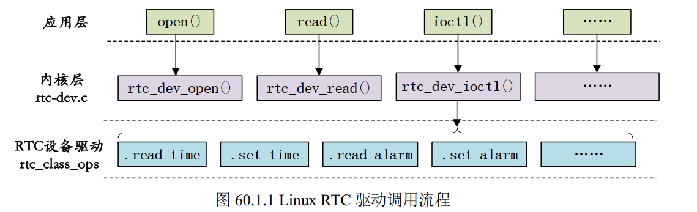

# Linux RTC实时时钟

## 一、RTC驱动核心概念


### 1. RTC硬件基础
RTC使用很简单，只需要打开RTC，然后读取RTC计数器的值，获取时间值；或者向RTC计数器写入值，调整时间.

### 2. Linux RTC设备驱动
RTC 设备驱动是一个标准的字符设备驱动，应用程序通过 open、 release、 read、 write 和 ioctl
等函数完成对 RTC 设备的操作，

RTC设备的结构体`rtc_device`如下,RTC 设备驱动就是申请并初始化`rtc_device`，最后将 rtc_device 注册到Linux内核里面。
```c
struct rtc_device
{
	struct device dev;
	struct module *owner;

	int id;
	char name[RTC_DEVICE_NAME_SIZE];

    //重点，这个结构体里面包含了RTC设备底层操作函数集合，包括读取时间，写入新时间
	const struct rtc_class_ops *ops;  

	struct mutex ops_lock;

	struct cdev char_dev;
	unsigned long flags;

	unsigned long irq_data;
	spinlock_t irq_lock;
	wait_queue_head_t irq_queue;
	struct fasync_struct *async_queue;
    ......


};
```

```c
//rtc最底层的操作函数，并不是提供给应用层的file_operations操作函数集
struct rtc_class_ops {
	int (*open)(struct device *);
	void (*release)(struct device *);
	int (*ioctl)(struct device *, unsigned int, unsigned long);
	int (*read_time)(struct device *, struct rtc_time *);
	int (*set_time)(struct device *, struct rtc_time *);
	int (*read_alarm)(struct device *, struct rtc_wkalrm *);
	int (*set_alarm)(struct device *, struct rtc_wkalrm *);
	int (*proc)(struct device *, struct seq_file *);
	int (*set_mmss64)(struct device *, time64_t secs);
	int (*set_mmss)(struct device *, unsigned long secs);
	int (*read_callback)(struct device *, int data);
	int (*alarm_irq_enable)(struct device *, unsigned int enabled);
};
```

在`drivers/rtc/rtc-dev.c`中定义了RTC设备通用的操作函数集，如下所示。这些函数就是依赖于`rtc_device`中的`ops`函数集中的底层操作函数实现的。
```c

static const struct file_operations rtc_dev_fops = {
	.owner		= THIS_MODULE,
	.llseek		= no_llseek,
	.read		= rtc_dev_read,
	.poll		= rtc_dev_poll,
	.unlocked_ioctl	= rtc_dev_ioctl,
	.open		= rtc_dev_open,
	.release	= rtc_dev_release,
	.fasync		= rtc_dev_fasync,
};
```




### 3. 驱动开发流程


## 二、RTC应用开发

### 1.用户空间访问接口

### 2.应用编程示例