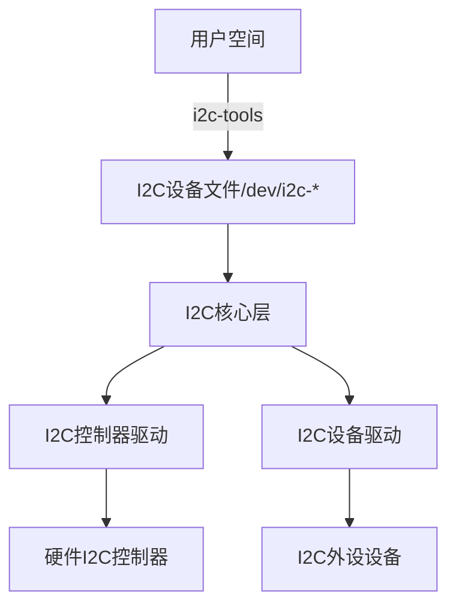

# Linux I2C驱动开发笔记

## 一、I2C核心概念

### 1. I2C物理层特性
- **半双工**
- **同步通信**，有独立的时钟线
- **两线制**：SCL（时钟线）、SDA（数据线）
- **通信速度**：
  - 标准模式：100Kbps
  - 快速模式：400Kbps
  - 高速模式：3.4Mbps
- **地址机制**：7位/10位设备地址（0x00-0x7F）

### 2. Linux I2C子系统架构


## 二、IIC控制器驱动开发

### 1. 设备树配置

......
### 2. 驱动框架

#### 2.1 I2C总线
I2C总线驱动的重点是IIC适配器（也就是SOC的**IIC接口控制器**）驱动，该驱动中有2个重要的数据结构：`i2c_algorithm`和`i2c_adapter`.

```c
struct i2c_adapter {
	struct module *owner;
	unsigned int class;		  /* classes to allow probing for */
	const struct i2c_algorithm *algo; /* 总线访问算法 */
	void *algo_data;

	/* data fields that are valid for all devices	*/
	struct rt_mutex bus_lock;

	int timeout;			/* in jiffies */
	int retries;
	struct device dev;		/* the adapter device */

	int nr;
	char name[48];
	struct completion dev_released;

	struct mutex userspace_clients_lock;
	struct list_head userspace_clients;

	struct i2c_bus_recovery_info *bus_recovery_info;
	const struct i2c_adapter_quirks *quirks;
};

```
`i2c_adapter`的成员变量`const struct i2c_algorithm *algo`就是供I2C设备访问I2C总线的函数。

```c
struct i2c_algorithm {
	/* If an adapter algorithm can't do I2C-level access, set master_xfer
	   to NULL. If an adapter algorithm can do SMBus access, set
	   smbus_xfer. If set to NULL, the SMBus protocol is simulated
	   using common I2C messages */
	/* master_xfer should return the number of messages successfully
	   processed, or a negative value on error */
	int (*master_xfer)(struct i2c_adapter *adap, struct i2c_msg *msgs,
			   int num);
	int (*smbus_xfer) (struct i2c_adapter *adap, u16 addr,
			   unsigned short flags, char read_write,
			   u8 command, int size, union i2c_smbus_data *data);

	/* To determine what the adapter supports */
	u32 (*functionality) (struct i2c_adapter *);

#if IS_ENABLED(CONFIG_I2C_SLAVE)
	int (*reg_slave)(struct i2c_client *client);
	int (*unreg_slave)(struct i2c_client *client);
#endif
};

```
`master_xfer`就是I2C控制器的传输函数，通过此函数就可以完成与I2C设备之间的通信。

`smbus_xfer`是SMBUS总线的传输函数。(SMBus全称是System Management Bus，中文是系统管理总线。SMBus最初的目的是为智能电池、充电电池、其他微控制器之间的通信链路而定义的。SMBus也被用来连接各种设备，包括电源相关设备，系统传感器，EEPROM通讯设备等等。**SMBus是基于I2C协议的，SMBus要求更严格，SMBus是I2C协议的子集。**)

**综上所述**，I2C控制器的主要工作就是初始化`i2c_adapter`的成员变量，然后设置`i2c_algorithm`中的函数。最后通过`i2c_add_adapter`或`i2c_add_numbered_adapter`向系统注册设置好的`i2c_adapter`。

```c
int i2c_add_adapter(struct i2c_adapter *);
void i2c_del_adapter(struct i2c_adapter *);
int i2c_add_numbered_adapter(struct i2c_adapter *);
```

**一般来说，I2C控制器驱动都由半导体厂商完成，我们只需要专注于I2C设备驱动编写。**

## 三、I2C设备驱动开发

### 3.1 i2c_client设备结构体

```c
struct i2c_client {
	unsigned short flags;		/* 标志		*/
	unsigned short addr;		/* 设备地址，7位	*/
					/* addresses are stored in the	*/
					/* _LOWER_ 7 bits		*/
	char name[I2C_NAME_SIZE];	/*名字*/
	struct i2c_adapter *adapter;	/* 对应的i2c控制器	*/
	struct device dev;		/* 设备结构体		*/
	int irq;			/* 中断号		*/
	struct list_head detected;
#if IS_ENABLED(CONFIG_I2C_SLAVE)
	i2c_slave_cb_t slave_cb;	/* callback for slave mode	*/
#endif
};
```

内核每从设备树中检测到一个I2C设备就会给该I2C设备分配一个i2c_client。


### 3.2 i2c_driver驱动结构体

i2c_driver类似于platform_driver，是编写I2C设备驱动的重点。
```c
struct i2c_driver {
	unsigned int class;

	/* Notifies the driver that a new bus has appeared. You should avoid
	 * using this, it will be removed in a near future.
	 */
	int (*attach_adapter)(struct i2c_adapter *) __deprecated;

	/* Standard driver model interfaces */
	int (*probe)(struct i2c_client *, const struct i2c_device_id *);	//重点,第二个参数是I2C设备ID
	int (*remove)(struct i2c_client *);	

	/* driver model interfaces that don't relate to enumeration  */
	void (*shutdown)(struct i2c_client *);

	/* Alert callback, for example for the SMBus alert protocol.
	 * The format and meaning of the data value depends on the protocol.
	 * For the SMBus alert protocol, there is a single bit of data passed
	 * as the alert response's low bit ("event flag").
	 */
	void (*alert)(struct i2c_client *, unsigned int data);

	/* a ioctl like command that can be used to perform specific functions
	 * with the device.
	 */
	int (*command)(struct i2c_client *client, unsigned int cmd, void *arg);

	struct device_driver driver;			//重点
	const struct i2c_device_id *id_table;

	/* Device detection callback for automatic device creation */
	int (*detect)(struct i2c_client *, struct i2c_board_info *);
	const unsigned short *address_list;
	struct list_head clients;
};****
```

`device_driver`标准驱动结构体，==**若内核支持设备树，则需设置该成员变量的`of_match_table`属性。**==

#### 3.2.1 id_table

```c
struct i2c_driver {
	......
	const struct i2c_device_id *id_table;
	......
}


struct i2c_device_id {
	char name[I2C_NAME_SIZE];//该字段会与i2c设备的name匹配，如果使用设备树的话就是i2c设备节点的名称
	kernel_ulong_t driver_data;	/* Data private to the driver */
};
```

`id_table`是传统的、未使用设备树的设备匹配ID表。
==**但必须定义给i2c_driver的id_table赋值！！！**==
```c
/*i2c_core.c*/
static int i2c_device_probe(struct device *dev)
{
	......
	driver = to_i2c_driver(dev->driver);

	//若driver->id_table为空，则直接判定为找不到设备
	if (!driver->probe || !driver->id_table)	
		return -ENODEV;
	......
}
```


例子
```c
static const struct i2c_device_id ap3216c_id[] = {
    { "ap3216c", 0 },
    {}
};

//与of_match_table相同，以空结构体为搜索停止点
```

当I2C设备和驱动匹配成功后，probe函数就会执行。

对于我们I2C设备驱动编写人来说，重点就是构建`i2c_driver`，并在构建完成后向内核注册这个i2c_driver。

#### 3.2.2 I2C驱动注册函数
```c
int i2c_register_driver(struct module *owner, struct i2c_driver *driver);

-- owner：一般为THIS_MODULE.
-- driver:要注册的I2C设备驱动

#define i2c_add_driver(driver) \
	i2c_register_driver(THIS_MODULE, driver)
```

#### 3.2.3 I2C驱动卸载函数
```C
void i2c_del_driver(struct i2c_driver *driver);
```

### 3.3 i2c驱动编写流程

```c
/* i2c 驱动的 probe 函数 */
static int xxx_probe(struct i2c_client *client, const struct i2c_device_id *id)
{
	/* 函数具体程序 */
	/*字符设备驱动的流程*/
	return 0;
}

/* i2c 驱动的 remove 函数 */
static int xxx_remove(struct i2c_client *client)
{
	/* 函数具体程序 */
	return 0;
}

/* 传统匹配方式 ID 列表 */
static const struct i2c_device_id xxx_id[] = {
	{"xxx", 0},
	{}
};

/* 设备树匹配列表 */
static const struct of_device_id xxx_of_match[] = {
	{ .compatible = "xxx" },
	{ /* Sentinel */ }
};

/* i2c 驱动结构体 */
static struct i2c_driver xxx_driver = {
	.probe = xxx_probe,
	.remove = xxx_remove,
	.driver = {
		.owner = THIS_MODULE,
		.name = "xxx",
		.of_match_table = xxx_of_match,
	},
	.id_table = xxx_id,
};

/* 驱动入口函数 */
static int __init xxx_init(void)
{
	int ret = 0;

	ret = i2c_add_driver(&xxx_driver);
	return ret;
}

/* 驱动出口函数 */
static void __exit xxx_exit(void)
{
	i2c_del_driver(&xxx_driver);
}

module_init(xxx_init);
module_exit(xxx_exit);
```

## 四、I2C设备的设备树节点
NXP官方的EVK开发板再I2C1上接了一个mag3110磁力计芯片，该设备的设备树节点如下：
```c
&i2c1 {
	clock-frequency = <100000>;
	pinctrl-names = "default";
	pinctrl-0 = <&pinctrl_i2c1>;
	status = "okay";

	mag3110@0e {						//0e是该i2c设备的器件地址
		compatible = "fsl,mag3110";
		reg = <0x0e>;
		position = <2>;
	};
};
```

## 五、I2C设备数据收发流程

### 5.1 i2c_transfer函数
在I2C设备驱动的probe函数中，我们需要进行字符设备的初始化，那么要初始化I2C设备，就必须对I2C设备寄存器进行读写操作。

```c
int i2c_transfer(struct i2c_adapter *adap, struct i2c_msg *msgs,
			int num);

-- adap:使用的I2C适配器，i2c_client会保存其对应的i2c_adapter
-- msgs:要发送的一个或多个信息
-- num:要发送信息的数量
返回值：
	负值：失败
	非负值：发送消息的数量
```


**i2c_transfer完成的是一个写器件地址（读/写标志）和读/写操作。在I2C协议中，读操作一般进行2次`i2c_transfer`，写操作只需一次。**
- **==读==从机数据的操作要发送==2次消息==，需要进行2次`i2c_transfer`。**
  - 第一次传输：发送器件地址（写标志）+ 寄存器地址。作用：告诉从机 “我接下来要读哪个寄存器”
  - 第二次传输：发送器件地址（读标志）+ 接受数据。作用：从指定寄存器读取数据
- **向从机==写==数据要发送==一次消息==，需要进行1次`i2c_transfer`**
  - 一次传输：发送器件地址（写标志）+ 寄存器地址 + 数据


### 5.2 i2c_msg消息结构体
```c
struct i2c_msg {
	__u16 addr;	/* 从机地址			*/
	__u16 flags;	/*标志*/

#define I2C_M_TEN		0x0010	/* 表示这是一个 10 位地址的 I2C 设备。I2C 地址通常是 7 位，但也支持 10 位地址模式。*/
					/*设置此标志后，驱动会将 addr 字段解释为 10 位地址。 */
#define I2C_M_RD		0x0001	/* 数据将从从设备（slave）传输到主设备（master）。如果未设置此标志，则默认为写操作。 */
#define I2C_M_STOP		0x8000	/* 在传输结束时发送 STOP 条件。此标志需要硬件支持 I2C_FUNC_PROTOCOL_MANGLING 功能。 */
#define I2C_M_NOSTART		0x4000	/* 不发送 START 条件。用于在已建立的 I2C 会话中继续传输，需要硬件支持 I2C_FUNC_NOSTART 功能。 */
#define I2C_M_REV_DIR_ADDR	0x2000	/* 反转传输方向时不改变从设备地址。通常在读写操作切换时需要重新发送地址，但设置此标志后可以省略这一步，需要硬件支持 I2C_FUNC_PROTOCOL_MANGLING。 */
#define I2C_M_IGNORE_NAK	0x1000	/*忽略从设备的 NAK（非应答）信号。正常情况下，接收到 NAK 表示传输失败，但设置此标志后会继续传输，需要硬件支持 I2C_FUNC_PROTOCOL_MANGLING。 */
#define I2C_M_NO_RD_ACK		0x0800	/* 在读操作中不发送 ACK（应答）信号。用于特殊设备的通信需求，需要硬件支持 I2C_FUNC_PROTOCOL_MANGLING。 */
#define I2C_M_RECV_LEN		0x0400	/* 表示接收的第一个字节是数据长度。用于自动确定接收数据的长度，常见于某些传感器设备 */
	__u16 len;		/* 本次发送的消息长度				*/
	__u8 *buf;		/* 要发送的消息			*/
};

```
`i2c_msg`结构体中的宏定义用于设置I2C消息结构体中的标志，可以使用或运算来组合使用。部分标志（如 `I2C_M_STOP`、`I2C_M_NOSTART` 等）需要硬件控制器支持特定功能。在使用前，通常需要通过 `i2c_check_functionality()` 检查控制器是否支持这些功能。

### 5.3 发数据示例

```c
/* 设备结构体 */
struct xxx_dev {
......
void *private_data; /* 私有数据，一般会设置为 i2c_client */
};

/*
 * @description : 读取 I2C 设备多个寄存器数据
 * @param – dev : I2C 设备
 * @param – reg : 要读取的寄存器首地址
 * @param – val : 读取到的数据
 * @param – len : 要读取的数据长度
 * @return : 操作结果
 */
static int xxx_read_regs(struct xxx_dev *dev, u8 reg, void *val,
int len)
{
	int ret;
	struct i2c_msg msg[2];
	struct i2c_client *client = (struct i2c_client *)
	dev->private_data;

	/* msg[0]，第一条写消息，发送要读取的寄存器首地址 */
	msg[0].addr = client->addr; /* I2C 器件地址 */
	msg[0].flags = 0; /* 标记为发送数据 */
	msg[0].buf = &reg; /* 读取的首地址 */
	msg[0].len = 1; /* reg 长度 */

	/* msg[1]，第二条读消息，读取寄存器数据 */
	msg[1].addr = client->addr; /* I2C 器件地址 */
	msg[1].flags = I2C_M_RD; /* 标记为读取数据 */
	msg[1].buf = val; /* 读取数据缓冲区 */
	msg[1].len = len; /* 要读取的数据长度 */
	ret = i2c_transfer(client->adapter, msg, 2);	//发送2次消息
	if(ret == 2) {
		ret = 0;
	} else {
		ret = -EREMOTEIO;
	}
	return ret;
}

/*
 * @description : 向 I2C 设备多个寄存器写入数据
 * @param – dev : 要写入的设备结构体
 * @param – reg : 要写入的寄存器首地址
 * @param – buf : 要写入的数据缓冲区
 * @param – len : 要写入的数据长度
 * @return : 操作结果
 */
static s32 xxx_write_regs(struct xxx_dev *dev, u8 reg, u8 *buf,
u8 len)
{
	u8 b[256];
	struct i2c_msg msg;
	struct i2c_client *client = (struct i2c_client *)
	dev->private_data;

	b[0] = reg; /* 寄存器首地址 */
	memcpy(&b[1],buf,len); /* 将要发送的数据拷贝到数组 b 里面 */

	msg.addr = client->addr; /* I2C 器件地址 */
	msg.flags = 0; /* 标记为写数据 */

	msg.buf = b; /* 要发送的数据缓冲区 */
	msg.len = len + 1; /* 要发送的数据长度 */

	return i2c_transfer(client->adapter, &msg, 1);	//发送一次消息
	}
```


## 六、实际开发流程

1. 设备树配置
   - 添加设备节点，指定 compatible、reg 等属性。
  
2. 驱动框架实现
   - 定义 i2c_driver 结构体，填充 probe、remove 和 of_match_table等其他属性。
3. 驱动注册与注销
   - 使用 i2c_add_driver() 和 i2c_del_driver() 管理驱动生命周期。
4. 设备操作实现
   - 在 probe 中初始化设备，在 remove 中释放资源。
   - 使用 i2c_transfer() 实现读写操作。
5. 用户空间接口（可选）
   - 通过字符设备、sysfs 等提供用户空间访问方式。

## 七、问题

### 7.1 问题一
==**i2c设备在编写设备驱动时，必须要同时设置`of_device_id`和`i2c_device_id`,否则驱动无法匹配到i2c设备。**==
```c
//I2C设备驱动
static struct of_device_id ap3216c_match_table[] = {
    {.compatible = "alientek,ap3216c"},
    {}
};
static const struct i2c_device_id ap3216c_id[] = {
    { "ap3216c", 0 },
    {}
};

static struct i2c_driver ap3216c_driver = {
    .probe = ap3216c_probe,
    .remove = ap3216c_remove,
    .driver = {
        .name = "ap3216c",
        .owner = THIS_MODULE,
        .of_match_table = ap3216c_match_table,
    },
    .id_table = ap3216c_id,
};
```

### 7.2 问题二

貌似是因为ap3216c这个传感器的原因，只能循环读取，不能一次读6个字节

```c
static int ap3216c_read_data(struct ap3216c_dev *dev)
{
    int ret= 0;
    int i;

    u8 buf[6];

    for(i=0;i<6;i++)
    {
        ap3216c_read_regs(dev,AP3216C_IRDATALOW+i,buf+i,1);
    }
    // ret = ap3216c_read_regs(dev,AP3216C_IRDATALOW,buf,6);
	......
```


