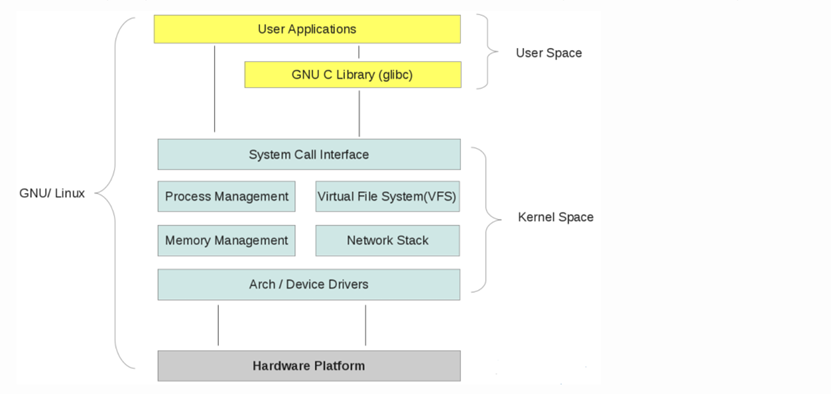
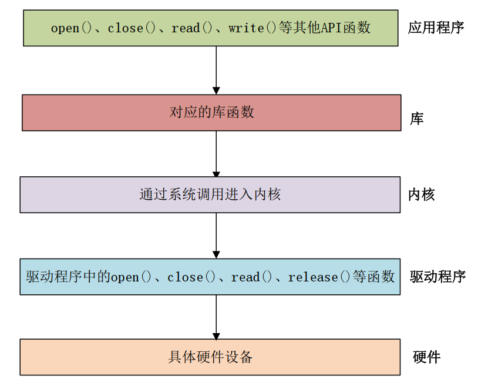

# 字符设备驱动
linux驱动分为3类
- 字符设备驱动：如GPIO、LED、串口、蜂鸣器、声卡等。	
- 块设备驱动：存储设备，如U盘、硬盘、TF卡等。
- 网络设备驱动：通信设备，如wifi、以太网等。


驱动就是获取外设、传感器数据，或者控制外设、传感器

Linux驱动编译既要编写一个驱动，还要我们编写一个简单的测试应用程序，APP。单片机下驱动和应用都是放到一个文件里面，也就是杂糅到一起。

Linux下驱动和应用是完全分开的。


## 用户空间和内核空间

（例子）对 32 位操作系统而言，它的寻址空间（虚拟地址空间，或叫线性地址空间）为 4G（2的32次方）。也就是说一个进程的最大地址空间为 4G。操作系统的核心是内核(kernel)，它独立于普通的应用程序，可以访问受保护的内存空间，也有访问底层硬件设备的所有权限。为了保证内核的安全，现在的操作系统一般都强制用户进程不能直接操作内核。具体的实现方式基本都是由操作系统将虚拟地址空间划分为两部分，一部分为内核空间，另一部分为用户空间。针对 Linux 操作系统而言，最高的 1G 字节(从虚拟地址 0xC0000000 到 0xFFFFFFFF)由内核使用，称为内核空间。而较低的 3G 字节(从虚拟地址 0x00000000 到 0xBFFFFFFF)由各个进程使用，称为用户空间。

**linux操作系统内核和驱动程序运行在内核空间**

**应用程序运行在用户空间**

**当进程运行在内核空间时就处于内核态**，**而进程运行在用户空间时则处于用户态**。

**应用程序想要访问内核资源有3种方法：系统调用、软中断和硬件中断。（应用程序一般使用系统调用）**

应用程序不会直接调用系统调用，而是通过API函数来间接的调用系统调用，比如POSIX、API和C库等。unix类操作系统中最常用的编程接口就是POSIX。

例如：c库的printf函数，最终通过调用write函数

每个系统调用都有一个系统调用号。系统调用处于内核空间，应用程序无法直接访问，因此需要“陷入“到内核，方法就是软中断。陷入内核以后还要指定系统调用号。




## 字符设备驱动开发流程


### 流程

1. **完成驱动模块的加载和卸载函数**
	-  **驱动模块的加载函数中要做：注册设备号**
	-  **驱动模块的卸载函数要做：注销设备号**
```c
module_init(character_device_init);
module_exit(character_device_exit);
```


2. **完成设备的具体操作函数，也就是file_operations结构体里面的函数（需要哪些函数就实现哪些函数，例如本次实验只实现read、write、open、release函数）**
3. **最后我们需要在驱动中加入 LICENSE 信息（必须添加）和作者信息（可选）**
```c
MODULE_LICENSE("GPL");
MODULE_AUTHOR("DYF");
```


### 字符设备驱动框架

Linux里面一切皆文件，驱动设备表现就是一个/dev/下的文件，/dev/led。应用程序调用open函数打开设备，比如led。应用程序通过write函数向/dev/led写数据，比如写1表示打开，写0表示关闭。如果要关闭设备那么就是close函数。

编写驱动的时候也需要编写驱动对应的open、close，write函数。



每一个系统调用，在驱动中都有与之对应的一个驱动函数，在 Linux 内核文件 include/linux/fs.h 中有个叫做 file_operations 的结构体，此结构体就是 Linux 内核驱动操作函数集合，内容如下所示:

```c
struct file_operations {
	struct module *owner;
	loff_t (*llseek) (struct file *, loff_t, int);
	ssize_t (*read) (struct file *, char __user *, size_t, loff_t *);
	ssize_t (*write) (struct file *, const char __user *, size_t, loff_t *);
	ssize_t (*read_iter) (struct kiocb *, struct iov_iter *);
	ssize_t (*write_iter) (struct kiocb *, struct iov_iter *);
	int (*iterate) (struct file *, struct dir_context *);
	unsigned int (*poll) (struct file *, struct poll_table_struct *);
	long (*unlocked_ioctl) (struct file *, unsigned int, unsigned long);
	long (*compat_ioctl) (struct file *, unsigned int, unsigned long);
	int (*mmap) (struct file *, struct vm_area_struct *);
	int (*mremap)(struct file *, struct vm_area_struct *);
	int (*open) (struct inode *, struct file *);
	int (*flush) (struct file *, fl_owner_t id);
	int (*release) (struct inode *, struct file *);
	int (*fsync) (struct file *, loff_t, loff_t, int datasync);
	int (*aio_fsync) (struct kiocb *, int datasync);
	int (*fasync) (int, struct file *, int);
	int (*lock) (struct file *, int, struct file_lock *);
	ssize_t (*sendpage) (struct file *, struct page *, int, size_t, loff_t *, int);
	unsigned long (*get_unmapped_area)(struct file *, unsigned long, unsigned long, unsigned long, unsigned long);
	int (*check_flags)(int);
	int (*flock) (struct file *, int, struct file_lock *);
	ssize_t (*splice_write)(struct pipe_inode_info *, struct file *, loff_t *, size_t, unsigned int);
	ssize_t (*splice_read)(struct file *, loff_t *, struct pipe_inode_info *, size_t, unsigned int);
	int (*setlease)(struct file *, long, struct file_lock **, void **);
	long (*fallocate)(struct file *file, int mode, loff_t offset,
			  loff_t len);
	void (*show_fdinfo)(struct seq_file *m, struct file *f);
#ifndef CONFIG_MMU
	unsigned (*mmap_capabilities)(struct file *);
#endif
};
```

**驱动的实现其实就是file_operation结构体函数的实现**


### 设备号

**Linux 下每个设备都有一个设备号（不能冲突），linux内核使用dev_t数据类型来定义设备号，设备号分为主设备号和次设备号两部分。dev_t就是一个unsigned int,其中高 12 位为主设备号， 低 20 位为次设备号。** include/linux/kdev_t.h 中提供了几个关于设备号的操作函数(本质是宏)，如下所示：

```c
#define MINORBITS 20					//次设备号位数
#define MINORMASK ((1U << MINORBITS) - 1)	//次设备号掩码
#define MAJOR(dev) ((unsigned int) ((dev) >> MINORBITS))//从 dev_t 中获取主设备号
#define MINOR(dev) ((unsigned int) ((dev) & MINORMASK))//从 dev_t 中获取次设备号
#define MKDEV(ma,mi) (((ma) << MINORBITS) | (mi))//将给定的主设备号和次设备号的值组合成 dev_t 类型	
```


### 驱动模块的加载和卸载

linux驱动程序可以编译到kernel中（zImage）,也可以编译为模块(Linux 下模块扩展名为.ko)，Linux 内核启动以后使用“**modprobe**”命令加载驱动模块。在调试驱动的时候一般都选择将其编译为模块，这样我们修改驱动以后只需要编译一下驱动代码即可，不需要编译整个 Linux 代码。而且在调试的时候只需要加载或者卸载驱动模块即可，不需要重启整个系统。

模块有加载和卸载两种操作，我们在编写驱动的时候需要注册这两种操作函数，模块的加载和
卸载注册函数如下：

```c
module_init(xxx_init); //注册模块加载函数
module_exit(xxx_exit); //注册模块卸载函数
```

module_init 函数用来向 Linux 内核注册一个模块加载函数，参数 xxx_init 就是需要注册的具体函数，当使用`modprobe`命令加载驱动的时候， xxx_init 这个函数就会被调用。 module_exit()函数用来向 Linux 内核注册一个模块卸载函数，参数 xxx_exit 就是需要注册的具体函数，当使用“rmmod”命令卸载具体驱动的时xxx_exit 函数就会被调用。字符设备驱动模块加载和卸载模板如下所示：

```c
示例代码 40.2.1.1 字符设备驱动模块加载和卸载函数模板
/* 驱动入口函数 */
static int __init xxx_init(void)
{
	//字符设备注册
	register_chrdev();
	
	
	return 0;
}


 /* 驱动出口函数 */
static void __exit xxx_exit(void)
 {
 	//字符设备注销
    unregister_chrdev();
 }


 /* 将上面两个函数指定为驱动的入口和出口函数 */
 module_init(xxx_init);
 module_exit(xxx_exit)
```


字符设备的注册和注销函数原型如下所示:

```c
static inline int register_chrdev(unsigned int major, const char *name, const struct file_operations *fops)		//这个函数会将主设备号下的此设备号全部注册，

```


- major： ==**主设备号**==

- name：设备名字，指向一串字符串。

- fops： 结构体 file_operations 类型指针，指向设备的操作函数集合变量。


```c
static inline void unregister_chrdev(unsigned int major, const char *name)
```

- major： 要注销的设备对应的**主设备号**。
- name： 要注销的设备对应的设备名。


驱动代码编写完成后使用下面的Makefile文件进行编译

```makefile
KERNELDIR := /home/user/linux/imx6ull/driver/linux_kernel
CURRENT_PATH := $(shell pwd)
obj-m := character_device.o

build: kernel_modules

kernel_modules:
	$(MAKE) -C $(KERNELDIR) M=$(CURRENT_PATH) modules
clean:
	$(MAKE) -C $(KERNELDIR) M=$(CURRENT_PATH) clean
```

编译生成.ko文件就是驱动模块。

我们使用`modprobe`命令来加载模块（比`insmod`好一点），命令为`modprobe ***.ko`。`modprobe`默认会从`/lib/modules/<kernel-version>`目录中查找模块，比如本实验使用的 Linux kernel 的版本号为 4.1.15，就要手动创建一个`/lib/modules/ 4.1.15`目录，然后把生成的.ko文件拷贝进去。

在加载模块之前还需要在`/lib/modules/ 4.1.15`执行`depmod`命令，不然会报错。（`deomod`命令由busybox编译得来）

卸载模块的命令是`rmmod ***.ko`

输入`lsmod`命令即可查看当前系统中存在的模块

输入`cat /proc/devices`可查看当前系统中的设备


### 虚拟字符设备驱动完善


- **file_operations结构体中的read函数**

```c
/*
@description 从设备读取数据
@parameter - filp : 要打开的设备文件
@parameter - buf  : 返回给用户空间的数据缓冲区
@parameter - count: 要读的字节数
@parameter - ppos : 相对于文件首地址的偏移
*/
static ssize_t strdev_read(struct file *filp, char __user *buf,
							size_t count, loff_t *ppos)
{
	// printk("strdev_read\r\n");
	

	return 0;
}

```

**!!!返回给用户的数据缓冲区不可以直接指向内核数据，**需要借助其他函数：**copy_to_user**函数

```c
/*
@description		将内核空间的数据拷贝到用户空间
@parameter - to		拷贝到哪
@parameter - from	从哪拷贝
@parameter - n		拷贝的字节数		
*/
static inline long copy_to_user(void __user *to, const void *from, unsigned long n)
```


- **file_operations结构体中的write函数**

```c
/*
@description 向设备中写数据
@parameter - filp : 要打开的设备文件
@parameter - buf  : 要写入设备的用户空间的数据缓冲区
@parameter - count: 要写的字节数
@parameter - ppos : 相对于文件首地址的偏移
*/
static ssize_t strdev_write(struct file *filp, const char __user *buf,
	size_t count, loff_t *ppos)
{
	int ret = 0;

	ret = copy_from_user(writebuf,buf,count);
	
	if(ret == 0)
	{
		printk("write success\r\n");
	}

	return 0;
}
```

**不可将内核空间的数据直接指向用户空间，需借助其他函数拷贝：copy_from_user**

```c
/*
@description		将用户空间的数据拷贝到内核空间
@parameter - to		拷贝到哪
@parameter - from	从哪拷贝
@parameter - n		拷贝的字节数				
*/
static inline long copy_to_user(void __user *to, const void *from, unsigned long n)
```


**file_operations结构体中的函数**


