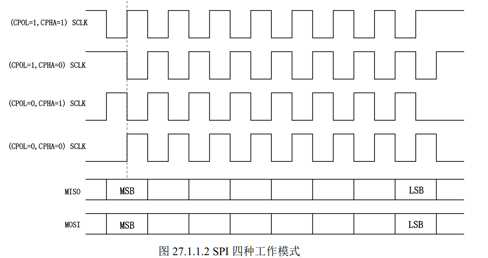
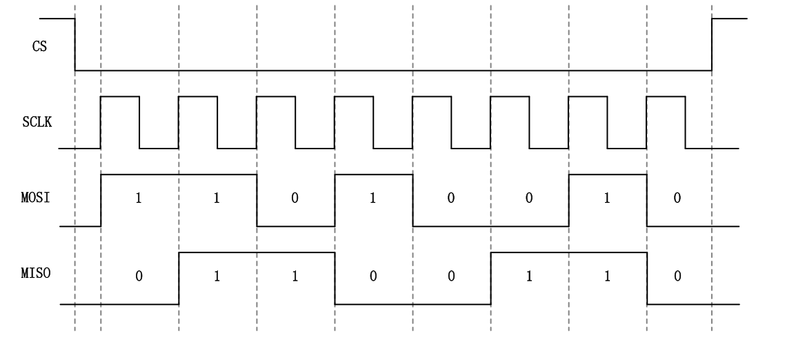

# SPI子系统

## 一、SPI时序图

SPI是高速，全双工（**意味着发多少收多少，就算你只想发也得收**），串行同步通信协议，比IIC快，最高速度可以达到几十Mhz。SPI 以主从方式工作，通常是有一个主设备和一个或多个从设备，标准SPI有4根线:

- CS/SS， Slave Select/Chip Select，这个是片选信号线

- SCK， Serial Clock，串行时钟，和 I2C 的 SCL 一样，为 SPI 通信提供时钟。

- MOSI/==SDO==， Master Out Slave In/==Serial Data Output==，简称主出从入信号线，这根数据线
  只能用于主机向从机发送数据，也就是主机输出，从机输入

- MISO/==SDI==， Master In Slave Out/==Serial Data Input==，简称主入从出信号线，这根数据线只
  能用户从机向主机发送数据，也就是主机输入，从机输出。

SPI 有四种工作模式，通过==串行时钟极性(CPOL)和相位(CPHA)==的搭配来得到四种工作模式（根据从机支持的模式去配置主机）：

- CPOL=0，串行时钟空闲状态为低电平。

- CPOL=1，串行时钟空闲状态为高电平，此时可以通过配置时钟相位(CPHA)来选择具体的传输协议。

- CPHA=0，串行时钟的第一个跳变沿(上升沿或下降沿)采集数据

- CPHA=1，串行时钟的第二个跳变沿(上升沿或下降沿)采集数据。
- 



SPI的时序图如下（每个从机都有单独的片选信号线，或者串行连接）：




## 二、Linux下SPI驱动框架


### 2.1、linux SPI子系统框架

+---------------------+
|   设备驱动层         |  (如触摸屏、传感器驱动)
+---------------------+
|   SPI核心层          |  (drivers/spi/spi.c)
+---------------------+
|   SPI控制器驱动层     |  (drivers/spi/spi-xxx.c)
+---------------------+
|   硬件控制器          |  (SoC SPI控制器)
+---------------------+


### 2.2、SPI主机驱动
SPI主机驱动就是SOC的SPI控制器驱动。Linux内核使用`spi_master`表示SPI控制器驱动。
```c
struct spi_master {
	struct device	dev;

	struct list_head list;

	/* other than negative (== assign one dynamically), bus_num is fully
	 * board-specific.  usually that simplifies to being SOC-specific.
	 * example:  one SOC has three SPI controllers, numbered 0..2,
	 * and one board's schematics might show it using SPI-2.  software
	 * would normally use bus_num=2 for that controller.
	 */
	s16			bus_num;

	/* chipselects will be integral to many controllers; some others
	 * might use board-specific GPIOs.
	 */
	u16			num_chipselect;

	/* some SPI controllers pose alignment requirements on DMAable
	 * buffers; let protocol drivers know about these requirements.
	 */
	u16			dma_alignment;

	/* spi_device.mode flags understood by this controller driver */
	u16			mode_bits;

	/* bitmask of supported bits_per_word for transfers */
	u32			bits_per_word_mask;
#define SPI_BPW_MASK(bits) BIT((bits) - 1)
#define SPI_BIT_MASK(bits) (((bits) == 32) ? ~0U : (BIT(bits) - 1))
#define SPI_BPW_RANGE_MASK(min, max) (SPI_BIT_MASK(max) - SPI_BIT_MASK(min - 1))

	/* limits on transfer speed */
	u32			min_speed_hz;
	u32			max_speed_hz;

	/* other constraints relevant to this driver */
	u16			flags;
#define SPI_MASTER_HALF_DUPLEX	BIT(0)		/* can't do full duplex */
#define SPI_MASTER_NO_RX	BIT(1)		/* can't do buffer read */
#define SPI_MASTER_NO_TX	BIT(2)		/* can't do buffer write */
#define SPI_MASTER_MUST_RX      BIT(3)		/* requires rx */
#define SPI_MASTER_MUST_TX      BIT(4)		/* requires tx */

	/* lock and mutex for SPI bus locking */
	spinlock_t		bus_lock_spinlock;
	struct mutex		bus_lock_mutex;

	/* flag indicating that the SPI bus is locked for exclusive use */
	bool			bus_lock_flag;

	/* Setup mode and clock, etc (spi driver may call many times).
	 *
	 * IMPORTANT:  this may be called when transfers to another
	 * device are active.  DO NOT UPDATE SHARED REGISTERS in ways
	 * which could break those transfers.
	 */
	int			(*setup)(struct spi_device *spi);

	/* bidirectional bulk transfers
	 *
	 * + The transfer() method may not sleep; its main role is
	 *   just to add the message to the queue.
	 * + For now there's no remove-from-queue operation, or
	 *   any other request management
	 * + To a given spi_device, message queueing is pure fifo
	 *
	 * + The master's main job is to process its message queue,
	 *   selecting a chip then transferring data
	 * + If there are multiple spi_device children, the i/o queue
	 *   arbitration algorithm is unspecified (round robin, fifo,
	 *   priority, reservations, preemption, etc)
	 *
	 * + Chipselect stays active during the entire message
	 *   (unless modified by spi_transfer.cs_change != 0).
	 * + The message transfers use clock and SPI mode parameters
	 *   previously established by setup() for this device
	 */
	int			(*transfer)(struct spi_device *spi,
						struct spi_message *mesg);            //控制器数据传输函数

	/* called on release() to free memory provided by spi_master */
	void			(*cleanup)(struct spi_device *spi);

  ......

  int (*transfer_one_message)(struct spi_master *master,
				    struct spi_message *mesg);
  ......
};

```
SPI主机驱动就是申请`spi_master`，然后初始化`spi_master`，最后向内核注册`spi_master`。

**SPI控制器驱动由芯片原厂完成，我们只需要专注于SPI设备驱动。**


### 2.3、SPI设备驱动

#### 2.3.1、spi_driver
Linux内核使用`spi_driver`表示spi设备驱动。**我们在编写驱动时要实现`spi_driver`。**

```c
struct spi_driver {
  	const struct spi_device_id *id_table;
	int (*probe)(struct spi_device *spi);
	int (*remove)(struct spi_device *spi);
	void (*shutdown)(struct spi_device *spi);
	struct device_driver	driver;
};
```
从上面的代码可以看出，`spi_driver`和`i2c_driver`、`platform_driver`基本一样，当spi设备和驱动匹配后，`probe`函数就会执行。

#### 2.3.2、SPI设备驱动注册函数

```c
int spi_register_driver(struct spi_driver *sdrv);
```

#### 2.3.3、SPI设备驱动注销函数

```c
void spi_unregister_driver(struct spi_driver *sdrv);

```

#### 2.3.4、SPI设备驱动编写框架

```c
/* probe 函数 */
static int xxx_probe(struct spi_device *spi)
{
	/* 具体函数内容 */
	return 0;
}

/* remove 函数 */
static int xxx_remove(struct spi_device *spi)
{
	/* 具体函数内容 */
	return 0;
}
/* 传统匹配方式 ID 列表 */
static const struct spi_device_id xxx_id[] = {
	{"xxx", 0},
	{}
};

/* 设备树匹配列表 */
static const struct of_device_id xxx_of_match[] = {
	{ .compatible = "xxx" },
	{ /* Sentinel */ }
};

/* SPI 驱动结构体 */
static struct spi_driver xxx_driver = {
	.probe = xxx_probe,
	.remove = xxx_remove,
	.driver = {
		.owner = THIS_MODULE,
		.name = "xxx",
		.of_match_table = xxx_of_match,
	},
	.id_table = xxx_id,
};

/* 驱动入口函数 */
static int __init xxx_init(void)
{
```


### 2.4、SPI设备结构体spi_device

### 2.5、SPI设备和驱动匹配过程
SPI设备和驱动的匹配过程是由SPI总线完成的，这一点和platform、I2C等驱动相同，SPI总线的数据结构为`spi_bus_type`，定义在`driver/spi/spi.c`中。

```c
struct bus_type spi_bus_type = {
	.name		= "spi",
	.dev_groups	= spi_dev_groups,
	.match		= spi_match_device,		//匹配函数
	.uevent		= spi_uevent,
};
```

```c
static int spi_match_device(struct device *dev, struct device_driver *drv)
{
	const struct spi_device	*spi = to_spi_device(dev);
	const struct spi_driver	*sdrv = to_spi_driver(drv);

	/* Attempt an OF style match */
	if (of_driver_match_device(dev, drv))
		return 1;

	/* Then try ACPI */
	if (acpi_driver_match_device(dev, drv))
		return 1;

	if (sdrv->id_table)
		return !!spi_match_id(sdrv->id_table, spi);

	return strcmp(spi->modalias, drv->name) == 0;
}

```

==**但SPI总线中并没有实现probe函数，也没发现类似于I2C总线probe函数中需要id_table不为空的条件**==


#### 2.6、SPI主机驱动分析

通过设备树的compatible属性就能找到NXP官方写的SPI控制器驱动了，在`drivers/spi/spi-imx.c`。

传输函数是`spi_imx_transfer`，底层逻辑就是把数据写到IMX6ULL的ECSPI的TXDATA寄存器里面。


## 三、SPI驱动编写流程

### 3.1、设备树修改
修改io，在ecspi节点下添加设备

nxp官方的开发板上没有SPI的设备，但是在其他芯片的开发板上有，在`imx6qdl-sabrelite.dtsi`设备树文件中有如下内容
```c
&ecspi1 {
	fsl,spi-num-chipselects = <1>;
	cs-gpios = <&gpio3 19 0>;
	pinctrl-names = "default";
	pinctrl-0 = <&pinctrl_ecspi1>;
	status = "okay";

	flash: m25p80@0 {
		compatible = "sst,sst25vf016b";
		spi-max-frequency = <20000000>;
		reg = <0>;
	};
};
```
仿照这个节点写就行

### 3.2、完成SPI设备数据收发处理

#### 3.2.1、spi_transfer

该结构体是用来描述SPI传输信息的
```c
struct spi_transfer {
	/* it's ok if tx_buf == rx_buf (right?)
	 * for MicroWire, one buffer must be null
	 * buffers must work with dma_*map_single() calls, unless
	 *   spi_message.is_dma_mapped reports a pre-existing mapping
	 */
	const void	*tx_buf;		//保存要发送的数据
	void		*rx_buf;		//保存接受的数据
	unsigned	len;			//要传输的数据长度，SPI是全双工，所以发送和接受数据是一样长的
								////len=发送的长度+读取的长度

	dma_addr_t	tx_dma;
	dma_addr_t	rx_dma;
	struct sg_table tx_sg;
	struct sg_table rx_sg;

	unsigned	cs_change:1;
	unsigned	tx_nbits:3;
	unsigned	rx_nbits:3;
#define	SPI_NBITS_SINGLE	0x01 /* 1bit transfer */
#define	SPI_NBITS_DUAL		0x02 /* 2bits transfer */
#define	SPI_NBITS_QUAD		0x04 /* 4bits transfer */
	u8		bits_per_word;
	u16		delay_usecs;		// 传输后的延迟（微秒）
	u32		speed_hz;

	struct list_head transfer_list;
};
```

#### 3.2.2、spi_message

```c
struct spi_message {
	struct list_head	transfers;

	struct spi_device	*spi;

	unsigned		is_dma_mapped:1;

	/* REVISIT:  we might want a flag affecting the behavior of the
	 * last transfer ... allowing things like "read 16 bit length L"
	 * immediately followed by "read L bytes".  Basically imposing
	 * a specific message scheduling algorithm.
	 *
	 * Some controller drivers (message-at-a-time queue processing)
	 * could provide that as their default scheduling algorithm.  But
	 * others (with multi-message pipelines) could need a flag to
	 * tell them about such special cases.
	 */

	/* completion is reported through a callback */
	void			(*complete)(void *context);		//回调函数
	void			*context;
	unsigned		frame_length;
	unsigned		actual_length;
	int			status;

	/* for optional use by whatever driver currently owns the
	 * spi_message ...  between calls to spi_async and then later
	 * complete(), that's the spi_master controller driver.
	 */
	struct list_head	queue;
	void			*state;
};
```

|特性|	spi_transfer|	spi_message|
|----|----|----|
|角色|	数据传输的基本单元|	传输操作的完整容器|
|数量关系|	一个 message 包含多个 transfer|	一个 message 管理多个 transfer|
|内存管理|	描述单个传输段|	管理传输段链表|
|原子性|	非原子操作|	代表原子操作（保持片选有效）|
|主要用途|	定义数据缓冲区/长度/时序|	组织和管理完整传输序列|


    +----------------------+
    |   spi_message        |   ← 原子操作单元（片选保持低电平）
    |  +----------------+  |
    |  | spi_transfer 1 |  |  ← 传输段1 (如：发送命令)
    |  |----------------|  |
    |  | spi_transfer 2 |  |  ← 传输段2 (如：读取数据)
    |  |----------------|  |
    |  | spi_transfer 3 |  |  ← 传输段3 (如：延迟等待)
    |  +----------------+  |
    +----------------------+

`spi_message`使用例子：
```c
static int icm20608_read_regs(struct icm20608_dev *dev, u8 reg, void *val, int len)
{
	//定义数据，分配内存
	......	
    // 设置发送缓冲区：命令字节 + dummy
    txbuf[0] = reg | 0x80;  // 读命令，要读的寄存器地址最高位要置1

    // 配置SPI传输
    transfer->tx_buf = txbuf;
    transfer->rx_buf = rxbuf;
    transfer->len = len + 1;  // 总长度：1字节命令 + len字节dummy/接收
    spi_message_init(&m);
    spi_message_add_tail(transfer, &m);

    //执行SPI传输
    ret = spi_sync(spi_dev, &m);

	//复制有效数据：跳过接收缓冲区的第一个垃圾字节
	memcpy(val, &rxbuf[1], len * sizeof(unsigned char));
}
```


#### 3.2.3、数据传输流程
1. 在使用`spi_message`之前需要将其进行初始化
   ```c
   void spi_message_init(struct spi_message *m)
   ```
2. 初始化之后将`spi_transfer`添加到`spi_message`队列中
   ```c
   void spi_message_add_tail(struct spi_transfer *t, struct spi_message *m)
   ```
3. 准备好`spi_message`之后就可以进行数据传输了，数据传输方式分为异步传输和同步传输
   - 异步传输：函数立即返回，传输在后台进行。**传输完成后调用`spi_message`中的回调函数**，并且可在中断上下文使用。
	```c
	int spi_async(struct spi_device *spi, struct spi_message *message);
	```
   - 同步传输：顺序执行，函数在传输完成之前会一直阻塞。只能在进程上下文中使用（同步可能会引起休眠，因此不能用在中断中）。同步传输没有回调函数。
	```c
	int spi_sync(struct spi_device *spi, struct spi_message *message);
	```

	|特性	|spi_sync (同步)|	spi_async (异步)|
	|----|----|----|
	|阻塞行为	|阻塞调用线程|	立即返回|
	|使用上下文	|仅进程上下文	|进程和中断上下文|
	|错误处理	|直接返回错误码	|通过回调或状态字段|
	|资源管理	|简单（通常栈分配）	|复杂（需要动态分配）|
	|性能特点	|低吞吐量，简单场景	|高吞吐量，并行处理|
	|延迟特性	|确定性强	|不确定性|
	|适用场景	|简单设备初始化/配置	|高速数据采集/流传输|
	|实现复杂度	|低	|高|


**数据传输例子**
```c
/*
 * @description :   从icm20608中读取多个寄存器数据,若len>1,则从reg寄存器地址开始读len个寄存器
 * @param dev :   自定义的icm20608设备
 * @param reg :   要读取的寄存器地址
 * @param val :   存放读取到的数据的缓冲区
 * @param len :   要读取的数据长度
 * @return      :   操作结果，正常为0，不正常为负数
 */
static int icm20608_read_regs(struct icm20608_dev *dev, u8 reg, void *val, int len)
{

    int ret = 0;
    int i = 0;
    unsigned char *txbuf = NULL;  // 发送缓冲区（命令 + dummy）
    unsigned char *rxbuf = NULL;  // 接收缓冲区（垃圾 + 有效数据）
    struct spi_transfer *transfer = NULL;
    struct spi_message m;

    struct spi_device *spi_dev = (struct spi_device *)dev->private_data;

    // 1. 分配 spi_transfer
    transfer = kzalloc(sizeof(struct spi_transfer), GFP_KERNEL);
    if (!transfer) {
        printk("kmalloc transfer failed\n");
        return -ENOMEM;
    }

    // 2. 分配发送缓冲区：len + 1 字节
    txbuf = kzalloc((len + 1) * sizeof(unsigned char), GFP_KERNEL);
    if (!txbuf) {
        ret = -ENOMEM;
        printk("kmalloc txbuf failed\n");
        goto txbuf_failed;
    }

    // 3. 分配接收缓冲区：len + 1 字节
    rxbuf = kzalloc((len + 1) * sizeof(unsigned char), GFP_KERNEL);
    if (!rxbuf) {
        ret = -ENOMEM;
        printk("kmalloc rxbuf failed\n");
        goto rxbuf_failed;
    }

    // 4. 设置发送缓冲区：命令字节 + dummy
    txbuf[0] = reg | 0x80;  // // 读命令，要读的寄存器地址最高位要置1


    // 5. 配置SPI传输
    transfer->tx_buf = txbuf;
    transfer->rx_buf = rxbuf;
    transfer->len = len + 1;  // 总长度：1字节命令 + len字节dummy/接收
    spi_message_init(&m);
    spi_message_add_tail(transfer, &m);

    // 6. 执行SPI传输
    ret = spi_sync(spi_dev, &m);
    if (ret) {
        printk("spi读取失败\n");
        goto spi_sync_failed;
    }

    // 7. 复制有效数据：跳过接收缓冲区的第一个垃圾字节
    memcpy(val, &rxbuf[1], len * sizeof(unsigned char));

    // 可选：调试打印（实际数据从 rxbuf[1] 开始）
    // printk("received data: ");
    // for (; i < len+1; i++) {
    //     printk("%#x ", rxbuf[i]);
    // }
    // printk("\n");

spi_sync_failed:
    kfree(rxbuf);  // 释放接收缓冲区

rxbuf_failed:
    kfree(txbuf);  // 释放发送缓冲区

txbuf_failed:
    kfree(transfer);  // 释放传输结构体

    return ret;

}
```

## 四、问题

### 4.1、浮点数
浮点数运算尽量放到app里，不要在驱动里进行浮点数运算。若APP用到了浮点数运算，在编译时要加上`-march=armv7-a -mfpu=neon -mfloat-abi=hard`

```bash
arm-linux-gnueabihf-gcc -march=armv7-a -mfpu=neon -mfloat-abi=hard icm20608_app.c -o icm20608_app
```


### 4.2、申请空间
==**针对spi传输数据过程，申请`spi_transfer`内存空间时，一定一定要使用`kzalloc`，不能使用`kmalloc`。**==

kzalloc和kmalloc都是申请空间，但是`kzalloc`会将申请到的空间中的数据清0，如果不清零，`spi_transfer`中的成员变量会是奇怪的数据，就会造成传输中的错误。


### 4.3、设备树
针对spi设备，设备树一般要配置的地方有2个，spi节点和pinctl，配置的重点都在下面有注释


```c

//spi节点
&ecspi3 {
	fsl,spi-num-chipselects = <1>;		//该spi接口下挂几个设备
	cs-gpios = <&gpio1 20 GPIO_ACTIVE_LOW>;	//nxp特有，软件片选信号，貌似是因为硬件片选不好用
	pinctrl-names = "default";
	pinctrl-0 = <&pinctrl_ecspi3>;
	status = "okay";

	spidev: icm20608@0 {			//@后面的0表示该接口下的第一个设备
		compatible = "alientek,icm20608";
		spi-max-frequency = <8000000>;	//icm20608支持的最大spi速率
		reg = <0>;		//表示第0个设备
	};
};


//spi接口的pinctl
&iomux{
	......
	imx6ull-evk{
		......
		pinctrl_ecspi3: ecspi3grp {
			fsl,pins = <
				MX6UL_PAD_UART2_RTS_B__ECSPI3_MISO        0x100b1  /* MISO*/
				MX6UL_PAD_UART2_CTS_B__ECSPI3_MOSI        0x100b1  /* MOSI*/
				MX6UL_PAD_UART2_RX_DATA__ECSPI3_SCLK      0x100b1  /* CLK*/
				MX6UL_PAD_UART2_TX_DATA__GPIO1_IO20       0x100b0  /* CS*/
				>;
		};
		......
	}
	
}

```

==**！！！！**== 一定要注意，有没有**节点复用冲突** 和**io使用冲突** ==**！！！！**== 

- **比如使用的ecspi3复用的是UART2的引脚，一定要去搜一下`UART2_RX_DATA`等引脚有没有复用为其他的功能。**
- **片选引脚使用的是gpio1的IO20,要搜一下这个io有没有被别的设备使用了。**


### 4.4、传输数据函数

当我们使用`spi_sync`函数进行数据传输时会调用nxp官方写好的spi传输函数（简称`spi_imx_sync`），在`spi_imx_sync`中会进行片选信号的控制。

`spi_imx_sync`中设置的是在传输完一个`spi_transfer`后，片选信号就会拉高，然后传输下一个`transfer`的时候再拉低。

**这就要求在设置`spi_message`的时候，不能把一整个传输流程分成几个`spi_transfer`。例如，要读一个寄存器的数据，不能把发送寄存器地址和读取寄存器数据作为2个`spi_transfer`，得写成一个。就像下面的例程一样，发数据和读数据在一个transfer里面。写的时候也是一样的。**
```c

txbuf = kzalloc((len + 1) * sizeof(unsigned char), GFP_KERNEL);

rxbuf = kzalloc((len + 1) * sizeof(unsigned char), GFP_KERNEL);

//设置发送缓冲区：命令字节 + dummy
txbuf[0] = reg | 0x80;  // 读命令，要读的寄存器地址最高位要置1


// 5. 配置SPI传输
transfer->tx_buf = txbuf;
transfer->rx_buf = rxbuf;
transfer->len = len + 1;  // 总长度：1字节命令 + len字节dummy/接收
spi_message_init(&m);
spi_message_add_tail(transfer, &m);

```

**该问题只针对imx6ull的spi控制器。**
