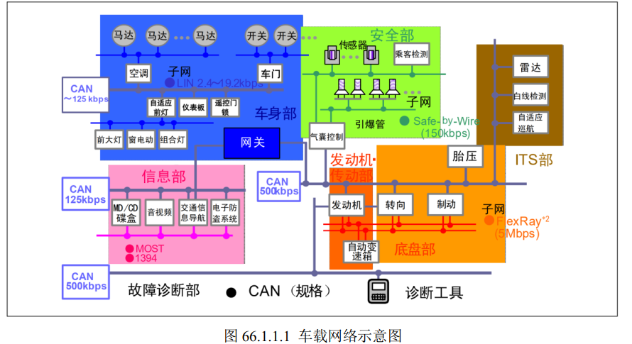
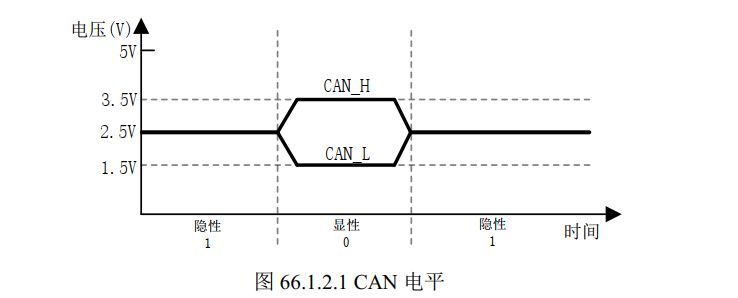
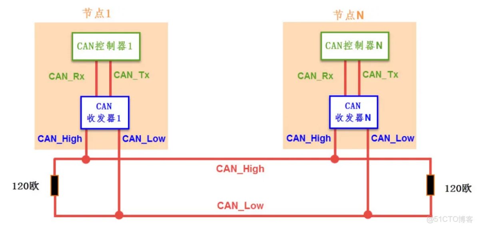
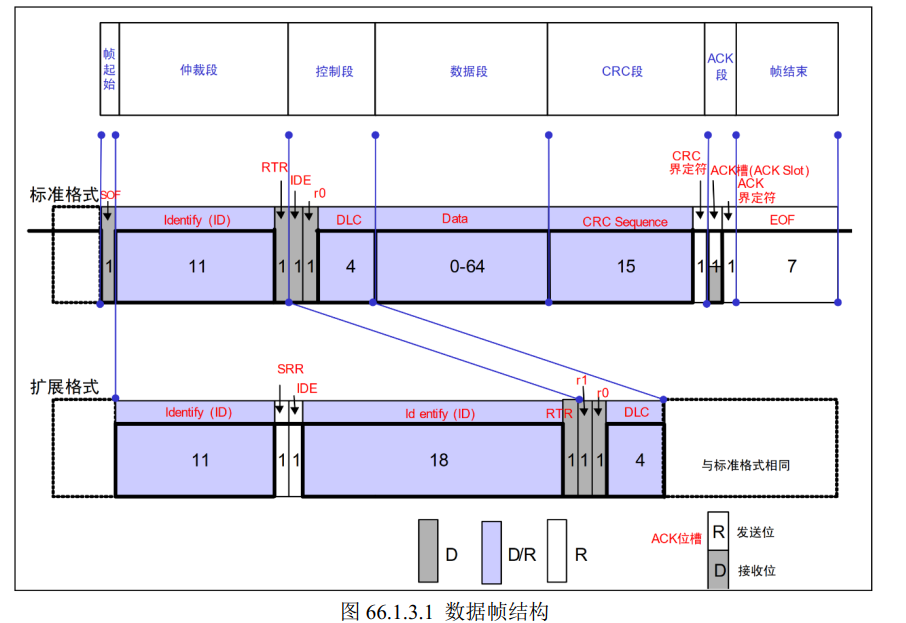

# Linux CAN驱动实验

## 一、CAN协议
CAN 是 Controller Area Network 的缩写，即控制器局域网，是 ISO 国际标准化的串行通信协议。它是一种多主串行通信协议，最初由德国博世公司开发，用于解决汽车中复杂线束问题。

CAN在 OSI 参考模型中的映射如下:

- 物理层(Physical Layer)：CAN 使用差分信号在总线上传输数据，定义了物理层的电气特性，如电压电平、电缆长度等。

- 数据链路层(Data Link Layer)：CAN 协议主要在数据链路层进行定义，包括:

  - 帧格式:定义了 CAN 帧的不同类型，如数据帧、远程帧、错误帧等。
  - 访问控制:采用 CSMA/CR(Carrier Sense Multiple Access with Collision Resolution)机制，支持多个节点争用总线并通过仲裁解决冲突。
  - 差错检测:包括位错误、帧错误、确认错误等，并定义了错误处理机制。
- 网络层(Network Layer)和更高层:CAN 协议主要集中在物理层和数据链路层，并没有定义网络层和更高层的内容。这些功能需要由上层协议(如 CANopen、DeviceNet 等)来实现。

- 应用层(Application Layer)：CAN 协议本身不定义应用层的内容，而是由上层协议(如 CANopen、DeviceNet)来定义应用层的功能，如报文格式、网络管理等。

### 1.1、CAN协议特点

- 多主控制：网络中的每个节点都可以作为主节点，向其他节点发送数据，无需像 I2C 那样有严格的主从关系。
- 高可靠性：具有强大的错误检测和处理机制，如 CRC 校验、错误帧等，能在复杂电磁环境中稳定通信。
- 异步半双工通信：与 I2C、SPI 等同步通讯方式不同，CAN 通讯不以时钟信号来进行同步，且同一时刻只能发送或接收数据，不能同时进行。
- 高速高效：高速 CAN 通信速率可达 1Mbps（ISO11898 标准），能满足实时性要求较高的场景。同一个CAN网络中的通信速率必须保持一致，不同网络之间的速率可以不同。比如上图中的信息部所有节点的速率都是125kbps。
- 故障封闭功能：当某个节点出现故障时，能自动将其隔离，不影响其他节点的正常通信。
- 系统的柔软性：与总线相连的单元没有类似于“地址”的信息。因此在总线上增加单元时，连接在总线上的其它单元的软硬件及应用层都不需要改变。

### 1.2、CAN通信标准
- ISO11898：针对通信速率为 125Kbps~1Mbps 的高速通信标准，通常用于闭环网络。
- ISO11519 - 2：针对通信速率为 125Kbps 以下的低速通信标准，一般用于开环网络。

### 1.3、CAN物理层

- 总线构成：CAN 总线由 CAN_H 和 CAN_L 两根线组成，CAN控制器通过判断2根线上的电位差来得到总线电平。CAN总线电平分为**显性电平和隐性电平**。CAN总线在没有节点传输数据是一直处于隐性电平。
  - 显性电平：CAN_H 为 3.5V、CAN_L 为 1.5V，电压差是 2V，对应逻辑 0。
  - 隐性电平：CAN_H 和 CAN_L 都为 2.5V，电压差为 0V，对应逻辑 1。

- 终端电阻：高速 CAN 总线终端电阻典型值为 120Ω，用于阻抗匹配，减少回波反射，提高信号质量。
- 节点组成：CAN 通讯节点由 CAN 控制器及 CAN 收发器组成。控制器与收发器之间通过 CAN_Tx 及 CAN_Rx 信号线相连，收发器与 CAN 总线之间使用 CAN_H 和 CAN_L 信号线相连。

### 1.4、CAN帧类型

CAN 通信是通过在 CAN 总线上传输 CAN 帧实现的，CAN 帧包括数据帧、遥控帧、错误帧、过载帧、帧间隔，具体如下：

- 数据帧：用于传输数据，是最常用也最复杂的帧，有标准格式和扩展格式两种，标准格式使用 11 位的标识符（ID），扩展格式使用 29 位的 ID。
- 遥控帧：接收单元向发送单元请求发送数据所用的帧，无数据段，DLC 表示其请求的数据长度。
- 错误帧：用于在接收和发送消息时检测出错误并通知错误，由错误标志和错误界定符构成。
- 过载帧：用于接收单元通知其尚未完成接收准备的帧，由过载标志和过载界定符构成。
- 帧间隔：用于分隔数据帧和遥控帧，数据帧和遥控帧可通过插入帧间隔将本帧与前面的任何帧分开，**过载帧和错误帧前不能插入帧间隔。**

### 1.5、数据帧结构

- 帧起始：标准格式和拓展格式的帧起始相同，为 1 个显性位。
- 仲裁段：表示数据优先级的段，即标识符（ID），ID 值越小优先级越高。
- 控制段：表示数据的字节数及保留位的段。r0、r1 为保留位，必须全部以显性电平发送。DLC 为数据长度码，表示数据段的字节长度（最长8个字节）。
- 数据段：0 - 8 字节，从 MSB 开始输出。
- CRC 校验段：用于检查帧传输错误，由 15 个位的 CRC 顺序和 1 个位的 CRC 界定符构成。
- ACK 段：用来确认是否正常接收，由 ACK 槽和 ACK 界定符 2 个位构成。
- 帧结束：由 7 个位的隐性位构成，表示该帧的结束。

上图的D是显性电平，R是隐性电平

### 1.6、仲裁机制

- 在总线空闲态，最先开始发送消息的单元获得发送权。
- 多个单元同时开始发送时，从仲裁段的第一位开始进行仲裁，ID 值越小优先级越高，连续输出显性电平最多的单元可继续发送，其他设备转为接收状态。
- 具有相同 ID 的数据帧和遥控帧竞争时，数据帧的 RTR 位为显性位，具有优先权。
- 标准格式 ID 与具有相同 ID 的遥控帧或者扩展格式的数据帧竞争时，标准格式的 RTR 位为显性位的具有优先权。

### 1.7、CAN速率

CAN 总线的波特率由位时间长度决定。而位时间长度是位时序中同步段、传播时间段和相位缓冲段的时间长度总和。对于 CAN 总线，一个位分为 4 段：

- 同步段（SS）：长度固定为 1 个 Tq（Time Quantum，时间片）
- 传播时间段（PTS）：用于补偿信号在网络和节点之间传播的物理延迟时间，通常为 1~8 个 Tq。
- 相位缓冲段 1（PBS1）：定义了采样点的位置，在 PBS1 结束的时间点对总线采样，得到的电平就是这个位的电平。其初始长度通常是 1 到 16 个 Tq，在再同步的时候可以被自动加长。
- 相位缓冲段 2（PBS2）：定义了发送点的位置，其初始长度一般是 1 到 8 个 Tq，再同步时可以被自动缩短，以补偿负相位漂移，同样用于补偿总线跳变沿在位时序中的误差。
- 再同步补偿宽度(SJW): 因时钟频率偏差、传输延迟等，各单元有同步误差。SJW为补偿此误差的最大值

## 二、IMX6ULL FlexCAN简介
I.MX6ULL 带有 CAN 控制器外设，叫做 FlexCAN， FlexCAN 符合 CAN2.0B 协议。 FlexCAN完全符合CAN协议，支持标准格式和扩展格式，支持 64个消息缓冲。I.MX6ULL自带的FlexCAN模块特性如下：
- 支持 CAN2.0B 协议，数据帧和遥控帧支持标准和扩展两种格式，数据长度支持 0~8 字
节，可编程速度，最高 1Mbit/S。
- 灵活的消息邮箱，最高支持 8 个字节。
- 每个消息邮箱可以配置为接收或发送，都支持标准和扩展这两种格式的消息。
- 每个消息邮箱都有独立的接收掩码寄存器。
- ......

### 2.1、工作模式

FlexCAN 支持四种模式：正常模式(Normal)、冻结模式(Freeze)、仅监听模式(Listen-Only)和回环模式(Loop-Back)，另外还有两种低功耗模式：禁止模式(Disable)和停止模式(Stop)。
- 正常模式：FlexCAN 正常接收或发送消息帧，所有的 CAN 协议功能都使能
- 回环模式：当 CTRL 寄存器的 LPB 位置 1 的时候进入此模式，此模式下 FlexCAN 工作在内部回环模式，一般用来进行自测。从模式下发送出来的数据流直接反馈给内部接收单元。
  

### 2.2、通信速率设置
FlexCAN的控制寄存器 CTRL 用于设置位时序， CTRL 寄存器中的 PRESDIV、 PROPSEG、PSEG1、PSEG2 和 RJW 这 5 个位域用于设置 CAN 位时序。

PRESDIV 为 CAN 分频值，也即是设置 CAN 协议中的 Tq 值，公式如下：

$$
f_{Tq}=\frac{f_{CANCLK}}{PRESDIV+1}
$$

$f_{CANCLK}$为 FlexCAN 模块时钟，这个根据时钟章节设置即可，设置好以后就是一个定值，因
此只需要修改 PRESDIV 即可修改 FlexCAN 的 Tq 频率值。

Tq定了之后进一步设置一个位的各个段：
- SS： 同步段(Synchronization Segment)，固定一个Tq，不用设置
- PTS： 传播时间段(Propagatin Segment)， FlexCAN 的 CTRL 寄存器中的 PROPSEG 位域设置此段，可以设置为 0~7，对应 1~8 个 Tq。
- PBS1： 相位缓冲段 1(Phase Buffer Segment 1)， FlexCAN 的 CRTL 寄存器中的 PSEG1 位域设置此段，可以设置为 0~7，对应 1~8 个 Tq。
- PBS2：相位缓冲段 2(Phase Buffer Segment 2)， FlexCAN 的 CRTL 寄存器中的 PSEG2 位域设置此段，可以设置为 1~7，对应 2~8 个 Tq
- SJW： 再同步补偿宽度(reSynchronization Jump Width)， FlexCAN 的 CRTL 寄存器中的 RJW位域设置此段，可以设置 0~3，对应 1~4 个 Tq。

SYNC+SEG+(PROP_SEG+PSEG1+2)+(PSEG2+1)就是总的 Tq.

$$
CAN波特率=\frac{f_{Tq}}{总Tq}
$$

## 三、驱动
NXP官方提供的Linux内核默认集成了 I.MX6ULL 的 FlexCAN 驱动，但是没有使能，只需要在Linux的menuconfig中打开FlexCAN即可。

