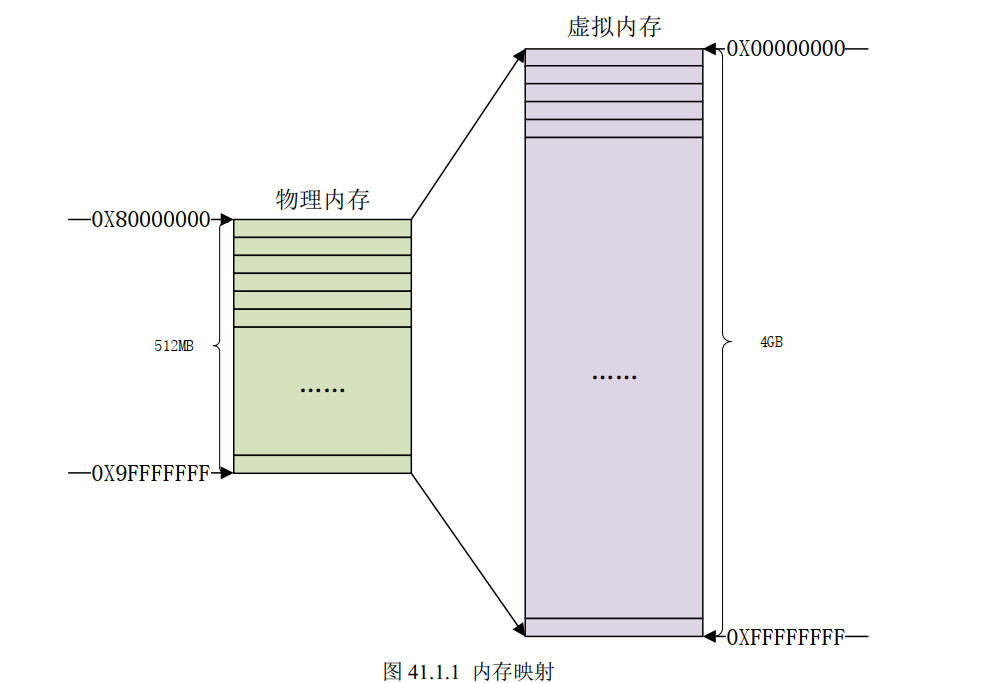

# Linux LED驱动实验(直接操作寄存器)

裸机led灯实验就是直接操作寄存器输出高低电平

Linux驱动开发也可以操作寄存器，但==**Linux不能直接对寄存器的物理地址进行读写操作**==，例如：寄存器A的物理地址为0x10101010，Linux不能直接操作该地址。因为Linux在启动时会使能**==MMU==**（Memory
Manage Unit），设置内存映射。


## 地址映射


### MMU（Memory Manage Unit）

MMU主要和**linux内存管理**有关，它的重要功能：

- 完成虚拟空间到物理空间的映射。
- 内存保护，设置存储器的访问权限，设置虚拟存储空间的缓冲特性。

我们主要关注第一点：**虚拟空间到物理空间的映射**

两个地址概念：**虚拟地址**(VA,Virtual Address)、**物理地址**(PA， Physcical Address)。对于 32 位的处理器来说，虚拟地址范围是 2^32=4GB，我们的开发板上有 512MB 的 DDR3，这 512MB 的内存就是物理内存，经过 MMU 可以将其映射到整个 4GB 的虚拟空间。



Linux 内核启动的时候会初始化 MMU，设置好内存映射，设置好以后 CPU 访问的都是虚拟地址 。 比如 I.MX6ULL 的 GPIO1_IO03 引 脚 的 复 用 寄 存 器IOMUXC_SW_MUX_CTL_PAD_GPIO1_IO03 的地址为 0X020E0068。如果没有开启 MMU 的话直接向 0X020E0068 这个寄存器地址写入数据就可以配置 GPIO1_IO03 的复用功能。现在开启了 MMU，并且设置了内存映射，因此就不能直接向 0X020E0068 这个地址写入数据了。我们必须得到 0X020E0068 这个物理地址在 Linux 系统里面对应的虚拟地址，这里就涉及到了物理内存和虚拟内存之间的转换，需要用到两个函数： `ioremap` 和 `iounmap`。

- **ioremap**

```c
#define ioremap(cookie,size)		__arm_ioremap((cookie), (size), MT_DEVICE)
```

ioremap的第一个参数是物理地址的起始地址，第二个参数是要转换的字节数量

假如我们要获取 I.MX6ULL 的 IOMUXC_SW_MUX_CTL_PAD_GPIO1_IO03 寄存器对应的虚拟地址，使用如下代码即可：

```c
#define SW_MUX_GPIO1_IO03_BASE (0X020E0068)
static void __iomem* SW_MUX_GPIO1_IO03;
SW_MUX_GPIO1_IO03 = ioremap(SW_MUX_GPIO1_IO03_BASE, 4);

```


- **iounmap**


```
#define iounmap				__arm_iounmap
```

卸载驱动的时候需要使用 iounmap 函数释放掉 ioremap 函数所做的映射，例如：

```c
iounmap(SW_MUX_GPIO1_IO03);
```


## IO内存访问函数

**io内存在ARM体系下可以直接理解为内存。**

### 写操作函数

```c
u8 readb(const volatile void __iomem *addr)		//读一个字节
u16 readw(const volatile void __iomem *addr)	//读16位
u32 readl(const volatile void __iomem *addr)	//读32位
```


### 读操作函数

```c
void writeb(u8 value, volatile void __iomem *addr)
void writew(u16 value, volatile void __iomem *addr)
void writel(u32 value, volatile void __iomem *addr)
```


