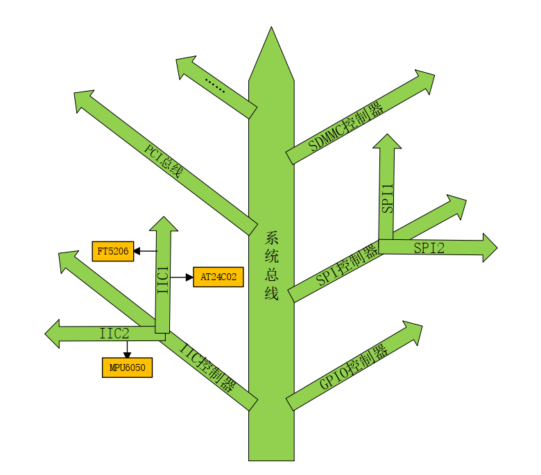
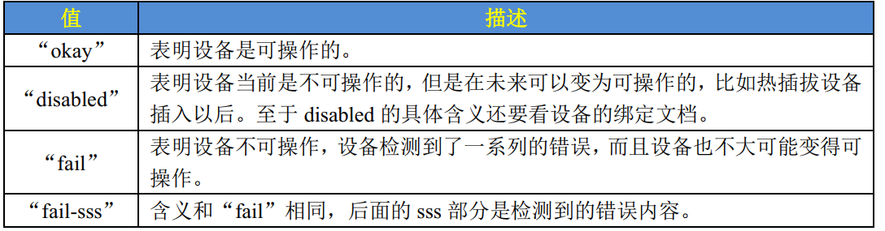
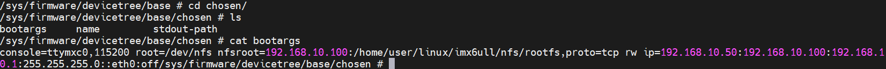
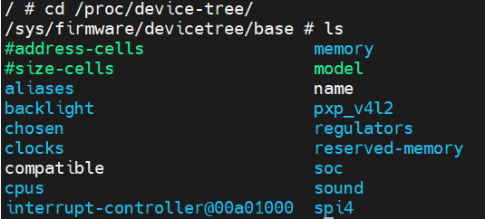
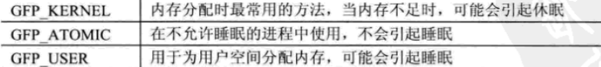

# 设备树

设备树(Device Tree)，将这个词分开就是“设备”和“树”，描述设备树的文件叫做 DTS(Device Tree Source)，这个 DTS 文件采用树形结构描述板级设备，也就是开发板上的设备信息，比如CPU 数量、 内存基地址、 IIC 接口上接了哪些设备、 SPI 接口上接了哪些设备等等，如下图所示：



在上图中，树的主干就是系统总线， IIC 控制器、 GPIO 控制器、 SPI 控制器等都是接到系统主线上的分支。IIC 控制器有分为 IIC1 和 IIC2 两种，其中 IIC1 上接了 FT5206 和 AT24C02这两个 IIC 设备， IIC2 上只接了 MPU6050 这个设备。 DTS 文件的主要功能就是按照上图所示的结构来描述板子上的设备信息。


## DTS   DTB   DTC

.dts文件就相当于.c，就是DTS源码文件

DTC相当于gcc编译器，用来编译DTS源码文件

.dtb文件就是编译结果

在linux源码目录下，执行`make`会编译linux的所有东西，包括zImage，dtb，.ko驱动模块等

执行`make dtbs`只会编译所有DTS文件，若只想编制某个特定平台的DTS文件，例如只编译正点原子的IMX6ULL开发板，执行`make imx6ull-alientek-emmc.dtb`

需要被编译的DTS的目录在`arm/arch/boot/dts/Makefile`文件中


## DTS语法

.dtsi文件时一个SOC共有的信息

```c
/dts-v1/;		//dts代码风格版本
#include <dt-bindings/input/input.h>
#include "imx6ull.dtsi"

//Skeleton.dtsi文件的内容

/ {									
	#address-cells = <1>;
	#size-cells = <1>;
	chosen { };
	aliases { };
	memory { device_type = "memory"; reg = <0 0>; };
};


//imx6ull.dtsi的内容

/ {								
	aliases {}
    ......
}

//imx6ull-alientek-emmc.dts

/ {		//根节点
    model = "Freescale i.MX6 ULL 14x14 EVK Board";		//属性
	compatible = "fsl,imx6ull-14x14-evk", "fsl,imx6ull";	//属性
    chosen {											//一级子节点
		stdout-path = &uart1;
	};
    memory {											//一级子节点，512MB的ddr
		reg = <0x80000000 0x20000000>;
	};
    reserved-memory {...}									//一级子节点
    backlight {...}											//一级子节点
    ......
    //这些一级子节点都是参考nxp官方开发板的DTS文件
}	//这3个根节点是同一个根节点，后面写的相同子节点会追加到前面子节点之后


```

节点名字命名规范：**外设名字@外设寄存器起始地址**，例如：

```c
i2c1: i2c@021a0000 {
				#address-cells = <1>;
				#size-cells = <0>;
				compatible = "fsl,imx6ul-i2c", "fsl,imx21-i2c";
				reg = <0x021a0000 0x4000>;
				interrupts = <GIC_SPI 36 IRQ_TYPE_LEVEL_HIGH>;
				clocks = <&clks IMX6UL_CLK_I2C1>;
				status = "disabled";
			};
```

也有特殊的节点：**节点标签：节点名字**，引入节点标签的目的是为了方便访问，可以直接使用**@节点标签**来访问节点，就不用打比较长的名字了

```c
intc: interrupt-controller@00a01000 {
	compatible = "arm,cortex-a7-gic";
	#interrupt-cells = <3>;
	interrupt-controller;
	reg = <0x00a01000 0x1000>,
	<0x00a02000 0x100>;
};

&intc								//访问中断控制器节点
&interrupt-controller@00a01000		//访问中断控制器节点
```


### 属性

每个节点都有不同属性，不同的属性又有不同的内容，属性都是键值对，值可以为空或任意的字节流。设备树源码中常用的几种数据形式如下所示：

1. 字符串

   ```c
   compatible = "arm,cortex-a7";
   ```

   

2. 32位无符号整数

   ```c
   reg = <0>;					//设置一个值
   reg = <0 0x123456 100>;		//设为一组值
   ```

3. 字符串列表

   ```c
   compatible = "fsl,imx6ull-gpmi-nand", "fsl, imx6ul-gpmi-nand";
   ```


### 标准属性

1. **compatible 属性**

	compatible 属性也叫做“兼容性”属性，这是非常重要的一个属性！compatible 属性的值是一个字符串列表， compatible 属性用于将设备和驱动绑定起来。字符串列表用于选择设备所要使用的驱动程序，例如sound节点的compatible属性：
	
	```c
	compatible = "fsl,imx6ul-evk-wm8960","fsl,imx-audio-wm8960";
	```
	
	属性值有两个，分别为“fsl,imx6ul-evk-wm8960”和“fsl,imx-audio-wm8960”，其中“fsl”表示厂商是飞思卡尔，“imx6ul-evk-wm8960”和“imx-audio-wm8960”表示驱动模块名字。 sound这个设备首先使用第一个兼容值在 Linux 内核里面查找，看看能不能找到与之匹配的驱动文件，如果没有找到的话就使用第二个兼容值查。
	
	一般驱动程序文件都会有一个 OF 匹配表，此 OF 匹配表保存着一些 compatible 值，如果设备节点的 compatible 属性值和 OF 匹配表中的任何一个值相等，那么就表示设备可以使用这个驱动。比如在文件 imx-wm8960.c 中有如下内容：
	
	```
	static const struct of_device_id imx_wm8960_dt_ids[] = {
		{ .compatible = "fsl,imx-audio-wm8960", },
		{ /* sentinel */ }
	};
	```
	
	imx_wm8960_dt_ids就是wm8960外设的匹配表
2. **device_type 属性**

	字符串，描述设备模块信息

3. **status 属性**

  status 属性值也是字符串，字符串是设备的状态信息

  

4. **#address-cells 和#size-cells 属性**

	**==这是父节点的属性，用于描述子节点的地址信息==**
	
	这两个属性的值都是无符号 32 位整形， #address-cells 和#size-cells 这两个属性可以用在任何拥有子节点的设备中，用于描述子节点的地址信息。#address-cells 属性值决定了子节点 reg 属性中地址信息所占用的字长(32 位)
	
	```
	spi4 {
		compatible = "spi-gpio";
		#address-cells = <1>;
		#size-cells = <0>;
	
		gpio_spi: gpio_spi@0 {
			compatible = "fairchild,74hc595";
			reg = <0>;
			};
	 	};
	
	aips3: aips-bus@02200000 {
	 	compatible = "fsl,aips-bus", "simple-bus";
	 	#address-cells = <1>;
	 	#size-cells = <1>;
	
	 	dcp: dcp@02280000 {
	 		compatible = "fsl,imx6sl-dcp";
	 		reg = <0x02280000 0x4000>;
	 		};
		};
	```


5. **reg 属性**

	reg 属性一般用于描述设备地址空间资源信息，一般都是某个外设的寄存器地址范围信息


6. **ranges 属性**

	ranges属性值可以为空或者按照(child-bus-address,parent-bus-address,length)格式编写的数字矩阵， ranges 是一个地址映射/转换表，ranges 属性每个项目由子地址、父地址和地址空间长度这三部分组成。IMX6ULL子地址和父地址完全相同，因此ranges属性为空。

### 根节点 compatible 属性

根节点的compatible 属性，linux内核根据这一属性查看是否支持某个开发板平台

```c
model = "Freescale i.MX6 ULL 14x14 EVK Board";
compatible = "fsl,imx6ull-14x14-evk", "fsl,imx6ull";
```

```c
#define DT_MACHINE_START(_name, _namestr)		\
static const struct machine_desc __mach_desc_##_name	\
 __used							\
 __attribute__((__section__(".arch.info.init"))) = {	\
	.nr		= ~0,				\
	.name		= _namestr,

#endif

#define MACHINE_END				\
};


static const char *imx6ul_dt_compat[] __initconst = {
	"fsl,imx6ul",
	"fsl,imx6ull",
	NULL,
};

DT_MACHINE_START(IMX6UL, "Freescale i.MX6 Ultralite (Device Tree)")
	.map_io		= imx6ul_map_io,
	.init_irq	= imx6ul_init_irq,
	.init_machine	= imx6ul_init_machine,
	.init_late	= imx6ul_init_late,
	.dt_compat	= imx6ul_dt_compat,
MACHINE_END
```


## 特殊节点

### aliases 节点

aliases 节点的主要功能就是定义别名，定义别名的目的就是为了方便访问节点。不过我们一般会在节点命名的时候会加上 label，然后通过&label来访问节点。

```c
aliases {
		can0 = &flexcan1;
		can1 = &flexcan2;
		ethernet0 = &fec1;
		ethernet1 = &fec2;
		gpio0 = &gpio1;
		gpio1 = &gpio2;
		gpio2 = &gpio3;
		gpio3 = &gpio4;
		gpio4 = &gpio5;
		i2c0 = &i2c1;
		i2c1 = &i2c2;
		i2c2 = &i2c3;
		i2c3 = &i2c4;
		mmc0 = &usdhc1;
		mmc1 = &usdhc2;
		serial0 = &uart1;
		serial1 = &uart2;
		serial2 = &uart3;
		serial3 = &uart4;
		serial4 = &uart5;
		serial5 = &uart6;
		serial6 = &uart7;
		serial7 = &uart8;
		spi0 = &ecspi1;
		spi1 = &ecspi2;
		spi2 = &ecspi3;
		spi3 = &ecspi4;
		usbphy0 = &usbphy1;
		usbphy1 = &usbphy2;
	};
```


### chosen节点

chosen 并不是一个真实的设备， chosen 节点主要是为了 uboot 向 Linux 内核传递数据，重点是 bootargs 参数。一般.dts 文件中 chosen 节点通常为空或者内容很少， imx6ull-alientekemmc.dts 中 chosen 节点内容如下所示：

```c
chosen {
	stdout-path = &uart1;
};
```

从示例代码中可以看出， chosen 节点仅仅设置了属性“stdout-path”，表示标准输出使用 uart1。但是当我们进入到/proc/device-tree/chosen 目录里面，会发现多了 bootargs 这个属性，如下图所示：



uboot 在启动 Linux 内核的时候会将 bootargs 的值传递给 Linux内核， bootargs 会作为 Linux 内核的命令行参数，linux会将bootargs写入chosen节点，将其作为chosen节点的属性。


## 设备树在系统中的体现

在启动内核时，我们指定了设备树文件的地址，那么在内核启动时就会解析设备树，并在/proc/device-tree中呈现出来。**在/proc/device-tree下存放着一级子节点**



各一级子节点文件夹下又包含着着各自的子节点 


## 绑定信息文档

这个文档就是用来描述设备树的设备信息，Linux 内核源码中有详细的.txt 文档描述了如何添加节点，这些.txt 文档叫做绑定文档，路径为：Linux 源码目录/Documentation/devicetree/bindings。这只是个参考。


## linux内核的OF操作函数

**==驱动获取设备树属性的函数==**

这一系列的函数开头都是of_，这些函数在include/linux/of.h


### 查找节点的of函数

```c
struct device_node {
	const char *name; /* 节点名字 */
	const char *type; /* 设备类型 */
	phandle phandle;
	const char *full_name; /* 节点全名 */
	struct fwnode_handle fwnode;
	
	struct property *properties; /* 属性 */
	struct property *deadprops; /* removed 属性 */
	struct device_node *parent; /* 父节点 */
	struct device_node *child; /* 子节点 */
	struct device_node *sibling;
	struct kobject kobj;
	unsigned long _flags;
	void *data;
	#if defined(CONFIG_SPARC)
	const char *path_component_name;
	unsigned int unique_id;
	struct of_irq_controller *irq_trans;
	#endif
};
```
与查找节点相关的函数有5个

of_find_node_by_path 函数


**kmalloc**函数，内核中的申请内存函数

```
static __always_inline void *kmalloc(size_t size, gfp_t flags);

```
常用flags的值如下：





**kfree**函数，内核中的释放内存函数

```c
void kfree(const void *);
```

