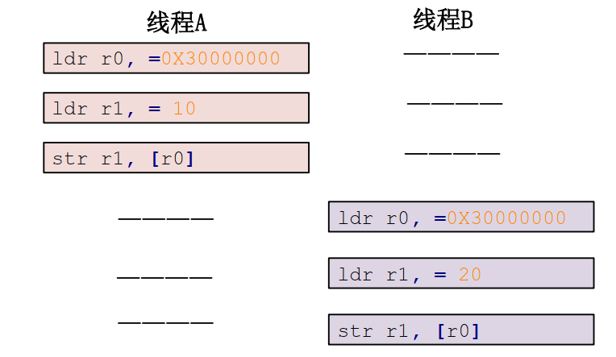
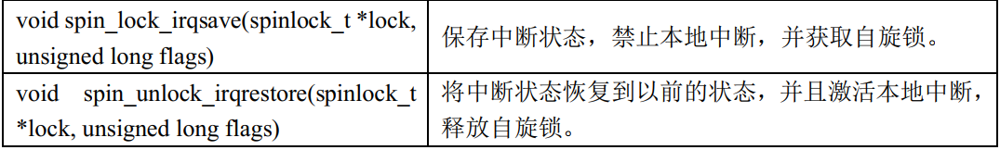

## 并发竞争

并发：cpu会在不同的任务之间切换

并行：在多个cpu上同时进行


多任务、中断、抢占、多核，在这样的情况下就会有并发和竞争


要防止并发访问**共享资源（共享数据，例如全局变量，写驱动的时候会定义的设备结构体）**，因此要保护**共享数据**。


## 原子操作

c语言最后也会转成汇编去执行，a=10点汇编代码可能是下面的样子:

```
ldr r0, =0X30000000 	/* 变量 a 地址 */
ldr r1, = 3 			/* 要写入的值 */
str r1, [r0] 			/* 将 3 写入到 a 变量中 */
```

若同时有2个线程A，B对a去操作，理想的流程如下：




但也可能出现下面的情况：


**要解决上面的问题就是要把a=10对应的3行汇编代码绑定在一起执行**，这就是原子操作


### 原子整形操作

Linux 内核定义了叫做 atomic_t 的结构体来完成整形数据的原子操作，用原子变量atomic_t来代替整形变量，此结构体定义在 include/linux/types.h 文件中，定义如下

```c
typedef struct {
	int counter;
} atomic_t;
```

linux内核有大量的API函数来操作原子变量，用的时候查就行了


上面的都是32位架构的原子操作，也有对应64位架构的原子操作。


### 原子位操作

位操作也是很常用的操作， Linux 内核也提供了一系列的原子位操作 API 函数，只不过原
子位操作不像原子整形变量那样有个 atomic_t 的数据结构，原子位操作是直接对内存进行操作。

例如set_bit函数会将p地址的第nr位置1。

```c
void set_bit(int nr, void *p)
```


## 资源访问冲突解决方案

内核当发生访问资源冲突的时候，可以有两种锁的解决方案选择：

- 自旋锁：等待中的线程会一直等待占有资源的线程释放资源

- 互斥锁：没有获取到资源的线程会把自己阻塞起来，等待重新调度


### 自旋锁

把自旋锁比作一个变量 a，变量 a=1 的时候表示共享资源可用，当 a=0的时候表示共享资源不可用。现在线程 A 要访问共享资源，发现 a=0(自旋锁被其他线程持有)，那么线程 A 就会不断的查询 a 的值，直到 a=1。

自旋锁的缺点：等待自旋锁的线程会一直处于自旋状态，这样会浪费处理器时间，降低系统性能，所以自旋锁的持有时间不能太长。所以自旋锁适用于短时期的轻量级加锁，如果遇到需要长时间持有锁的场景那就需要换其他的方法。

Linux 内核使用结构体 spinlock_t 表示自旋锁

```c
typedef struct spinlock {
	union {
		struct raw_spinlock rlock;

		#ifdef CONFIG_DEBUG_LOCK_ALLOC
		# define LOCK_PADSIZE (offsetof(struct raw_spinlock, dep_map))
        struct {
			u8 __padding[LOCK_PADSIZE];	
			struct lockdep_map dep_map;
		};
		#endif
	};
} spinlock_t;

spinlock_t lock 	//自旋锁定义
```


**自旋锁适用于SMP（对称多处理器结构 ）和单CPU线程之间的并发访问**，也就是适用于进程与进程、线程与线程之间的访问


#### 线程与线程

**占有自旋锁的线程一定不能调用能够引起睡眠或阻塞的API函数，否则会引发死锁现象。**例如：**自旋锁会自动禁止抢占**，也就说当线程 A得到锁以后会暂时禁止内核抢占。如果线程 A 在持有锁期间进入了休眠状态，那么线程 A 会自动放弃 CPU 使用权。线程 B 开始运行，线程 B 也想要获取锁，但是此时锁被 A 线程持有，而且内核抢占还被禁止了！线程 B 无法被调度出去，那么线程 A 就无法运行，锁也就无法释放，就会发生死锁现象。


#### 线程与中断


线程 A 先运行，并且获取到了 lock 这个自旋锁，当线程 A 运行 functionA 函数的时候中断发生了，中断抢走了 CPU 使用权。右边的中断服务函数也要获取 lock 这个锁，但是这个自旋锁被线程 A 占有着，中断就会一直自旋，等待锁有效。但是在中断服务函数执行完之前，线程 A 是不可能执行的，此时就发生了死锁。

**最好的解决方法就是获取锁之前关闭本地中断**，




#### 自旋锁使用注意事项

- **因为在等待自旋锁的时候处于“自旋”状态，因此锁的持有时间不能太长，一定要短，否则的话会降低系统性能。如果临界区比较大，运行时间比较长的话要选择其他的并发处理方式，比如稍后要讲的信号量和互斥体。**
- 自旋锁保护的临界区内不能调用任何可能导致线程休眠的 API 函数，否则的话可能导致死锁。
- 不能递归申请自旋锁，因为一旦通过递归的方式申请一个你正在持有的锁，那么你就必须“自旋”，等待锁被释放，然而你正处于“自旋”状态，根本没法释放锁。结果就是自己把自己锁死了！
- 在编写驱动程序的时候我们必须考虑到驱动的可移植性，因此不管你用的是单核的还是多核的 SOC，都将其当做多核 SOC 来编写驱动程序。


### 信号量

**相比于自旋锁，信号量可以让等待状态的线程进入休眠状态**

但信号量的使用开销比自旋锁大，因为线程进入休眠状态就会切换线程，切换线程就会有开销。

信号量的特点：

- 因为信号量可以使等待资源线程进入休眠状态，因此适用于那些占用资源比较久的线程。
- 由于信号量会引起休眠，而在中断不能休眠，因此不能在中断中使用信号量
- 如果共享资源的持有时间比较短，那就不适合使用信号量了，因为频繁的休眠、切换线程引起的开销要远大于信号量带来的那点优势。
- 线程持有自旋锁的时候，不能使用信号量

信号量有2种类型：数值信号量（）和二值信号量（互斥访问）


### 互斥锁

虽然可以通过二值信号量实现互斥访问，但是linux提供了一个更好的机制互斥体`mutex`来实现互斥访问

**mutex也会导致休眠**，因此不能在中断和自旋锁中使用
