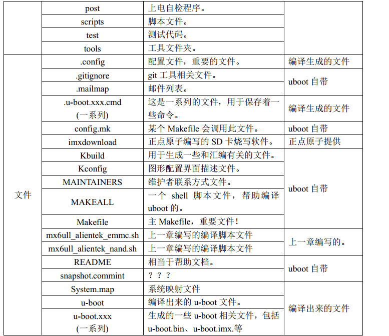
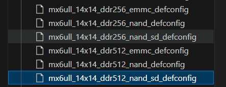

# uboot源码分析


## 目录结构




arch\arm\cpu\u-boot.lds就是整个u-boot的链接脚本

正点原子修改的uboot就是参考的board\freescale\mx6ullevk

config目录是uboot默认配置文件夹。此目录下都是以_defconfig结尾的。这些配置对应不同的开发板（不是芯片！！！）正点原子的配置文件是下面这6个



**移植uboot的时候，重点要关注board文件夹（参考官方开发板的uboot，进行小修改）。config文件夹（默认配置文件）。**


## uboot启动流程


### uboot顶层makefile分析

- 设置静默输出或者命令输出

- 设置编译结果输出目录

- 获取主机架构和系统

- ==**设置目标架构，交叉编译器，配置文件**==

- ‘‘没看完......’’


## uboot启动流程


### 链接脚本u-boot.lds

```c
//u-boot.map保存着整个uboot的地址映射
OUTPUT_FORMAT("elf32-littlearm", "elf32-littlearm", "elf32-littlearm")
OUTPUT_ARCH(arm)
ENTRY(_start)							//入口地址是_start，是arch/arm/cpu/lib/vectors.S
SECTIONS/
{
 . = 0x00000000;
 . = ALIGN(4);
 .text :
 {
  *(.__image_copy_start)				//镜像拷贝开始地址 0x87800000
  *(.vectors)							//中断向量表
  arch/arm/cpu/armv7/start.o (.text*)	// arch/arm/cpu/armv7/start.c
  *(.text*)
 }
 . = ALIGN(4);
 .rodata : { *(SORT_BY_ALIGNMENT(SORT_BY_NAME(.rodata*))) }
 . = ALIGN(4);
 .data : {
  *(.data*)
 }
 . = ALIGN(4);
 . = .;
 . = ALIGN(4);
 .u_boot_list : {
  KEEP(*(SORT(.u_boot_list*)));
 }
 . = ALIGN(4);
 .image_copy_end :						
 {
  *(.__image_copy_end)						//镜像拷贝结束地址，0x8784f1a4
 }
 .rel_dyn_start :
 {
  *(.__rel_dyn_start)						//rel_dyn段的开始，0x8784f1a4
 }
 .rel.dyn : {
  *(.rel*)
 }
 .rel_dyn_end :
 {
  *(.__rel_dyn_end)							//rel_dyn结束,0x8785794c
 }
 .end :
 {
  *(.__end)									//0x8785794c
 }
 _image_binary_end = .;						//0x8785794c
 . = ALIGN(4096);
 .mmutable : {
  *(.mmutable)
 }
 .bss_start __rel_dyn_start (OVERLAY) : {	//bss段开始0x8784f1a4
  KEEP(*(.__bss_start));
  __bss_base = .;
 }
 .bss __bss_base (OVERLAY) : {
  *(.bss*)
   . = ALIGN(4);
   __bss_limit = .;
 }
 .bss_end __bss_limit (OVERLAY) : {
  KEEP(*(.__bss_end));						//bss段结束0x8789a194
 }
 .dynsym _image_binary_end : { *(.dynsym) }
 .dynbss : { *(.dynbss) }
 .dynstr : { *(.dynstr*) }
 .dynamic : { *(.dynamic*) }
 .plt : { *(.plt*) }
 .interp : { *(.interp*) }
 .gnu.hash : { *(.gnu.hash) }
 .gnu : { *(.gnu*) }
 .ARM.exidx : { *(.ARM.exidx*) }
 .gnu.linkonce.armexidx : { *(.gnu.linkonce.armexidx.*) }
}

```

### 流程（大致流程）
1. 设置中断向量表
2. reset
   1. 将处理器模式设为SVC，关闭IRQ和FRQ（CPSR寄存器）
   2. 设置中断向量表偏移（cp15的VBAR寄存器）
   3. 初始化cp15寄存器（关闭cache，mmu，对齐之类的东西）
   4. 设置sp指针指向IMX6ULL的内部RAM、设置R9寄存器（r9 寄存器的使用是由平台指定的，不同平台可能将它实现成不同的作用，在 Uboot 的实现中，r9 就被用来保存 global data 的起始地址。）
   5. 在内部RAM中预留malloc内存区域和global data 内存区域，更新R9寄存器
   6. 初始化DDR，定时器等，同时将sp指向DDR，更新global data地址
   7. uboot自己把uboot代码从0x87800000拷贝到DDR最后面的地址区域，给linux腾空间
	8. 初始化一系列外设、比如串口之类的，并打印一些信息
	```c
	typedef struct global_data {
	bd_t *bd;
	unsigned long flags;
	unsigned int baudrate;
	unsigned long cpu_clk;	/* CPU clock in Hz!		*/
	unsigned long bus_clk;
   /* We cannot bracket this with CONFIG_PCI due to mpc5xxx */
   unsigned long pci_clk;
   unsigned long mem_clk;
   unsigned long env_addr;	/* Address  of Environment struct */
   unsigned long env_valid;	/* Checksum of Environment valid? */
   
   unsigned long ram_top;	/* Top address of RAM used by U-Boot */
   
   unsigned long relocaddr;	/* Start address of U-Boot in RAM */
   phys_size_t ram_size;	/* RAM size */
   unsigned long mon_len;	/* monitor len */
   unsigned long irq_sp;		/* irq stack pointer */
   unsigned long start_addr_sp;	/* start_addr_stackpointer */
   unsigned long reloc_off;
   #ifdef CONFIG_SYS_MALLOC_F_LEN
   unsigned long malloc_base;	/* base address of early malloc() */
   unsigned long malloc_limit;	/* limit address */
   unsigned long malloc_ptr;	/* current address */
   struct global_data *new_gd;	/* relocated global data */
   const void *fdt_blob;	/* Our device tree, NULL if none */
   void *new_fdt;		/* Relocated FDT */
   unsigned long fdt_size;	/* Space reserved for relocated FDT */
   struct jt_funcs *jt;		/* jump table */
   char env_buf[32];	/* buffer for getenv() before reloc. */
   ...中间也有省略
   ```